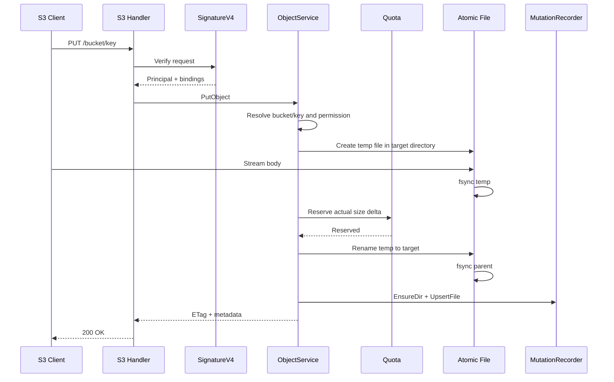

# S3 兼容接口设计

本文定义 `warehouse` 在保留现有 PostgreSQL、本地文件目录、WebDAV、配额、回收站和 active/standby 复制机制的前提下，增加 S3 兼容接口的推荐方案。

本文讨论的是“S3 协议适配层”，不是“把底层文件存储迁移到 AWS S3、MinIO 或其他对象存储”。

## 1. 结论先行

在当前项目中增加 S3 兼容接口可行，推荐采用以下路线：

1. 保留本地 POSIX 文件系统作为文件内容真相。
2. 保留 PostgreSQL 作为用户、权限、密钥、分享、配额和业务元数据真相。
3. 新增独立 S3 HTTP Endpoint 和 AWS Signature V4 鉴权。
4. 抽取与协议无关的 `ObjectService`，由 WebDAV 和 S3 共同复用文件操作规则。
5. S3 写入必须复用原子上传、权限、配额、回收站和 `MutationRecorder`，不能由 S3 Handler 直接写磁盘。
6. 第一阶段只开放 `personal` 和 `apps` 两类逻辑 bucket。
7. 定向分享 bucket 延后到第二阶段，避免在第一版中混入跨用户物理路径和分享权限解析。
8. 生产可用版本必须支持 Multipart Upload；只支持简单 `PutObject` 不能满足常见大文件客户端。

不推荐：

- 在现有 `/dav/` 路径下混入 S3 协议。
- 直接把 S3 请求转换成内部 WebDAV HTTP 请求。
- S3 Handler 绕过应用服务直接调用 `os.Create`、`os.Remove`。
- 第一阶段同时替换底层存储为对象存储。
- 使用现有 bcrypt 密钥哈希直接验证 Signature V4。

## 2. 目标与非目标

### 2.1 目标

- 允许 AWS CLI、AWS SDK、rclone 等客户端通过 S3 协议访问 Warehouse 文件。
- S3 和 WebDAV 看到同一份文件内容。
- S3 写入遵循现有用户权限、目录绑定和配额规则。
- S3 删除遵循 Warehouse 回收站规则。
- S3 写入成功后进入现有 active/standby 复制链路。
- 保持当前单 active 写入模型，不因为增加 S3 引入新的多写节点。
- 为未来切换共享 POSIX 或对象存储保留清晰的应用服务边界。

### 2.2 非目标

第一阶段不实现完整 AWS S3 产品能力：

- 不支持任意创建或删除 bucket。
- 不支持 bucket ACL、bucket policy。
- 不支持对象版本控制。
- 不支持 lifecycle、tagging、website hosting。
- 不支持跨区域复制。
- 不支持 Object Lock、Legal Hold。
- 不支持服务端加密 SSE-S3、SSE-KMS、SSE-C。
- 不承诺兼容所有依赖 AWS 私有行为的客户端。
- 不把本地文件系统替换成 AWS S3、MinIO 或其他对象存储。

## 3. 两种“S3 支持”必须区分

### 3.1 S3 协议适配层

```text
S3 Client
    |
    v
S3 Handler + Signature V4
    |
    v
ObjectService
    |
    +-- 权限
    +-- 配额
    +-- 原子写入
    +-- 回收站
    +-- MutationRecorder
    |
    v
Local Filesystem + PostgreSQL
```

这是本文推荐的近期方案。

优点：

- 复用现有存储和业务规则。
- 对 WebDAV 和前端影响较小。
- 可以分阶段支持 S3 操作。
- active/standby 复制机制继续有效。

### 3.2 底层存储对象化

```text
WebDAV / S3 / API
        |
        v
Object Storage Abstraction
        |
        v
AWS S3 / MinIO / Ceph
```

这是中长期存储架构改造，会影响：

- WebDAV 文件系统适配。
- 目录、移动和复制语义。
- 回收站。
- 原子上传。
- 配额统计。
- standby 复制。
- reconcile。
- readiness 检查。

该方案不应与第一阶段 S3 协议接入捆绑实施。

## 4. 当前可复用能力

当前项目已有以下基础能力：

- 用户隔离目录。
- `personal` 与 `apps` 资产空间。
- 基于 `C/R/U/D` 的路径权限。
- 访问密钥与目录绑定。
- 上传前配额检查和上传后 `used_space` 更新。
- 临时文件、`fsync`、`rename`、父目录同步的原子落盘。
- 删除进入回收站。
- active 节点通过 `MutationRecorder` 记录复制事件。
- standby 接收文件和文件系统变更事件。

S3 接入应复用这些能力，而不是重新实现一套简化版本。

当前需要收敛的问题：

1. `WebDAVService` 同时承担 HTTP 协议和文件业务逻辑，不能直接作为 S3 应用服务。
2. 没有 AWS Signature V4 验证器。
3. 现有访问密钥只保存 bcrypt 哈希，不能用于 HMAC 签名复算。
4. 无 `Content-Length` 时，现有配额估算可能读取完整请求体，不适合大文件流式上传。
5. 当前没有 Multipart Upload 会话和分片生命周期管理。
6. 当前没有统一的 S3 对象元数据和 ETag 规则。

## 5. Endpoint 与部署方式

### 5.1 推荐独立 Endpoint

推荐对外提供：

```text
https://s3.yeying.pub
```

第一阶段只支持 path-style：

```text
https://s3.yeying.pub/{bucket}/{key}
```

示例：

```text
https://s3.yeying.pub/personal/documents/report.pdf
https://s3.yeying.pub/apps/chat.yeying.pub/backup/data.json
```

第一阶段不支持 virtual-hosted style：

```text
https://personal.s3.yeying.pub/documents/report.pdf
```

原因：

- 不需要 wildcard DNS 和 wildcard TLS 证书。
- bucket 名不进入 Host，路由和签名校验更简单。
- 避免与现有 WebDAV、API、前端静态站点路径冲突。

### 5.2 推荐独立监听端口

建议 Warehouse 在同一进程中增加一个可选 S3 HTTP Server：

```yaml
s3:
  enabled: false
  address: ":6066"
  region: "us-east-1"
  path_style_only: true
  max_clock_skew: "15m"
  multipart:
    enabled: true
    min_part_size: 5242880
    max_part_size: 5368709120
    max_parts: 10000
    expire_after: "24h"
```

采用独立端口的原因：

- S3 根路径是 `/{bucket}/{key}`，不适合挂在现有 `/api/`、`/dav/` 路由树中。
- 可以单独设置上传超时、请求缓冲、连接数和限流。
- 可以单独关闭或灰度 S3，不影响 WebDAV。
- S3 Handler 仍复用同一进程中的 Repository、Service 和 MutationRecorder。

### 5.3 Nginx 要求

推荐配置原则：

```nginx
server {
    server_name s3.yeying.pub;

    client_max_body_size 0;
    client_body_timeout 3600s;

    location / {
        proxy_pass http://127.0.0.1:6066;
        proxy_http_version 1.1;

        proxy_set_header Host $host;
        proxy_set_header X-Real-IP $remote_addr;
        proxy_set_header X-Forwarded-For $proxy_add_x_forwarded_for;
        proxy_set_header X-Forwarded-Proto $scheme;

        proxy_request_buffering off;
        proxy_buffering off;
        proxy_read_timeout 3600s;
        proxy_send_timeout 3600s;
    }
}
```

强约束：

- Nginx 不得重写 URI 或 query。
- Nginx 必须保留原始 Host。
- 不得在 Nginx 层修改参与签名的 `x-amz-*` 请求头。
- 上传必须关闭 `proxy_request_buffering`，避免大文件先完整落到 Nginx 临时目录。
- 对象响应不启用通用 gzip，避免 Range、长度和校验行为变复杂。

## 6. Bucket 与现有资产空间映射

### 6.1 Bucket 是逻辑视图

第一阶段 bucket 不是磁盘上的新一级目录，也不是全局可创建资源，而是由当前认证主体解析出的逻辑视图。

| Bucket | 物理路径 | 第一阶段 |
| --- | --- | --- |
| `personal` | `/<user_root>/personal/` | 支持 |
| `apps` | `/<user_root>/apps/` | 支持 |
| `share-{shareId}` | 分享拥有者目录中的授权路径 | 延后 |

同一个 `personal` bucket 在不同 Access Key 下映射到不同用户目录。

因此：

- bucket 命名空间是认证主体隔离的。
- 响应不得被公共代理跨 Authorization 缓存。
- `ListBuckets` 只能返回当前密钥有权访问的逻辑 bucket。

### 6.2 目录绑定规则

现有 Access Key 可以绑定一个或多个目录，例如：

```text
/personal/projects/a
/apps/chat.yeying.pub
```

映射规则：

- 绑定路径与 `/personal` 相交时，可以看到 `personal` bucket。
- 绑定路径与 `/apps` 相交时，可以看到 `apps` bucket。
- bucket 可见不代表整个 bucket 可访问，具体 key 仍需经过目录绑定和权限检查。
- `ListObjectsV2` 必须过滤无权访问的前缀，不能先列出再依赖对象读取时报错。

### 6.3 为什么分享 bucket 延后

定向分享文件的物理路径属于分享拥有者，但访问主体是接收者。

这与当前 Access Key 的“owner 目录 + binding path”模型不同，需要额外抽取：

- 分享授权解析。
- 分享拥有者路径解析。
- 分享权限到 S3 操作的映射。
- 分享撤销后的 S3 访问失效。
- 分享列表与 bucket 可见性。

第一阶段混入这部分会显著增加鉴权边界和路径逃逸风险，因此先不开放。

## 7. S3 Access Key 与 Signature V4

### 7.1 不能直接复用现有密钥哈希

当前 WebDAV Access Key 使用：

- `key_id`
- bcrypt `secret_hash`

Basic Auth 只需要验证“用户提供的 secret 是否匹配 hash”。

Signature V4 服务端需要使用原始 secret 重新计算 HMAC，因此：

- 仅有 bcrypt hash 无法验证 Signature V4。
- 已存在的 WebDAV 密钥不能自动升级为 S3 密钥。
- 不能为了兼容而把现有 secret 改成数据库明文。

### 7.2 推荐统一密钥模型

产品层继续使用统一的“密钥管理”，数据层在现有密钥模型上增加凭证用途：

```text
credential_type:
  - webdav_basic
  - s3_v4
```

推荐字段：

```sql
credential_type     VARCHAR(32) NOT NULL
secret_hash         TEXT NULL
secret_ciphertext   BYTEA NULL
secret_key_version  INTEGER NULL
```

规则：

- `webdav_basic` 使用 `secret_hash`。
- `s3_v4` 使用 `secret_ciphertext`。
- 同一个密钥不能同时作为 WebDAV Basic 密钥和 S3 Signature V4 密钥。
- WebDAV 密钥不能调用 S3 Endpoint，S3 密钥不能用于 WebDAV Basic Auth。
- 所有类型继续复用 owner、目录绑定、权限、状态、过期时间和最近使用时间。
- 现有 WebDAV 密钥默认迁移为 `webdav_basic`。
- 用户需要显式创建新的 S3 密钥。

### 7.3 Secret 加密存储

S3 secret 使用服务端主密钥进行 AES-256-GCM 加密。

主密钥要求：

- 只通过环境变量或 Secret Manager 注入。
- 不写入 Git。
- 不打印到日志。
- 支持 `key_version`，为后续轮换保留空间。

示例环境变量：

```text
WAREHOUSE_S3_CREDENTIAL_MASTER_KEY=<base64-encoded-32-byte-key>
WAREHOUSE_S3_CREDENTIAL_KEY_VERSION=1
```

数据库泄漏但主密钥未泄漏时，不应直接恢复 S3 secret。

### 7.4 Signature V4 第一阶段范围

第一阶段支持：

- Header-based Signature V4。
- 固定 service：`s3`。
- 固定 region：配置项 `s3.region`。
- `x-amz-date` 和请求时间偏差检查。
- `x-amz-content-sha256`。
- `UNSIGNED-PAYLOAD` 仅允许服务端确认的外部 HTTPS 请求。
- 直连 TLS 可直接确认；TLS 在 Nginx 终止时，只信任来自受控代理地址的 `X-Forwarded-Proto: https`。
- 不能信任公网客户端直接提交的 `X-Forwarded-Proto`。

第二阶段支持：

- Presigned URL。
- `STREAMING-AWS4-HMAC-SHA256-PAYLOAD`。
- 更完整的 trailer checksum。

如果目标客户端在第一阶段默认使用 aws-chunked streaming，必须在兼容性测试中确认并提前实现，不能仅依据普通 `curl` 测试判断可用。

## 8. 统一 ObjectService

### 8.1 设计原则

S3 Handler 只负责：

- 解析 S3 请求。
- 验证 Signature V4。
- 把 bucket/key 转换为对象操作参数。
- 输出 S3 XML、响应头和错误码。

对象业务逻辑统一放入 `ObjectService`：

```go
type ObjectService interface {
    ListBuckets(ctx context.Context, principal Principal) ([]Bucket, error)
    HeadBucket(ctx context.Context, principal Principal, bucket string) error
    ListObjects(ctx context.Context, input ListObjectsInput) (*ListObjectsOutput, error)
    HeadObject(ctx context.Context, input ObjectInput) (*ObjectInfo, error)
    OpenObject(ctx context.Context, input GetObjectInput) (*ObjectReader, error)
    PutObject(ctx context.Context, input PutObjectInput) (*PutObjectOutput, error)
    DeleteObject(ctx context.Context, input ObjectInput) error
    CopyObject(ctx context.Context, input CopyObjectInput) (*CopyObjectOutput, error)
}
```

Multipart 独立接口：

```go
type MultipartService interface {
    CreateMultipartUpload(ctx context.Context, input CreateMultipartInput) (*MultipartUpload, error)
    UploadPart(ctx context.Context, input UploadPartInput) (*UploadedPart, error)
    CompleteMultipartUpload(ctx context.Context, input CompleteMultipartInput) (*PutObjectOutput, error)
    AbortMultipartUpload(ctx context.Context, input AbortMultipartInput) error
}
```

### 8.2 推荐模块划分

```text
internal/domain/object/
  object.go
  errors.go

internal/application/service/
  object_service.go
  multipart_service.go

internal/infrastructure/objectfs/
  filesystem.go
  metadata.go

internal/interface/s3/
  server.go
  handler.go
  signature_v4.go
  request.go
  response.go
  errors.go
```

不建议让 `internal/interface/s3` 依赖 WebDAV Handler 或构造内部 HTTP 请求。

### 8.3 WebDAV 的演进方式

第一阶段可以先让 S3 调用新的 `ObjectService`，现有 WebDAV 保持运行。

但以下规则必须从一开始共用：

- canonical path 解析。
- 权限判断。
- 原子写入。
- 配额 delta。
- 回收站。
- MutationRecorder。

后续再逐步把 WebDAV 中的 PUT、DELETE、COPY 移到 `ObjectService`，避免一次性重写整个 WebDAVService。

## 9. Canonical Path 与安全边界

所有 S3 bucket/key 必须经过统一解析：

```text
principal + bucket + key
    -> logical path
    -> authorized path
    -> absolute filesystem path
```

规则：

- key 使用 UTF-8。
- 保留 key 中合法的空格和 Unicode 字符。
- 拒绝 NUL。
- 拒绝解析后逃出 bucket 根目录的 `..`。
- 不能只依赖 `filepath.Join` 后的结果。
- 必须使用 `filepath.Rel(bucketRoot, target)` 再次确认结果不以 `..` 开头。
- 不跟随指向用户目录外部的符号链接。
- 系统忽略文件规则与 WebDAV 保持一致。
- 内部临时文件、Multipart 分片目录不能被 ListObjects 返回。

## 10. S3 操作范围

### 10.1 阶段 1：小文件 MVP

| S3 操作 | HTTP 形式 | Warehouse 行为 |
| --- | --- | --- |
| ListBuckets | `GET /` | 返回可见逻辑 bucket |
| CreateBucket | `PUT /{bucket}` | 对 `personal`、`apps` 返回幂等成功，不创建新 bucket |
| HeadBucket | `HEAD /{bucket}` | 校验 bucket 和权限 |
| ListObjects | `GET /{bucket}` | 兼容 rclone 默认使用的 v1 列举 |
| ListObjectsV2 | `GET /{bucket}?list-type=2` | 列出对象和 CommonPrefixes |
| HeadObject | `HEAD /{bucket}/{key}` | 返回大小、ETag、时间和类型 |
| GetObject | `GET /{bucket}/{key}` | 流式下载，支持 Range |
| PutObject | `PUT /{bucket}/{key}` | 原子写入 |
| DeleteObject | `DELETE /{bucket}/{key}` | 永久删除并释放额度 |

阶段 1 用于验证协议、鉴权、权限、配额、原子写入和复制链路，不作为面向所有客户端的大文件正式版本。

### 10.2 阶段 2：生产大文件范围

| S3 操作 | HTTP 形式 | Warehouse 行为 |
| --- | --- | --- |
| DeleteObjects | `POST /{bucket}?delete` | 批量删除 |
| CopyObject | `PUT` + `x-amz-copy-source` | 复制对象 |
| CreateMultipartUpload | `POST ?uploads` | 创建上传会话 |
| UploadPart | `PUT ?partNumber=&uploadId=` | 写入分片 |
| CompleteMultipartUpload | `POST ?uploadId=` | 合并并原子提交 |
| AbortMultipartUpload | `DELETE ?uploadId=` | 清理分片 |

完成阶段 2 并通过目标客户端兼容性、并发配额和中断清理测试后，才进入面向普通用户的生产开放。

### 10.3 明确不支持

- 创建 `personal`、`apps` 以外的任意 bucket。
- DeleteBucket。
- ListObjectVersions。
- ACL 和 Policy。
- Tagging。
- Versioning。
- Lifecycle。
- SelectObjectContent。
- RestoreObject。
- Object Lock。

未支持操作返回标准 S3 错误：

```xml
<Error>
  <Code>NotImplemented</Code>
  <Message>The requested operation is not implemented.</Message>
  <RequestId>...</RequestId>
  <HostId>...</HostId>
</Error>
```

## 11. 权限映射

| S3 操作 | Warehouse 权限 |
| --- | --- |
| ListBuckets | 至少存在一个可读绑定 |
| HeadBucket | bucket 下至少存在一个可访问绑定 |
| ListObjectsV2 | `R` |
| HeadObject | `R` |
| GetObject | `R` |
| PutObject 新建 | `C` |
| PutObject 覆盖 | `U` |
| DeleteObject | `D` |
| CopyObject 读取源 | 源路径 `R` |
| CopyObject 新建目标 | 目标路径 `C` |
| CopyObject 覆盖目标 | 目标路径 `U` |
| Multipart UploadPart | 上传会话授权 + 目标路径写权限 |
| CompleteMultipartUpload | 新建 `C` 或覆盖 `U` |

创建和覆盖必须像当前 WebDAV 一样区分，不能把所有 `PutObject` 都简单映射为 `U`。

## 12. PutObject 写入流程

推荐流程：



关键要求：

- 临时文件必须与目标文件位于同一文件系统，确保 `rename` 原子。
- 请求中断必须删除临时文件。
- 在文件完整写入和校验前，正式 key 不可见。
- 覆盖文件时，旧文件在最终提交前保持可读。
- 写入成功后再记录复制事件。
- 不能先返回成功再异步完成本地文件提交。

### 12.1 配额并发

现有“先检查、后更新”在并发上传时可能发生竞态。

S3 大文件和 Multipart 上线前，建议增加数据库原子额度预留：

```sql
UPDATE users
SET used_space = used_space + $delta
WHERE id = $user_id
  AND (quota = 0 OR used_space + $delta <= quota)
RETURNING used_space;
```

推荐提交顺序：

1. 流式写入临时文件。
2. 获取实际新文件大小和旧文件大小。
3. 按 key 加锁，重新确认旧文件状态。
4. 原子预留 `delta`。
5. `rename` 提交。
6. 提交失败时释放已预留额度。
7. 记录复制事件。

本地文件和 PostgreSQL 不能形成真正分布式事务，因此仍需：

- 明确补偿逻辑。
- 保留 quota reconcile 修复漂移。
- 对补偿失败输出结构化错误日志。

## 13. Multipart Upload

### 13.1 为什么生产版本必须支持

常见 S3 客户端会对大文件自动使用 Multipart Upload。

如果只实现 `PutObject`：

- 小文件测试可能通过。
- 大文件在 AWS CLI、SDK 或 rclone 中可能直接失败。
- 失败表现容易被误判为代理、超时或权限问题。

### 13.2 数据模型

建议新增：

```text
s3_multipart_uploads
  id
  owner_user_id
  access_key_id
  bucket
  object_key
  target_path
  status
  content_type
  metadata_json
  created_at
  expires_at

s3_multipart_parts
  upload_id
  part_number
  size
  etag
  temp_path
  created_at
```

约束：

- `upload_id + part_number` 唯一。
- 分片路径必须在 Warehouse 内部隐藏 staging 目录。
- staging 目录不能通过 WebDAV 或 S3 列出。
- 分片上传允许覆盖同一 part number。
- Complete 时按客户端提交的 part 顺序合并。
- ETag 不匹配时拒绝 Complete。

### 13.3 分片额度

不能只在 Complete 时检查正式对象额度，否则攻击者可以创建大量未完成分片占满磁盘。

第一阶段建议：

- 活跃 Multipart 分片计入临时占用。
- 校验 `used_space + multipart_staging_space`。
- 设置单用户活跃 upload 数量限制。
- 设置单 upload 最大分片数和总大小。
- 后台定期清理过期 upload。

### 13.4 active/standby 行为

第一阶段只在 Complete 成功后复制最终文件，不复制未完成分片。

因此：

- active 故障切换时，未完成 Multipart 会话允许丢失。
- 切换后客户端收到 `NoSuchUpload`，需要重新上传。
- 正式完成的对象仍通过现有复制链路进入 standby。

这是第一阶段可接受的明确取舍。

### 13.5 推荐默认限制

这里的“单文件和 Multipart 产品限制”是指：为了避免单个用户或异常客户端占满磁盘、连接和临时目录，需要给对象大小、并发数和未完成上传设置上限。

推荐默认值：

| 限制项 | 推荐默认值 | 说明 |
| --- | --- | --- |
| 单次 PutObject 最大对象 | `5 GiB` | 更大的对象必须使用 Multipart |
| Multipart 最大对象 | `100 GiB` | 第一版的产品上限，可配置 |
| 最小分片 | `5 MiB` | 除最后一个分片外 |
| 最大分片 | `5 GiB` | 防止单个 part 过大 |
| 单个 upload 最大分片数 | `10000` | 与常见 S3 客户端预期一致 |
| 单用户活跃 Multipart 会话 | `10` | 防止大量未完成会话 |
| 单用户并行上传请求 | `8` | 包括 PutObject 和 UploadPart |
| 同一个 key 并发写入 | `1` | 避免覆盖竞态 |
| 未完成 Multipart 保留时间 | `24h` | 到期自动清理 |

这些值全部应通过配置调整。阶段 1 小文件 MVP 可以使用更低的测试环境限制，但协议错误需要返回明确的 `EntityTooLarge`、`InvalidRequest` 或限流错误。

## 14. 读取、列举与目录语义

### 14.1 GetObject

要求：

- 流式读取文件，不把完整文件加载进内存。
- 支持单 Range。
- 第一阶段可不支持 multi-range。
- 返回 `Content-Length`、`Content-Type`、`Last-Modified`、`ETag`。
- 客户端取消请求后及时关闭文件。

### 14.2 ListObjects v1/v2

本地目录映射规则：

- 普通文件映射为对象。
- 目录映射为 prefix。
- `delimiter=/` 时返回 `CommonPrefixes`。
- continuation token 必须由服务端签名或编码，不能信任客户端直接提供的本地路径。
- 必须按 key 字典序稳定排序。
- 必须过滤无权限路径和内部文件。
- v1 使用 `marker` 分页，v2 使用 `continuation-token` 分页。
- rclone 默认使用 ListObjects v1，因此阶段 1 必须同时实现 v1 和 v2。

第一阶段可基于目录扫描实现，但需要限制：

- `max-keys` 最大 1000。
- 不允许一次递归返回整个超大目录树。
- continuation token 需要支持分页继续。

### 14.3 目录标记对象

部分客户端会上传以 `/` 结尾的零字节对象表示目录。

建议行为：

- `key/` 的零字节 `PutObject` 转换为创建目录。
- ListObjects 可返回对应 prefix。
- 不额外创建用户可见的零字节文件。

## 15. ETag 与对象元数据

### 15.1 ETag 原则

S3 ETag 是不透明标识，不应在协议层承诺始终等于 MD5。

建议：

- S3 单次上传时流式计算 MD5 或 SHA-256，生成稳定 ETag。
- Multipart 使用兼容的 multipart ETag 或服务端不透明 ETag。
- WebDAV 创建但没有 S3 元数据的文件，使用 `size + mtime_ns` 生成可重复的 fallback ETag。
- ETag 必须在文件变化后变化。

### 15.2 扩展元数据

本地文件系统不能可靠保存所有 `x-amz-meta-*`。

如果第一阶段需要支持自定义 metadata，建议增加可选表：

```text
s3_object_metadata
  owner_user_id
  bucket
  object_key
  file_size
  file_mtime_ns
  etag
  content_type
  metadata_json
  created_at
  updated_at
```

规则：

- 文件系统仍是内容和存在性的真相。
- 元数据表是 S3 扩展信息。
- `file_size + file_mtime_ns` 不匹配时，视为文件被 WebDAV 修改，旧 metadata 失效。
- WebDAV MOVE、COPY、DELETE 后应逐步补充 metadata 同步或清理。

是否支持自定义 metadata 的影响：

- 不支持时，AWS CLI、rclone 等文件同步和备份场景仍可正常使用。
- 不支持时，依赖 `x-amz-meta-*`、`Cache-Control`、`Content-Disposition` 等属性的 S3 原生应用无法完整保留这些信息。
- 支持后需要增加数据库表，并处理 WebDAV 修改、MOVE、COPY、DELETE 后的 metadata 失效、迁移和清理。
- metadata 表存储在共享 PostgreSQL 时不需要单独复制到 standby，但必须与本地文件状态做一致性校验。

推荐：

- 阶段 1 只提供文件系统可推导的 `Content-Length`、`Last-Modified`、fallback ETag 和按扩展名推导的 `Content-Type`。
- 阶段 1 不保存任意 `x-amz-meta-*`，但特殊支持 rclone 使用的 `x-amz-meta-mtime`。
- `x-amz-meta-mtime` 解析成功后映射为文件 mtime；非法值返回 `InvalidArgument`，不能静默写入错误时间。
- HeadObject 和 GetObject 必须返回 `Last-Modified`，否则 rclone 无法可靠读取修改时间。
- 阶段 3 在出现明确的 S3 原生应用需求后，再增加 `s3_object_metadata`。

## 16. 删除、回收站与 CopyObject

### 16.1 DeleteObject

需要区分 WebDAV 产品语义和标准 S3 客户端预期：

- WebDAV 删除进入 Warehouse 回收站，文件仍占用额度。
- S3 客户端通常认为 `DeleteObject` 会直接删除对象并释放对应存储占用。

如果 S3 `DeleteObject` 也进入回收站，会出现：

- 用户在 S3 中看不到文件，但额度没有释放。
- S3 客户端执行“移动”时通常采用 CopyObject + DeleteObject，源文件进入回收站后会造成额外额度占用。
- 同步工具反复删除文件可能持续扩大回收站。
- 用户必须进入 Warehouse 页面清理回收站，才能真正释放空间。

推荐决策：

- S3 `DeleteObject` 和 `DeleteObjects` 使用永久删除，匹配 S3 客户端预期。
- WebDAV 和 Warehouse 页面删除继续进入回收站。
- S3 密钥属于高级接口凭证，创建时需要明确提示“通过 S3 删除不可从回收站恢复”。
- 永久删除仍必须执行权限校验、额度扣减和 `MutationRecorder.RemovePath`。

### 16.2 CopyObject

S3 没有原生 rename。

常见客户端通过：

1. CopyObject。
2. DeleteObject。

实现移动。

CopyObject 必须：

- 校验源 `R`。
- 校验目标 `C` 或 `U`。
- 检查目标额度 delta。
- 使用临时文件或受控文件复制。
- 成功后记录 `MutationRecorder.CopyPath`。

如果客户端随后 DeleteObject，源对象进入回收站，可能导致“移动后源文件仍占额度”。

这与 Warehouse 回收站语义冲突，需要明确：

- 第一阶段接受该行为，并在文档中说明 S3 rename 会产生回收站项。
- 后续可增加受控的内部移动扩展，但不能冒充标准 S3 操作。

## 17. active/standby 与一致性

### 17.1 对外流量

第一阶段要求：

- S3 对外流量只进入 active。
- standby 不直接承接外部 S3 读写。
- standby 不重复执行用户 quota 校验。
- standby 只应用 active 已确认成功的复制事件。

如果将读请求分流到 standby，客户端可能读取到复制延迟前的旧数据，因此第一阶段不启用。

### 17.2 写入成功边界

S3 `PutObject` 返回成功至少表示：

- active 本地原子文件提交成功。
- 配额状态已更新或已完成可补偿的预留。
- 复制 outbox 已记录，或当前没有可用 standby 且按现有降级规则完成处理。

不表示 standby 已经同步完成。

因此当前一致性模型是：

- active 本地读后写强一致。
- standby 异步最终一致。

### 17.3 failover

active 切换后：

- 已完成且复制成功的对象可继续访问。
- outbox 未完成部分依赖现有 reconcile 修复。
- 未完成 Multipart 会话允许失效。
- S3 Access Key 存储在共享 PostgreSQL 时可继续使用。
- 新 active 必须能获取 S3 Secret 主密钥，否则 Signature V4 全部失败。

## 18. 错误映射

建议统一领域错误到 S3 错误：

| Warehouse 错误 | S3 Code | HTTP |
| --- | --- | --- |
| 未认证或签名错误 | `SignatureDoesNotMatch` / `InvalidAccessKeyId` | 403 |
| 路径无权限 | `AccessDenied` | 403 |
| bucket 不存在或不可见 | `NoSuchBucket` | 404 |
| 对象不存在 | `NoSuchKey` | 404 |
| uploadId 不存在 | `NoSuchUpload` | 404 |
| 配额不足 | `QuotaExceeded` | 403 |
| 条件不满足 | `PreconditionFailed` | 412 |
| Range 非法 | `InvalidRange` | 416 |
| 请求格式错误 | `InvalidRequest` | 400 |
| 未支持操作 | `NotImplemented` | 501 |
| 内部错误 | `InternalError` | 500 |

每个响应必须包含：

- `x-amz-request-id`
- `x-amz-id-2`
- XML `RequestId`
- 结构化服务端日志中的同一个 request ID

日志不得包含：

- Secret Access Key。
- Authorization 完整内容。
- Signature。
- 用户文件内容。

## 19. 可观测性

建议增加指标：

- `s3_requests_total{operation,status}`
- `s3_request_duration_seconds{operation}`
- `s3_bytes_uploaded_total`
- `s3_bytes_downloaded_total`
- `s3_signature_failures_total{reason}`
- `s3_active_multipart_uploads`
- `s3_multipart_staging_bytes`
- `s3_quota_rejections_total`
- `s3_replication_record_failures_total`

结构化日志字段：

- request_id
- operation
- access_key_id
- owner_user_id
- bucket
- key_hash 或受控截断后的 key
- content_length
- bytes_transferred
- duration
- status
- error_code

生产日志中不建议完整打印敏感对象 key，可通过配置控制。

## 20. 实施阶段

### 阶段 0：基础重构

- [ ] 定义 canonical object path resolver。
- [ ] 抽取权限、原子写入、quota delta、回收站和 MutationRecorder 共用能力。
- [ ] 增加数据库原子 quota reserve/release。
- [ ] 保持现有 WebDAV 行为和测试全部通过。

验收：

- 没有增加 S3 路由时，现有 WebDAV 行为不变。
- PUT、覆盖、DELETE、COPY、回收站、复制测试通过。

### 阶段 1：S3 小文件 MVP

- [ ] 新增独立 S3 Server 和配置。
- [ ] 新增 S3 Access Key 创建、撤销和目录绑定。
- [ ] 实现 Header Signature V4。
- [ ] 实现 `personal`、`apps` bucket。
- [ ] 实现 ListBuckets、幂等 CreateBucket、HeadBucket、ListObjects v1/v2。
- [ ] 实现 HeadObject、GetObject、PutObject、DeleteObject。
- [ ] PutObject 流式校验 SHA-256、Content-MD5 和 `x-amz-checksum-*`。
- [ ] 特殊支持 `x-amz-meta-mtime`，并返回 `Last-Modified`。
- [ ] 实现标准 XML 错误。
- [ ] 增加 AWS CLI、AWS SDK、rclone 兼容测试。

验收：

- 小文件可通过至少三类客户端上传、下载、覆盖、删除。
- WebDAV 上传的文件可通过 S3 读取。
- S3 上传的文件可通过 WebDAV 读取。
- 权限、额度、回收站和 standby 复制行为一致。

### 阶段 2：生产大文件能力

- [ ] CreateMultipartUpload。
- [ ] UploadPart。
- [ ] CompleteMultipartUpload。
- [ ] AbortMultipartUpload。
- [ ] 分片临时占用统计和限制。
- [ ] 过期分片清理任务。
- [ ] CopyObject、DeleteObjects。
- [ ] aws-chunked streaming 兼容。
- [ ] 压力测试和中断恢复测试。

验收：

- 大文件上传不会完整进入内存。
- 上传中断不会暴露不完整正式对象。
- 未完成分片能够自动清理。
- 并发上传不能绕过用户配额。

### 阶段 3：分享与增强能力

- [ ] `share-{shareId}` bucket。
- [ ] 分享授权和撤销实时生效。
- [ ] Presigned URL。
- [ ] 自定义对象 metadata。
- [ ] 更完整的条件请求和 checksum。
- [ ] 评估 virtual-hosted style。

## 21. 测试策略

### 21.1 单元测试

- Signature V4 canonical request。
- Header 大小写、空格、query 排序和 URI 编码。
- bucket/key 路径逃逸。
- 权限 `C/R/U/D` 映射。
- quota delta 和并发预留。
- S3 错误映射。
- continuation token 防篡改。
- Multipart part 顺序、覆盖和 ETag 校验。

### 21.2 集成测试

- AWS CLI。
- AWS SDK for Go。
- rclone S3 backend。
- Nginx 反向代理后的签名校验。
- WebDAV 写入后 S3 读取。
- S3 写入后 WebDAV 读取。
- active 写入后 standby 文件复制。
- active 切换后的已完成对象读取。

### 21.3 故障测试

- 上传中断。
- 客户端超时。
- Nginx 连接中断。
- 磁盘空间不足。
- 配额不足。
- PostgreSQL 暂时不可用。
- MutationRecorder 失败。
- active 在 Multipart Complete 前后退出。
- 临时文件和过期分片清理。

## 22. 上线策略

建议：

1. 默认 `s3.enabled=false`。
2. 先在测试环境开放独立域名。
3. 只给内部测试用户创建 S3 密钥。
4. 第一阶段限制单文件大小和并发数。
5. 观察内存、磁盘临时空间、上传时延、quota 漂移和复制 lag。
6. Multipart 和中断清理稳定后再扩大用户范围。
7. S3 与 WebDAV 共存期间持续执行 quota reconcile。

回滚：

- 关闭 `s3.enabled`。
- 保留已写入的正式文件，它们仍可通过 WebDAV 访问。
- 清理未完成 Multipart staging 和会话记录。
- 不需要迁移或回滚用户正式文件格式。

## 23. 关键决策记录

当前建议固定以下决策：

1. S3 是协议适配，不是底层对象存储迁移。
2. 使用独立域名和独立监听端口。
3. 第一阶段只支持 path-style。
4. bucket 是认证主体下的逻辑资产空间。
5. 第一阶段支持 `personal` 和 `apps`，分享延后。
6. WebDAV Basic 密钥和 S3 Signature V4 密钥严格分开，不能交叉使用。
7. S3 Access Key 与现有密钥管理统一，但 Secret 使用可解密密文存储。
8. 阶段 1 不实现 Presigned URL。
9. 第一批兼容客户端为 AWS CLI、AWS SDK for Go、rclone。
10. S3 Handler 不直接访问磁盘。
11. 正式 key 只在完整写入、校验和原子提交后可见。
12. Multipart 分片不复制到 standby，只复制 Complete 后的正式对象。
13. S3 DeleteObject 使用永久删除，WebDAV 删除继续进入回收站。
14. 阶段 1 不保存任意 `x-amz-meta-*`，仅特殊支持 `x-amz-meta-mtime`。
15. 第一阶段 S3 流量只进入 active。
16. 不承诺完整 AWS S3 功能，只声明经过测试的兼容操作。

## 24. 已确认参数

### 24.1 协议与客户端

1. S3 Access Key 不允许同时用于 WebDAV Basic。
2. 阶段 1 不实现 Presigned URL。
3. 第一批兼容客户端为：
   - AWS CLI。
   - AWS SDK for Go。
   - rclone。

### 24.2 容量与并发

容量和并发限制采用 13.5 节的默认值，并保持可配置：

- 单次 PutObject 最大对象：`5 GiB`。
- Multipart 最大对象：`100 GiB`。
- 单用户活跃 Multipart 会话：`10`。
- 单用户并行上传请求：`8`。
- 同一个 key 并发写入：`1`。
- 未完成 Multipart 保留时间：`24h`。

### 24.3 删除与 Metadata

- S3 DeleteObject 永久删除，WebDAV 和 Warehouse 页面删除继续进入回收站。
- 阶段 1 不支持任意自定义 metadata。
- 阶段 1 只提供文件系统可推导的基础属性。
- 阶段 1 特殊支持 `x-amz-meta-mtime`，用于 rclone 文件时间兼容。

### 24.4 Endpoint

正式 Endpoint 使用：

- 域名：`https://s3.yeying.pub`
- region：`us-east-1`
- 内部监听：`127.0.0.1:6066`
- 寻址方式：path-style
- TLS：由 Nginx 和 Let's Encrypt 终止，只开放 TLS 1.2/1.3

选择 `us-east-1` 而不是自定义 `yeying-1` 的原因：

- 大量客户端和 SDK 默认使用 `us-east-1`。
- 用户配置更少。
- 避免部分工具要求显式指定自定义 region。
- 当前没有真实多地域数据隔离，不需要提前引入自定义 region 语义。

未来真正部署多个独立存储地域时，再引入 Warehouse 自定义 region。

---

相关文档：

- [架构概览.md](./架构概览.md)
- [认证设计.md](./认证设计.md)
- [资产空间分层设计.md](./资产空间分层设计.md)
- [额度管理方案.md](./额度管理方案.md)
- [内部复制版备用节点设计.md](./内部复制版备用节点设计.md)
- [多实例与多副本方案设计.md](./多实例与多副本方案设计.md)
- [S3兼容接口实施清单.md](./S3兼容接口实施清单.md)
