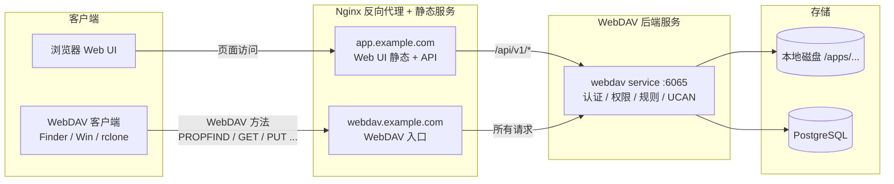

# WebDAV 部署架构（推荐）

本文说明 **WebDAV 后端 + Web UI + Nginx 代理** 的最佳部署实践，满足：
1) 第三方 WebDAV 客户端直连访问  
2) 浏览器 Web 页面访问  

同时兼顾上传稳定性与鉴权安全性（JWT / UCAN）。

## 1. 推荐拓扑（域名分离）

将 WebDAV 客户端与 Web UI 分离到不同域名，这是最稳妥、最少坑的方式。



### 说明
- **webdav.example.com**：只服务 WebDAV 客户端请求，根路径就是 WebDAV。  
- **app.example.com**：只服务 Web UI 静态文件与 API。  
- Nginx 负责 TLS、上传参数、反代路由与静态资源。  
- WebDAV 服务统一处理认证（JWT/UCAN）与权限校验。  

## 2. 关键设计原则

1) **WebDAV 与 Web UI 分离域名**  
   - 避免 SPA `try_files`/路由规则抢占 WebDAV 路径  
   - 避免 `/api` 重写导致的 301/404  
   - 第三方客户端配置更简单（直接填 WebDAV 域名）

2) **上传稳定性配置**  
   - `client_max_body_size` 设大  
   - `proxy_request_buffering off`  
   - `proxy_read_timeout / proxy_send_timeout` 足够长

3) **TLS 必开**  
   - Finder/Win/rclone 对 WebDAV HTTPS 依赖强  
   - UCAN/JWT 也应在 HTTPS 传输

4) **鉴权隔离**  
   - Web UI 主要使用 JWT 登录  
   - WebDAV 客户端可使用 Basic/JWT/UCAN  
   - UCAN 建议启用 `app:*` 目录隔离（见 `docs/zh/ucan.md`）

## 3. Nginx 配置要点（建议）

### 3.1 WebDAV 独立域名（推荐）

```nginx
server {
  server_name webdav.example.com;

  client_max_body_size 1000M;
  client_body_timeout 300s;
  proxy_request_buffering off;
  proxy_read_timeout 300s;
  proxy_send_timeout 300s;

  location / {
    proxy_pass http://127.0.0.1:6065;
    proxy_set_header Host $host;
    proxy_set_header X-Real-IP $remote_addr;
    proxy_set_header X-Forwarded-For $proxy_add_x_forwarded_for;
    proxy_set_header X-Forwarded-Proto $scheme;
    proxy_redirect off;
  }
}
```

### 3.2 Web UI 域名（静态 + API）

```nginx
server {
  server_name app.example.com;

  root /usr/share/nginx/html/webdav-ui;
  index index.html;

  location / {
    try_files $uri /index.html;
  }

  location /api/v1/ {
    proxy_pass http://127.0.0.1:6065;
    proxy_set_header Host $host;
    proxy_set_header X-Real-IP $remote_addr;
    proxy_set_header X-Forwarded-For $proxy_add_x_forwarded_for;
    proxy_set_header X-Forwarded-Proto $scheme;
  }
}
```

## 4. 单域名备选方案（不推荐，但可用）

如果只能使用一个域名，建议将 WebDAV 放在 `/dav/` 前缀：

```nginx
location /dav/ { proxy_pass http://127.0.0.1:6065; }
location / { try_files $uri /index.html; }
```

并在 WebDAV 服务配置中把 `webdav.prefix` 设置为 `/dav`，避免路径错乱。

## 5. 请求流说明

- **WebDAV 客户端**  
  直接访问 `https://webdav.example.com/`  
  -> Nginx -> WebDAV 服务 -> 磁盘/数据库  

- **Web 页面访问**  
  浏览器访问 `https://app.example.com/`  
  -> Nginx 静态文件  
  -> `/api/v1/*` 走后端鉴权接口  

## 6. 常见坑

- `/api` 反代去前缀，导致 WebDAV 路径被剥离 → 301/404  
- SPA `try_files` 抢占 WebDAV 路径 → Finder 无法连接  
- 代理缓存或 request buffering 导致大文件上传失败  

---

如需更细的 UCAN app scope 配置，请参考：`docs/zh/ucan.md`。
