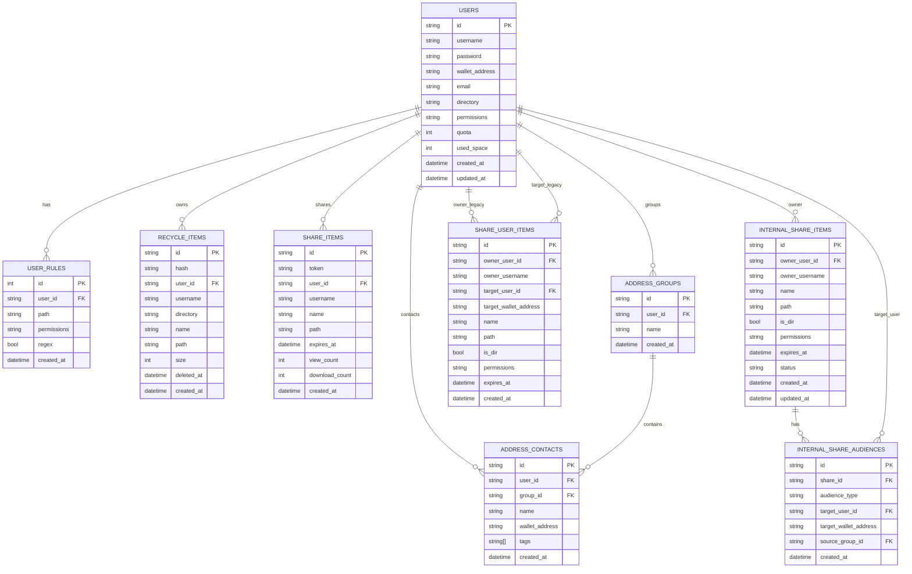

# Data Model

This document summarizes the PostgreSQL schema and key relationships.

## ER Diagram

## Key Tables

- **users**: core user record with permissions, quota, and wallet address.
- **user_rules**: path-level rules that override default permissions.
- **recycle_items**: deleted file records for restore/permanent delete.
- **share_items**: public share records keyed by token.
- **share_user_items**: legacy targeted-share table kept for backward compatibility.
- **internal_share_items / internal_share_audiences**: internal-share canonical tables for single-user, group-expanded, and all-users audiences.
- **address_groups / address_contacts**: address book and contacts.

## Migration & Compatibility

- Startup migration idempotently backfills legacy `share_user_items` rows into `internal_share_items / internal_share_audiences`.
- New writes are persisted to `internal_share_*`; legacy table remains mainly for compatibility and rollback fallback.
- API path remains unchanged (`/api/v1/public/share/user/*`), but create payload has been upgraded to `targetMode + targetAddresses/groupIds`; legacy single-field `targetAddress` payload is no longer supported.

## Indexes & Constraints (summary)

- `users.username` unique
- `users.wallet_address` unique (when non-null)
- `users.email` unique (when non-null)
- `share_items.token` unique
- `internal_share_items.id` unique
- `internal_share_audiences.id` unique
- `internal_share_audiences(share_id, audience_type, target_user_id)` unique when `audience_type='user'`
- `internal_share_audiences(share_id, audience_type)` unique when `audience_type='all_users'`
- `recycle_items.hash` unique
- `address_groups(user_id, name)` unique
- `address_contacts(user_id, wallet_address)` unique
