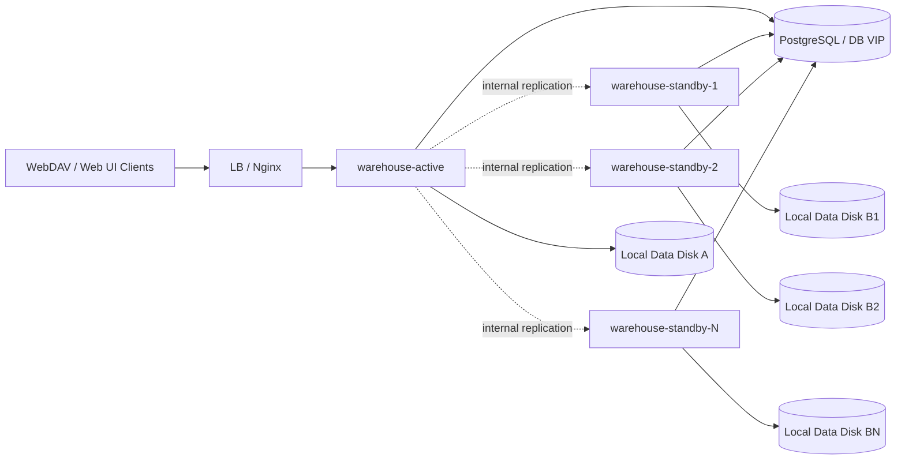

# 阶段一高可用部署：Active / Standby

本文描述 `warehouse` 阶段一高可用的**选定路线**：

- `1 active + N standby`
- 最小部署可以先从 `1 standby` 起步
- active 对外提供 `public` / `admin` 流量
- standby 不接用户流量，只接实例间 `internal` 同步流量
- active / standby 各自使用本地挂载目录
- 文件数据通过应用内 `internal` 同步保持多份
- PostgreSQL 采用主备、托管高可用，或至少具备可靠备份恢复能力

这是一种**单活 + 多 standby fan-out**方案；最小落地形态仍然可以是单活双机，但它不是正式多副本负载均衡方案。

## 1. 当前边界

阶段一的目标是：

- 让 standby 上始终有一份可接管的本地文件数据
- 在 active 故障后，standby 能在可接受的 RPO / RTO 内接管
- 不要求当前就支持多副本并发接流量

阶段一不解决：

- WebDAV 锁跨副本共享
- challenge / email code 跨副本共享
- 多副本无状态扩缩容

这些属于后续正式多副本阶段。

## 2. 拓扑



说明：

- 只有 active 在 LB 上游池中
- standby 平时不接 public/admin 流量
- standby 需要能被 active 访问到 `internal` 接口
- standby 不需要配置静态 peer；standby 不主动分发，只需要正确上报 `node.advertise_url`
- active 与 standby 均连接同一个 PostgreSQL 高可用拓扑

## 3. 方案要点

### 3.1 只同步文件，不同步业务元数据

阶段一建议：

- 元数据以 PostgreSQL 为准
- 文件树变化通过 `internal` 接口同步
- 不在应用层实例之间同步用户、分享、回收站记录等数据库数据

### 3.2 standby 不是第二个 active

standby 的职责是：

- 接收复制事件
- 在本地盘上幂等应用文件变更
- 暴露健康状态和复制状态
- 在故障时接管流量

standby 不应该：

- 正常情况下接 public/admin 用户写流量
- 与 active 同时写同一份逻辑文件树

### 3.3 历史补齐 + 后续增量

当前实现支持：

- active 启动后会对当前所有有效 standby 逐个触发 startup reconcile
- active 会周期性扫描当前健康 standby，对仍处于 `pending` / `reconciling` 或缺少当前 generation baseline 的 standby 自动再次触发 reconcile
- reconcile 成功后，active 会自动向对应 standby 发送一次 `bootstrap/mark`，把当前 watermark outbox id 写成该 generation 的 baseline offset
- 如果某条 assignment 因历史补齐失败进入 `error`，allocator 会按退避节奏自动把它恢复到 `pending`，让后续 auto reconcile 继续接管

建议顺序：

1. 确保 active / standby 都已启动，且 internal 鉴权配置一致
2. 等待 active 完成 startup reconcile；如果启动窗口内未完成，继续观察后台 periodic auto reconcile 是否补齐
3. 当 standby baseline 初始化成功后，继续依赖 outbox 增量复制追平后续变更
4. 最后根据复制 lag、assignment 状态与 reconcile 状态判断是否具备切换资格

如果你要显式控制历史基线（例如离线全量拷贝后再接入），仍可手工走 `bootstrap/mark` 流程；但这已经不是正常启动后的主路径。

日常运维统一通过二进制 CLI 操作：

```shell
# 查看当前节点复制状态
build/warehouse ha status -c config.yaml

# 在 active 上查看某个 standby 的复制状态
build/warehouse ha status -c config.yaml --target-node-id warehouse-standby-1

# 直接查看某个 standby 实例自己的复制状态
build/warehouse ha status -c config.yaml --peer --target-node-id warehouse-standby-1

# 手工触发某个 standby 的历史补齐
build/warehouse ha reconcile start -c config.yaml --target-node-id warehouse-standby-1

# 查看某个 standby 的历史补齐状态
build/warehouse ha reconcile status -c config.yaml --target-node-id warehouse-standby-1

# 显式写入某个 standby 的 bootstrap baseline
build/warehouse ha bootstrap mark -c config.yaml --peer --target-node-id warehouse-standby-1 --outbox-id 123

# 观察 assignment 状态
build/warehouse ha assignments status -c config.yaml
```

说明：

- 默认访问当前实例；在多 standby 场景下建议显式带上 `--target-node-id`
- `--peer` 表示通过共享控制面解析目标 standby 地址，并直接访问该 standby 的 internal 接口
- 在多 standby 场景下，推荐把 `--peer` 和 `--target-node-id` 一起使用；如果只传 `--peer`，当前会使用控制面解析出的第一个匹配 peer
- 常规 baseline 运维建议统一使用 `build/warehouse ha bootstrap mark --peer --target-node-id ...`

## 4. 当前 readiness 的作用与边界

仓库中已提供：

- `GET /api/v1/public/health/heartbeat`
- `GET /api/v1/public/health/readiness`
- `warehouse -c config.yaml --check-ready`

它们当前只能回答：

- 进程是否活着
- 本机数据库是否可连通
- 本机 `webdav.directory` 是否存在且可写

它们**不能**回答：

- standby 是否已经追平 active
- 复制事件是否卡住
- standby 是否还有未应用的 outbox 事件

因此阶段一切换时，除了 readiness，还必须看**复制状态**。

## 5. 切换前必须满足的条件

建议至少满足：

1. active 已经失去写能力，或已被摘流量并确认不会继续写入
2. standby 本机 readiness 成功
3. standby 的复制 lag 在可接受 RPO 内
4. standby 已应用的最后事件序号不落后于切换基线
5. PostgreSQL 已具备可用的主库或可恢复的数据库入口

## 6. 建议的切换流程

1. 确认 active 故障，或人工进入切换窗口
2. 对 active 做 fencing，避免双写
3. 检查 standby：
   - readiness 正常
   - 复制 lag 正常
   - 最后应用事件序号达到切换要求
4. 将 LB 上游从 active 切到 standby
5. 执行验收：
   - WebDAV 目录列表
   - 上传一个小文件
   - 下载刚上传的文件
   - 分享访问
   - 回收站列表 / 恢复 / 删除

## 7. 验收重点

阶段一至少要验证：

- WebDAV PUT / MKCOL / MOVE / DELETE 会产生复制事件
- 回收站恢复 / 清理会同步到 standby
- 定向分享中的 upload / folder / rename / delete 会同步到 standby
- standby 重复应用同一事件不会产生错误结果
- standby 落后时，系统能明确暴露 lag
- 人工切换演练能在目标 RTO 内完成

## 8. 推荐配套文档

- 总体方案：[multi-instance-replica-design.md](./multi-instance-replica-design.md)
- 详细设计：[internal-replication-design.md](./internal-replication-design.md)
- 实施清单：[internal-replication-implementation-checklist.md](./internal-replication-implementation-checklist.md)

## 9. 当前文档状态说明

本文沉淀的是**选定方案**，同时也作为当前阶段一实现的使用说明。

当前仓库已经具备：

- `internal` 鉴权与复制接口
- `replication_outbox` / `replication_offsets` 持久化状态
- `cluster_nodes` / `cluster_replication_assignments` 控制面
- standby 侧幂等 apply handler
- active 侧按 standby 独立推进的顺序分发 worker
- 当前所有有效 standby 的 outbox fan-out
- reconcile 与 assignment 生命周期联动
- reconcile 成功后自动 `bootstrap mark`
- startup reconcile + periodic auto reconcile sweep
- `error assignment` 自动退避恢复到 `pending`
- 可按 `target-node-id` 观察 standby 状态的状态接口与 assignment CLI

当前仍需继续补齐：

- 基于差异比较的更完整周期性对账 / 漂移修复
- 更细粒度的多 standby 并发控制、带宽限流与背压
- 更完整的切换自动化、failover / promote / rebalance 能力
- 更完整的多 standby 观测、指标与告警
