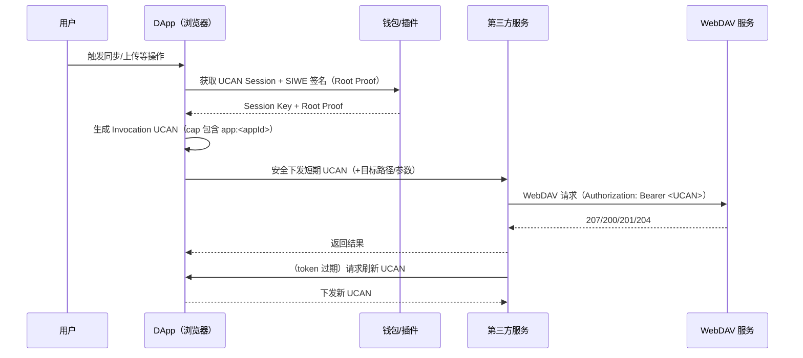

# WebDAV 中的 UCAN 认证说明

本文档基于当前后端实现，说明 WebDAV 服务如何校验 UCAN（User-Controlled Authorization Networks）令牌，以及能力匹配规则与排查方式。

> 重点：本服务默认只做“认证准入 + 必需能力校验”，不把 UCAN 的 action 映射为通用 CRUD 权限；  
> 但当使用 `app:<appId>` 能力时，会基于 action（`read`/`write`/`create`/`update`/`delete`/`move`/`copy`）对应用目录做访问限制。

## 1. 启用方式与配置

在 `config.yaml` 中启用 UCAN：

```yaml
web3:
  ucan:
    enabled: true
    audience: "did:web:127.0.0.1:6065"
    required_resource: "app:*"
    required_action: "read,write"
    app_scope:
      path_prefix: "/apps"
```

只读模式：将 `required_action` 改为 `read`，写操作会返回 403。

- `enabled`: 开启 UCAN 校验。
- `audience`: UCAN 的 `aud` 必须匹配此值。为空时默认 `did:web:localhost:<port>`。
- `required_resource` / `required_action`：会组合成“必需能力”，用于校验 UCAN 的 `cap`。
  - 若两者都为空：不做能力校验（仅验证 UCAN 本身）。
  - 若其中一个为空：会自动补 `*`。
  - 支持多值（`,` 或 `|` 分隔），例如 `read,write` 或 `read`。
  - 支持动作：`read`、`write`、`create`、`update`、`delete`、`move`、`copy`（`write` 视为写操作总开关）。
- `app_scope.path_prefix`：应用目录根前缀，默认 `/apps`。
- 当 UCAN `cap` 中包含 `app:<appId>` 时，会自动启用应用目录隔离（应用级 Path Scope）：
  - 服务端会提取所有 `resource` 以 `app:` 开头的 cap，形成 `appId -> actions` 白名单。
  - `appId` 必须是单段字符串（`a-zA-Z0-9._-`），不支持 `*` 通配。
  - 请求路径必须落在 `${app_scope.path_prefix}/<appId>/...` 下，否则直接拒绝。
  - `action` 由 UCAN cap 决定，且会被 `required_action` 进一步过滤（例如只读模式下写操作会被拒绝）。
  - **如果一个 UCAN 同时包含多个 `app:<appId>`**，则该 UCAN 可以访问多个应用目录；每次请求会根据路径选择对应 appId 校验。
    - MOVE/COPY 会同时校验源路径与目标路径；若两个 appId 都在 cap 中且动作允许，则可跨应用移动/复制。
    - 若不希望单个 UCAN 访问多个应用，建议为每个 app 单独签发 UCAN（或在网关/业务层禁止跨 app MOVE/COPY）。

## 2. 认证入口

当请求携带 `Authorization: Bearer <token>` 时：

- 若 token 看起来像 UCAN（JWS 头部 `typ=UCAN` 或 `alg=EdDSA`），走 UCAN 校验。
- 否则走 JWT 校验。

## 3. UCAN 校验流程（实现细节）

### 3.1 JWS 基础校验

- UCAN 必须是 **EdDSA** 签名的 JWS。
- `iss` 必须是 `did:key:z...`，服务端会从 did:key 解析出 ed25519 公钥。
- 校验 `exp` / `nbf`（毫秒或秒时间戳均可）。

### 3.2 Audience 校验

- `payload.aud` 必须与 `web3.ucan.audience` 完全一致。

### 3.3 能力校验（cap）

- UCAN 的能力字段：`cap: [{ resource, action }]`。
- 服务端会把 `required_resource` / `required_action` 组合成必需能力列表。
- 当前匹配规则：
  - `*` 表示全匹配。
  - 以 `*` 结尾的前缀匹配（如 `app:*` 或 `files*`）。
  - 否则为全等匹配。
  - 支持通配符与多值匹配（`,` 或 `|` 分隔）。
  - 通配符可以出现在 **required 或 cap** 中（两者都会被匹配）。

### 3.4 Proof Chain（prf）校验

UCAN 的 `prf` 支持两种形式：

1. **链式 UCAN**：`prf` 里是 UCAN 字符串
   - 每一跳要求 `aud` 等于上一跳 `iss`。
   - 每一跳 `cap` 必须覆盖上一跳所需能力。
   - 每一跳的 `exp` 不能早于上一跳。

2. **Root Proof（SIWE）**：`prf` 里是一个 JSON 对象
   - `type = "siwe"`
   - `siwe.message` 内包含一行 `UCAN-AUTH: {...}`，服务端从中解析 `aud`/`cap`/`exp`/`nbf`。
   - `siwe.signature` 用以恢复以太坊地址，作为 `did:pkh:eth:<address>`。

最终根证明需要满足：

- root 的 `aud` 与当前 `iss` 匹配。
- root 的 `cap` 覆盖当前所需能力。
- root 的 `exp` 不早于当前 `exp`。

## 4. 与权限系统的关系

UCAN 只决定是否允许“以该身份进入系统”。进入后仍会做：

- 用户权限（CRUD）校验
- 规则匹配（path/regex）校验
- 配额限制

当 UCAN 携带 `app:<appId>` 能力时，还会额外对 **路径前缀** 与 **读写动作** 做限制。

因此 UCAN 能通过，并不代表一定拥有读写权限。

## 5. 详细示例（含日志排查）

### 5.1 服务端配置

示例：**WebDAV 应用目录隔离**（推荐配置）。

```yaml
web3:
  ucan:
    enabled: true
    audience: "did:web:webdav.your-domain.com"
    required_resource: "app:*"
    required_action: "read,write"
    app_scope:
      path_prefix: "/apps"
```

配置含义：
- `enabled: true`：启用 UCAN 校验。
- `audience`：**WebDAV 服务自身的 DID**，必须与 UCAN `aud` 完全一致。
- `required_resource: "app:*"`：强制 UCAN 必须携带 `app:<appId>` 能力（触发应用目录隔离）。
- `required_action: "read,write"`：允许读写；只读场景改为 `read`（写操作会 403）。
- `app_scope.path_prefix`：应用目录根前缀（默认 `/apps`），会把 `app:<appId>` 映射为 `/apps/<appId>/...`。

如需兼容其他后端能力（比如非 WebDAV 的 `profile#read`），请在 **UCAN cap 中额外加入**对应能力，
但 `required_resource/action` 仍建议以 `app:*` 为主，避免绕过应用隔离。

### 5.2 UCAN 令牌能力（cap）

UCAN payload 示例（只展示关键字段）：

```json
{
  "iss": "did:key:z6Mk...",
  "aud": "did:web:webdav.your-domain.com",
  "cap": [
    { "resource": "app:dapp-a", "action": "write" }
  ],
  "exp": 1738560000000,
  "prf": [ "... root proof or delegated UCAN ..." ]
}
```

当客户端携带 `Authorization: Bearer <UCAN>` 访问 WebDAV 时：  
- 若 `cap` 中包含 `app:<appId>`，且 `action` 满足当前方法需要的动作（`read/write/create/update/delete/move/copy`），即通过 UCAN 校验。  
- 若 `cap` 中不包含任何 `app:<appId>`，且服务端配置了 `required_resource=app:*`，则会触发 `UCAN capability denied`。  

**指定两个 appId 的方式**：在 `cap` 中放入两个应用能力即可，例如：

```json
{
  "cap": [
    { "resource": "app:dapp-a", "action": "write" },
    { "resource": "app:dapp-b", "action": "read" }
  ]
}
```

含义：  
- `/apps/dapp-a/...` 允许读写  
- `/apps/dapp-b/...` 只读  

> 注意：单个 UCAN 包含多个 `app:<appId>` 时，服务端会**按路径匹配 appId** 来校验动作。  
> MOVE/COPY 会同时校验源路径与目标路径；若你不希望跨应用操作，请为每个 app 单独签发 UCAN。

### 5.3 失败日志示例

```
WARN ucan.go:... ucan capability denied {
  "required_caps": "app:*#read,write",
  "provided_caps": "app:dapp-a#read",
  "audience": "did:web:webdav.your-domain.com",
  "issuer": "did:key:z..."
}
```

通过日志即可明确：**服务端要求 `app:*#read,write`，而客户端只给了 `app:dapp-a#read`**，写操作会被拒绝。

## 6. 资源/动作建议（WebDAV 场景）

> 注意：本服务对 UCAN 的“必需能力”做准入校验；真正影响 WebDAV 访问的是 `app:<appId>` 的目录前缀与动作限制。  
> 因此 WebDAV 场景建议以 `app:<appId>` 作为核心能力。

### 6.1 推荐资源（resource）

- `app:<appId>`：应用目录权限（推荐，触发 app scope）。
- 若你还有其他后端（非 WebDAV）需要 UCAN 准入，可在 cap 中额外加入业务资源（如 `profile` / `share`），  
  但 **WebDAV 不会把它们映射成目录权限**。

> 提示：`webdav#access` 属于旧示例能力，仅当你把 `required_resource/action` 配成 `webdav/access` 时才需要；  
> 当前 WebDAV 推荐使用 `app:*`，不需要 `webdav#access`。

### 6.2 推荐动作（action）

- 读写两档：`read` / `write`
- 细粒度：`create` / `update` / `delete` / `move` / `copy`
- `write` 等价于所有写类动作（见 7.5 对照表）

### 6.3 推荐的最小可用方案

- **required_resource = `app:*`**  
- **required_action = `read,write`**（只读场景改为 `read`）

### 6.4 环境隔离建议

- **推荐**使用不同 `audience` 区分环境：  
  - 生产：`did:web:webdav.prod.example.com`  
  - 测试：`did:web:webdav.staging.example.com`
- 或在 `appId` 中编码环境：`prod.example.com` / `staging.example.com`
- **不建议**使用 `webdav:prod` 这类资源做隔离（本服务不会映射为目录权限，且易被通配符覆盖）

### 6.5 安全使用建议

- **required_resource/action 不要留空**，否则任何 UCAN 都可能通过。
- **audience 固定为你的服务域名**，避免跨环境/跨系统复用。
- **缩短 exp 生命周期**（例如 5~30 分钟），避免长期凭证被滥用。
- **不要在 UCAN cap 中使用 `app:*` 或 `app:xxx*` 通配**（会绕过 app scope 的目录限制）。
- 需要更细粒度授权时，在 DApp 或网关侧继续做路径/动作校验。

## 7. 多应用隔离最佳实践（DApp/插件场景）

常见需求：同一用户在多个 DApp/钱包插件中使用 WebDAV，但每个应用 **只能访问自己的目录**。

### 7.1 推荐目录规范

统一约定应用目录前缀：  
`/apps/<appId>/...`

例如：  
- DApp A：`/apps/dapp-a/`
- 插件 B：`/apps/plugin-b/`

### 7.2 UCAN 资源/动作规范（建议）

建议将 `resource` 绑定到应用维度，`action` 表示读写权限：  
- `resource = app:<appId>`
- `action = read` 或 `write`，以及更细粒度的 `create/update/delete/move/copy`
  - `write` 默认包含写类动作（create/update/delete/move/copy）

例如 DApp A 签发 UCAN：  
```
cap: [{ "resource": "app:dapp-a", "action": "write" }]
```

#### appId 命名规范（推荐）

建议使用**域名主机部分**作为 appId（不含协议/路径/查询/端口），并全部小写：

- `https://dapp.example.com` → `appId = dapp.example.com`
- `https://wallet.example.org` → `appId = wallet.example.org`

如需区分环境：

- `https://staging.example.com` → `appId = staging.example.com`
- `https://prod.example.com` → `appId = prod.example.com`

注意：服务端只校验字符合法性（`a-z0-9.-_`），不会验证域名归属；签发 UCAN 的一方需确保 appId 与真实应用一致。

### 7.3 服务器侧隔离方案（按安全强度）

**方案 A：多实例（推荐、最安全）**  
每个应用一个 WebDAV 实例（或子域名），配置不同的 `audience` 与 `required_resource/action`，并把目录指向对应的应用目录。  
好处：强隔离、简单可靠；缺点：运维成本高。

**方案 B：网关隔离（单实例）**  
在网关层对 `Host/Path` 做映射：  
- `webdav-dapp-a.example.com` → 强制前缀 `/apps/dapp-a/`  
- 校验 UCAN `cap` 是否包含 `app:dapp-a#write`  
好处：单实例，隔离仍强；缺点：需要网关改造。

**方案 C：服务内校验（已内置）**  
服务端会解析 UCAN `cap`，将 `resource=app:<appId>` 映射为路径前缀限制，并在每个请求中做校验。  
当 UCAN 含 `app:<appId>` 能力时自动生效；若要**强制所有 UCAN 必须携带 app 能力**，请设置：  
`required_resource = "app:*"`。

### 7.4 当前实现的限制

当前服务端只支持 **全局** `required_resource/action`，并提供基于 `app:<appId>` 的应用目录隔离：  
- **仅对 UCAN 请求生效**（JWT/Basic 不受影响）。  
- `app:<appId>` 会触发目录隔离；读写权限由 action 决定。  
  - 读类：`read`
  - 写类：`create` / `update` / `delete` / `move` / `copy`（`write` 作为写类总开关）
- 只支持单段 appId（不支持 `*` 通配），并以路径前缀做隔离。  

如果多个应用共用一个实例，建议启用 **方案 C**（或采用方案 A/B 进一步加强隔离）。

### 7.5 WebDAV 方法 → action 对照表

| WebDAV 方法 | action |
| --- | --- |
| GET / HEAD / PROPFIND / REPORT / SEARCH | `read` |
| MKCOL / POST | `create` |
| PUT | `update` 或 `create` |
| PATCH / PROPPATCH / LOCK / UNLOCK | `update` |
| DELETE | `delete` |
| MOVE | `move` |
| COPY | `copy` |

> 说明：如果 UCAN cap 只有 `write`，会被视为允许所有写类动作（create/update/delete/move/copy）。

### 7.6 接入示例（前端/DApp 侧）

目标：DApp 仅访问自己的目录 `/apps/<appId>/...`，并通过 UCAN 完成认证。

**前提配置**

```yaml
web3:
  ucan:
    enabled: true
    audience: "did:web:webdav.your-domain.com"
    required_resource: "app:*"
    required_action: "read,write"
    app_scope:
      path_prefix: "/apps"
```

**DApp 侧约定**

- 统一 appId：例如 `dapp-a`
- 所有文件路径都放在 `/apps/dapp-a/...`
- UCAN 必须包含 `app:dapp-a#write`（或 `read` / `create` / `update` / `delete` / `move` / `copy`）能力

**DApp 侧 appId 与 cap 生成示例（浏览器）**

```ts
// 当前 DApp 域名作为 appId（不含协议/端口/路径）
const appId = window.location.hostname.toLowerCase();

// 当前 DApp：读写自己目录
const caps = [
  { resource: `app:${appId}`, action: 'write' },
];

// 额外只读的其他应用目录（按需配置）
const extraReadApps = ['foo.com', 'bar.org'];
for (const otherAppId of extraReadApps) {
  caps.push({ resource: `app:${otherAppId}`, action: 'read' });
}

// caps 作为 UCAN 能力列表参与签发（root / invocation）
// createRootUcan({ ..., capabilities: caps })
// createInvocationUcan({ ..., capabilities: caps })
```

> 注意：不要使用 `app:*` 或 `app:xxx*`，否则会绕过目录隔离。

**UCAN payload 示例（核心字段）**

```json
{
  "iss": "did:key:z6Mk...",
  "aud": "did:web:webdav.your-domain.com",
  "cap": [
    { "resource": "app:dapp-a", "action": "write" }
  ],
  "exp": 1738560000000,
  "prf": [ "... root proof / delegated UCAN ..." ]
}
```

**前端请求示例**

```ts
const token = "<UCAN_JWS>";
const base = "https://webdav.your-domain.com";

// 1) 列目录
fetch(`${base}/apps/dapp-a/`, {
  method: "PROPFIND",
  headers: { Authorization: `Bearer ${token}`, Depth: "1" },
});

// 2) 上传文件
fetch(`${base}/apps/dapp-a/docs/readme.txt`, {
  method: "PUT",
  headers: { Authorization: `Bearer ${token}` },
  body: fileBlob,
});
```

**常见错误**

- 返回 403：UCAN 缺少 `app:<appId>` 能力，或访问路径不在 `/apps/<appId>/` 下。
- 返回 401：UCAN 校验失败（audience/exp/prf 等）。

### 7.7 签发 UCAN（含 SIWE root proof）示例

下面是一个**完整签发流程**的参考示例，包含 SIWE root proof 与 UCAN JWS。  
注意：服务端只解析 `UCAN-AUTH:` 行并通过签名恢复地址，不会校验 SIWE 的 domain/nonce 等字段，但**建议你仍按 SIWE 规范生成 message**。

#### 步骤 1：准备能力与 appId

```json
[
  { "resource": "app:dapp-a", "action": "write" }
]
```

#### 步骤 2：生成 SIWE message 并签名（EIP-191）

示例 message（只展示常用字段）：

```
example.com wants you to sign in with your Ethereum account:
0xAbC...1234

URI: https://example.com
Version: 1
Chain ID: 1
Nonce: 8d9f2c
Issued At: 2026-02-03T10:00:00Z
UCAN-AUTH: {"aud":"did:web:webdav.your-domain.com","cap":[{"resource":"app:dapp-a","action":"write"}],"exp":1738560000000}
```

钱包签名得到 `signature`（形如 `0x...`）。

#### 步骤 3：构造 root proof 对象

```json
{
  "type": "siwe",
  "iss": "did:pkh:eth:0xabc...1234",
  "siwe": {
    "message": "<上面的 SIWE message>",
    "signature": "0x..."
  }
}
```

说明：
- `iss` 可省略；若填写，必须与签名恢复出的地址一致。
- `aud/cap/exp` 推荐放在 `UCAN-AUTH` 行里；root 顶层的 `aud/cap/exp` 也支持，但会被 `UCAN-AUTH` 覆盖。

#### 步骤 4：构造 UCAN JWS

UCAN Header：
```json
{ "alg": "EdDSA", "typ": "UCAN" }
```

UCAN Payload（核心字段）：
```json
{
  "iss": "did:key:z6Mk...",
  "aud": "did:web:webdav.your-domain.com",
  "cap": [
    { "resource": "app:dapp-a", "action": "write" }
  ],
  "exp": 1738560000000,
  "prf": [
    {
      "type": "siwe",
      "iss": "did:pkh:eth:0xabc...1234",
      "siwe": {
        "message": "<上面的 SIWE message>",
        "signature": "0x..."
      }
    }
  ]
}
```

使用 `ed25519` 私钥对 `base64url(header) + "." + base64url(payload)` 签名，得到 UCAN JWS。

#### 步骤 5：请求服务

```
Authorization: Bearer <UCAN_JWS>
```

然后按 `/apps/dapp-a/...` 路径访问即可通过 app scope 校验。

### 7.8 第三方服务端接入（UCAN）完整时序 + 示例代码

目标：第三方服务代表用户访问 WebDAV，但**权限只限于指定 app 目录**。

#### 7.8.1 时序图（Mermaid）



#### 7.8.2 安全下发（推荐模式）

安全下发的目标：**第三方只拿到短期 Invocation UCAN**，且能力最小化；  
**Root Proof / Session Key 不应外泄**。

推荐做法（服务器中转）：

1) **用户在 DApp 页面授权**（明确“授予第三方访问哪些 app 目录、哪些动作”）。  
2) DApp 前端将授权请求发送给 **DApp 自己的后端**（带登录态）。  
3) DApp 后端生成 **短期 Invocation UCAN**（5~30 分钟），**仅包含必要 `app:<appId>` 能力**。  
4) DApp 后端通过 **HTTPS** 将 UCAN 下发给第三方服务（建议后端到后端，不要暴露在浏览器或 URL）。  

安全要求：
- **只下发短期 Invocation UCAN**，不要下发 root proof 或 session key。  
- **能力最小化**：只给必要的 `app:<appId>` + `read/write`（或更细粒度动作）。  
- **不使用 URL 参数传递 UCAN**（避免被日志/Referer 泄露）。  
- 建议**后端到后端**通信，并限制来源 IP / client_id。  
- 建议在 DApp 后端维护 **授权记录与可撤销列表**（便于禁用第三方）。  

可选的下发接口约定（示例）：
- `POST /third-party/ucan/issue`：用户授权后调用，返回 `{ ucan, exp }`
- `POST /third-party/ucan/refresh`：用于刷新（见下一节）

#### 7.8.3 更新/刷新 UCAN（建议）

第三方**不自行刷新** UCAN，而是请求 DApp 后端重新签发短期 Invocation UCAN：

- **刷新触发条件**：
  - `exp - now < 1~2 分钟`
  - 或请求返回 `401`（token 过期）/ `403`（权限不足）
- **刷新流程**：
  1) 第三方调用 `POST /third-party/ucan/refresh`  
  2) DApp 后端校验第三方身份与授权记录  
  3) DApp 后端重新签发短期 UCAN，返回 `{ ucan, exp }`

建议：
- 对刷新接口 **限流**（避免刷爆钱包签名或后台资源）。  
- 若授权被撤销，刷新直接返回 403。  
- 刷新失败时，第三方应要求用户重新授权。

#### 7.8.4 DApp 侧生成 UCAN 的关键要点

- **cap 必须包含 `app:<appId>`**，否则无法访问 `/apps/<appId>/...`
- 建议使用短期 `exp`（例如 5~30 分钟），第三方到期后向 DApp 请求刷新

示例能力：
```json
[
  { "resource": "app:dapp.example.com", "action": "write" },
  { "resource": "app:foo.com", "action": "read" }
]
```

#### 7.8.5 第三方服务端示例（Node.js）

> 说明：第三方服务只需要拿到 UCAN 并调用 WebDAV；**不需要**钱包私钥。

```ts
import fetch from 'node-fetch';

const webdavBase = 'https://webdav.example.com';
const ucan = process.env.UCAN_TOKEN; // 由 DApp 下发（短期）

async function listAppDir(appId: string) {
  const res = await fetch(`${webdavBase}/apps/${appId}/`, {
    method: 'PROPFIND',
    headers: {
      Authorization: `Bearer ${ucan}`,
      Depth: '1',
    },
  });
  if (!res.ok) throw new Error(`PROPFIND failed: ${res.status}`);
  return res.text();
}

async function uploadFile(appId: string, path: string, content: string) {
  const res = await fetch(`${webdavBase}/apps/${appId}/${path}`, {
    method: 'PUT',
    headers: { Authorization: `Bearer ${ucan}` },
    body: content,
  });
  if (!res.ok) throw new Error(`PUT failed: ${res.status}`);
}

// 示例调用
await listAppDir('dapp.example.com');
await uploadFile('dapp.example.com', 'docs/readme.txt', 'Hello WebDAV');
```

#### 7.8.6 失败处理建议

- `401`：UCAN 过期或无效 → 让 DApp 重新签发 UCAN
- `403`：cap 不匹配或路径不在 `/apps/<appId>/` 下
- 建议第三方服务在 UCAN 过期前 1~2 分钟主动向 DApp 请求刷新

## 8. 日志与排查

当出现 `UCAN capability denied` 时，日志会给出：

```
WARN ucan.go:... ucan capability denied {
  "required_caps": "app:*#read,write",
  "provided_caps": "app:dapp-a#read",
  "audience": "did:web:127.0.0.1:6065",
  "issuer": "did:key:z..."
}
```

排查建议：

1. **对比 required/provided**：确保 UCAN 内含满足要求的 `cap`。
2. **检查 audience**：UCAN 的 `aud` 是否与服务端一致。
3. **检查时效**：`exp/nbf` 是否有效。
4. **检查 proof chain**：中间层 `aud/cap/exp` 是否逐级满足要求。

## 9. 常见配置示例

### JWT 登录 + UCAN 登录 + app scope（完整示例）

**服务端配置**

```yaml
web3:
  jwt_secret: "your-super-secret-jwt-key-at-least-32-characters-long"
  token_expiration: 24h
  refresh_token_expiration: 720h
  ucan:
    enabled: true
    audience: "did:web:webdav.your-domain.com"
    required_resource: "app:*"
    required_action: "read,write"
    app_scope:
      path_prefix: "/apps"
```

**JWT 登录（钱包签名）**

1) 获取挑战

```
POST /api/v1/public/auth/challenge
{ "address": "0xAbC...1234" }
```

2) 验证签名获取 JWT

```
POST /api/v1/public/auth/verify
{ "address": "0xAbC...1234", "signature": "0x..." }
```

返回：`access_token`（JWT）与 `refresh_token`。

**UCAN 登录（DApp 侧）**

UCAN payload 必须包含：

```json
{
  "aud": "did:web:webdav.your-domain.com",
  "cap": [
    { "resource": "app:dapp.example.com", "action": "write" }
  ]
}
```

并携带 SIWE root proof（参考 7.6 章节）。

**访问示例（受 app scope 限制）**

```
Authorization: Bearer <JWT 或 UCAN>

GET/PUT/PROPFIND /apps/dapp.example.com/...
```

- 使用 **JWT**：不受 app scope 限制（仍受用户权限/规则约束）。
- 使用 **UCAN**：必须带 `app:dapp.example.com`，且路径必须在 `/apps/dapp.example.com/` 下。

### 仅校验 audience，不校验能力

```yaml
web3:
  ucan:
    enabled: true
    audience: "did:web:127.0.0.1:6065"
    required_resource: ""
required_action: ""
```

说明：该配置仅做 UCAN 真实性校验，**不会强制 app scope**。仅当 UCAN cap 中包含 `app:<appId>` 时才会启用目录隔离。
不建议用于生产环境。

### 必须包含 `files#read` 能力

```yaml
web3:
  ucan:
    enabled: true
    audience: "did:web:127.0.0.1:6065"
    required_resource: "files"
    required_action: "read"
```

UCAN 示例能力字段：

```json
{
  "cap": [
    { "resource": "files", "action": "read" }
  ]
}
```

说明：此示例仅用于展示 `required_resource/action` 语法，与 WebDAV 的应用目录隔离无关。

---

如需更细粒度的 UCAN 授权（例如按路径/方法控制），建议在 DApp 或网关侧实现，本服务当前不内置该逻辑。
