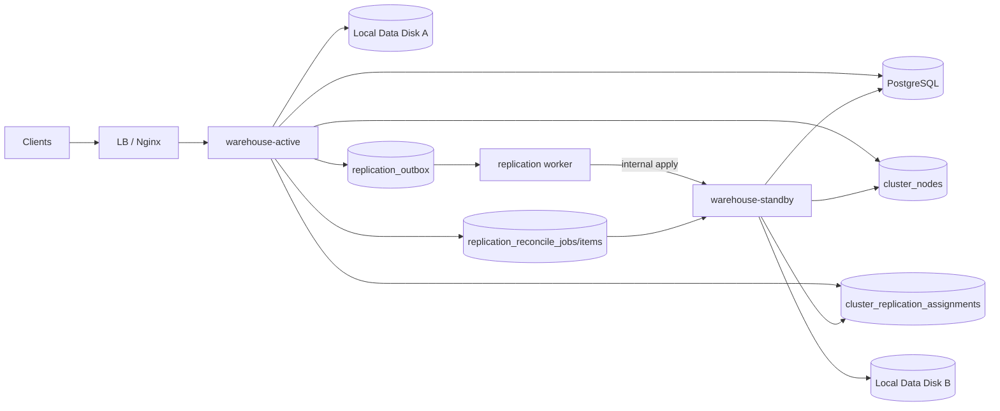

# 内部复制版备用节点设计

本文定义 `warehouse` 阶段一高可用的**内部复制方案**：

- active 对外服务
- standby 不对外接 public/admin 用户流量
- 文件变更由 active 通过 `internal` 接口复制到 standby
- PostgreSQL 仍然作为元数据的统一来源

> 注意：本文以**当前实现 + 后续演进建议**为主。当前仓库已经落地了节点身份、内部鉴权、`cluster_nodes` / `cluster_replication_assignments` 控制面、outbox / offsets / reconcile、standby apply handler、active worker、assignment generation fence，以及 `1 active -> N standby` fan-out、startup reconcile、periodic auto reconcile sweep、reconcile 成功后自动 `bootstrap mark`、`error assignment` 自动退避恢复的主链路。更完整的切换自动化与多 standby 编排仍需继续补齐。

## 1. 设计目标

目标：

1. 让 standby 上始终有一份接近 active 的本地文件副本
2. 让应用自己掌握复制 lag、失败重试、最后应用序号
3. 在不引入共享存储的前提下，支持单活 + standby 接管，最小可先从双机形态落地

非目标：

- 正式多副本负载均衡
- WebDAV 锁跨副本共享
- challenge / email code 跨副本共享
- 数据库元数据的应用层双写同步

## 2. 总体架构

图中只画一个 standby 便于说明单条复制链路；当前实现已经支持 active 按 assignment 对多个 standby fan-out。

核心原则：

- **数据库元数据以 PostgreSQL 为准**
- **复制控制面以 assignment 为准**
- **文件复制以 outbox 事件为准**
- **复制是异步的，不做请求内双写**
- **standby apply 必须幂等**
- **切换前必须检查复制 lag**

## 3. 为什么不用“请求内双写”

不建议把用户一次写请求做成：

- 先写 active 本地盘
- 再同步写 standby 本地盘
- 两边都成功才返回

原因：

- standby 短时故障会直接拖慢或拖垮 active 写请求
- 大文件上传时延会显著增加
- half-success 状态补偿复杂
- 删除 / rename / recycle 语义更难兜底

因此阶段一采用：

1. active 本地先完成写入
2. 记录持久化 outbox 事件
3. 后台 worker 异步复制到 standby
4. standby 记录已应用序号

## 4. 事件模型

### 4.1 事件表达原则

复制事件不使用“用户视角路径”，而使用：

- **相对于 `webdav.directory` 根目录的规范化路径**

这样做的好处：

- WebDAV、回收站、定向分享都能收敛到统一模型
- standby 不需要理解太多业务语义，只需要应用文件系统变更
- 回收站操作可以表达成普通的 `move/remove`

例如：

- WebDAV 删除：`move /alice/a.txt -> /.recycle/<hash>_a.txt`
- 回收站恢复：`move /.recycle/<hash>_a.txt -> /alice/a.txt`
- 清空回收站：`remove /.recycle/<hash>_a.txt`

### 4.2 建议的基础事件类型

建议第一版只支持这几类通用事件：

1. `ensure_dir`
   - 确保目录存在
2. `upsert_file`
   - 创建或覆盖一个文件
3. `move_path`
   - 重命名 / 移动路径
4. `copy_path`
   - 复制路径
5. `remove_path`
   - 删除文件或目录

这些事件足以覆盖当前主要写路径：

- WebDAV `PUT` / `MKCOL` / `MOVE` / `COPY` / `DELETE`
- 回收站 `Recover` / `Remove` / `Clear`
- 定向分享 `upload` / `folder` / `rename` / `delete`

## 5. 当前代码里的事件采集点

至少需要覆盖这些写路径：

- WebDAV 主写路径：[internal/application/service/webdav_service.go](../../internal/application/service/webdav_service.go)
- 回收站恢复/清理：[internal/application/service/recycle_service.go](../../internal/application/service/recycle_service.go)
- 定向分享直接文件操作：[internal/interface/http/handler/share_user.go](../../internal/interface/http/handler/share_user.go)

建议不要在 Handler 层零散插同步逻辑，而是收敛为统一的：

- `ReplicationRecorder`
- 或 `MutationRecorder`

负责在本地文件操作成功后记录事件。

## 6. Outbox 数据模型

当前代码里核心复制表已经至少包括：

- `replication_outbox`
- `replication_offsets`
- `replication_reconcile_jobs`
- `replication_reconcile_items`
- `cluster_nodes`
- `cluster_replication_assignments`

### 6.1 `replication_outbox`

建议字段：

- `id BIGSERIAL PRIMARY KEY`
- `source_node_id TEXT NOT NULL`
- `target_node_id TEXT NOT NULL`
- `op TEXT NOT NULL`
- `path TEXT NULL`
- `from_path TEXT NULL`
- `to_path TEXT NULL`
- `is_dir BOOLEAN NOT NULL DEFAULT FALSE`
- `content_sha256 TEXT NULL`
- `file_size BIGINT NULL`
- `assignment_generation BIGINT NULL`
- `status TEXT NOT NULL DEFAULT 'pending'`
- `attempt_count INT NOT NULL DEFAULT 0`
- `next_retry_at TIMESTAMP NOT NULL DEFAULT NOW()`
- `last_error TEXT NULL`
- `created_at TIMESTAMP NOT NULL DEFAULT NOW()`
- `dispatched_at TIMESTAMP NULL`

用途：

- 持久化增量复制事件
- 支持失败重试
- 支持 lag 统计和切换前校验
- 当前实现里，一次 active 本地文件变更会按每个 effective standby fan-out 成多条 outbox 记录，每条记录都绑定各自的 `target_node_id` 与 `assignment_generation`

### 6.2 `replication_offsets`

建议字段：

- `source_node_id TEXT NOT NULL`
- `target_node_id TEXT NOT NULL`
- `assignment_generation BIGINT NULL`
- `last_applied_outbox_id BIGINT NOT NULL`
- `last_applied_at TIMESTAMP NOT NULL`
- `updated_at TIMESTAMP NOT NULL`
- 复合主键：`(source_node_id, target_node_id)`

用途：

- 记录 standby 已应用到哪个事件序号
- 记录当前已初始化的 assignment generation fence
- 支持切换前比较 `last_applied` 与 outbox 最大序号

### 6.3 `cluster_replication_assignments`

关键字段：

- `active_node_id`
- `standby_node_id`
- `state`
- `generation`
- `lease_expires_at`
- `last_reconcile_job_id`
- `last_error`
- `failure_count`
- `next_retry_at`

当前语义：

- 有效状态为 `pending / reconciling / replicating / draining`
- 非有效状态为 `paused / released / error`
- `generation` 只会在 assignment 生命周期重新开始时切换，例如 `released -> pending`、`error -> pending`、`paused -> pending`
- `pending -> reconciling -> replicating` 这种同一轮生命周期内的推进不会切代
- `failure_count` 记录连续 `reconcile` 失败次数
- `next_retry_at` 记录下一次允许 allocator 自动恢复 `error -> pending` 的时间点
- 当连续失败达到 `replication.reconcile_auto_pause_failures` 阈值后，assignment 会自动切到 `paused`

## 7. 文件内容复制策略

`upsert_file` 事件不应把文件内容放进数据库。

建议：

- outbox 只保存文件元数据
- worker 在 active 本机打开目标文件
- 通过流式 HTTP 把文件内容传给 standby
- standby 校验 `sha256` / `size` 后再落盘

原因：

- 避免把大文件塞进 PostgreSQL
- 避免 outbox 表膨胀
- 更适合大文件上传场景

## 8. Internal 接口设计

以下接口是**建议新增**的内部接口。

### 8.1 鉴权建议

建议至少使用：

- 网络层：内网隔离或 mTLS
- 应用层：HMAC 签名

建议请求头：

- `X-Warehouse-Node-Id`
- `X-Warehouse-Timestamp`
- `X-Warehouse-Signature`
- `X-Warehouse-Content-SHA256`
- `X-Warehouse-Assignment-Generation`

签名内容建议包含：

- HTTP 方法
- URL 路径
- 时间戳
- body hash
- source node id

### 8.2 建议的内部接口

1. `POST /api/v1/internal/replication/fs/apply`
   - 用于 `ensure_dir` / `move_path` / `copy_path` / `remove_path`
   - body 为 JSON 元数据

2. `PUT /api/v1/internal/replication/file`
   - 用于 `upsert_file`
   - body 直接流式传文件内容
   - query/header 携带事件 id、路径、校验值

3. `GET /api/v1/internal/replication/status`
   - 返回本机角色、最后应用序号、lag、失败重试数
   - 用于切换前检查

4. `POST /api/v1/internal/replication/bootstrap/mark`
   - 用于记录当前 generation 已完成 baseline 初始化
   - 可显式传入基线 `outboxId`
   - 如果请求体不带 `outboxId`，则使用当前 source -> standby 的最大 outbox 序号

## 9. Worker 行为

active 侧 worker 建议：

1. 只在 `role=active` 时运行
2. 按 `outbox.id` 顺序拉取待分发事件
3. 对同一 target 串行发送，避免乱序
4. 成功后更新 outbox 状态
5. standby apply 成功后，由 standby 本地更新 `replication_offsets`
6. 失败时按退避策略重试

当前代码里还额外有两条约束：

- active 只会分发当前 assignment generation 对应的 outbox 事件
- standby 如果发现 assignment generation 与本地 offset generation 不一致，会拒绝增量 apply，直到新的 `bootstrap mark` 完成 fence 初始化

standby apply 建议：

- 如果事件已应用过，直接返回成功
- 如果发现序号跳跃，可返回冲突并要求重试/补齐
- 对重复 `mkdir` / 删除不存在路径 / 重复写同一版本文件，要保持幂等

## 10. 原子性与第一版取舍

当前文件写入和数据库写入并不天然在一个事务里。

第一版建议接受一个现实：

- 本地文件操作成功后，再写 outbox
- 如果 outbox 写入失败，请求返回 `500`
- 同时记录严重错误，并依赖后续 reconcile 修复潜在漂移

这不是完美原子性，但对于阶段一是可接受的工程折中。

## 11. 首次全量同步与 Reconcile

### 11.1 当前主路径：启动后自动 Reconcile

当前代码的正常路径是：

1. active 侧 allocator 会为所有健康 standby 续租/创建 effective assignment，初始状态为 `pending`
2. active 启动后会对当前所有有效 standby 逐个触发 startup reconcile
3. reconcile 开始时，对应 assignment 切到 `reconciling`
4. 历史文件批量下发到目标 standby
5. reconcile 成功后，active 自动调用一次 `POST /api/v1/internal/replication/bootstrap/mark`
6. standby 将 `replication_offsets.assignment_generation` 与 `last_applied_outbox_id=watermark` 持久化为当前 generation 基线
7. assignment 切到 `replicating`
8. 如果启动窗口内还没补齐，后台 periodic auto reconcile 会继续扫描 `pending` / `reconciling` / 缺少当前 generation baseline 的目标，并再次触发 reconcile
9. 如果 reconcile 失败导致 assignment 进入 `error`，allocator 会按退避节奏自动恢复到 `pending`，让后续自动 reconcile 继续接管
10. 如果连续失败达到阈值，assignment 会自动切到 `paused`，停止自动恢复，等待运维显式 `resume`

### 11.2 显式基线流程

如果是离线全量拷贝后再接入，也支持手工基线：

1. 先停写或进入维护窗口
2. 做一次离线全量拷贝到 standby
3. 调用 `POST /api/v1/internal/replication/bootstrap/mark` 记录基线 outbox 序号
4. 再开启增量复制或手工触发 reconcile

### 11.3 周期性 Reconcile

当前代码已经有一个轻量的 periodic auto reconcile sweep：

- 默认后台周期性扫描健康 standby
- 只对 `pending` / `reconciling` / 缺少当前 generation baseline 的目标再次触发 reconcile
- 目标是补 baseline、恢复中断，不是周期性全量重扫所有稳定副本
- 已经被运维或系统切到 `paused` 的 assignment，不会被 automatic reconcile 再次接管

即使如此，后续仍建议继续补更完整的周期性对账机制：

- 抽样或全量扫描关键目录
- 对比文件大小、mtime、hash
- 修复漏同步或异常失败的文件

否则长期运行后，仍然存在漂移风险。

## 12. 复制状态与可观测性

至少要暴露：

- outbox pending 数量
- oldest pending age
- `last_dispatched_outbox_id`
- `last_applied_outbox_id`
- 复制失败次数
- 最近一次错误原因
- 当前角色（active / standby）

这些状态应该：

- 能通过 HTTP 查询
- 能打到日志
- 最好能做指标采集

## 13. 切换条件

切换到 standby 前，建议至少满足：

1. active 已经被 fencing，确认不会继续写
2. standby readiness 正常
3. standby 复制 lag 在可接受 RPO 内
4. `last_applied_outbox_id` 达到切换基线
5. PostgreSQL 主库或恢复入口可用

## 14. 本设计与正式多副本的关系

这套内部复制方案只服务于**阶段一 standby**。

它的价值是：

- 先把单活 + standby 接管做出来，最小落地形态可以先从双机开始
- 先把写路径统一抽象成“可复制的文件变更事件”

后续如果演进到正式多副本：

- 文件层可能切到共享 POSIX 或对象存储
- `internal` standby 复制可逐步退出历史舞台
- 但事件抽象、幂等 apply、状态观测这些能力仍然有复用价值
