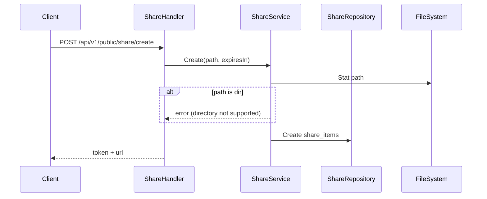
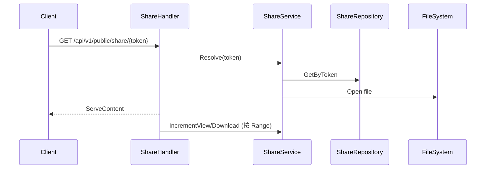
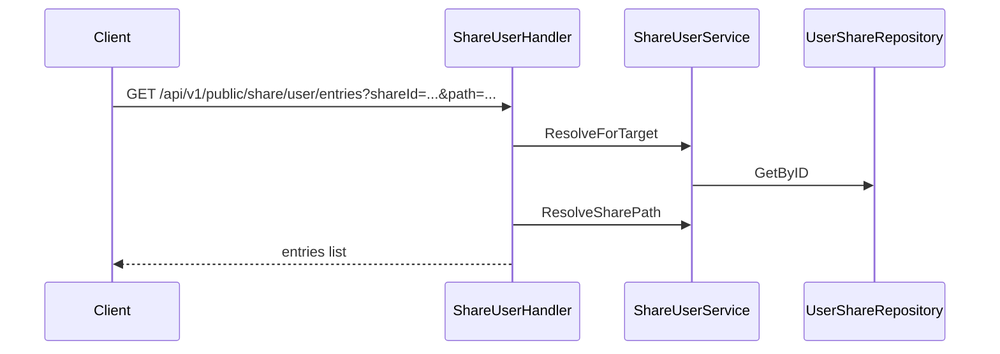

# 分享与回收站设计

本文档描述公开分享、定向分享以及回收站的核心流程。

## 公开分享（Share）

### 创建流程

- 公开分享仅支持文件，不支持目录。
- `expiresIn` > 0 时生成过期时间。

### 访问流程

- `Range` 非首段请求不会增加计数，避免分片导致膨胀。

## 定向分享（Share User）

### 创建与权限

- 目标用户通过钱包地址匹配。
- 支持三种共享受众模式：
  - 地址共享（`targetMode=addresses`，可传多个地址）
  - 分组共享（`targetMode=groups`，使用 `groupIds` 传多个分组并展开为用户快照）
  - 全员共享（`targetMode=all_users`）
- `permissions` 可包含 `read/create/update/delete`（或 `CRUD` 字符串）。
- 支持文件或目录分享。
- 创建成功后自动把目标地址写入地址簿（若不存在）。

### 使用流程（示例）

- 下载、上传、创建目录、重命名、删除均会先校验对应权限位。

### 当前实现

- 创建接口固定使用 `targetMode + targetAddresses/groupIds`。
- 站内共享元数据统一落在 `internal_share_items + internal_share_audiences`。

### 升级注意事项

- 升级前请确认数据库账号具备 `CREATE/ALTER/INDEX` 权限，启动时会执行表结构迁移。
- 如果旧库里存在 `share_user_items`，升级启动会自动幂等导入到 `internal_share_*`，不需要手工触发。
- 升级后创建接口只接受新请求体（`targetMode + targetAddresses/groupIds`），旧 `targetAddress` 调用需要改造客户端。
- 建议升级后抽样检查：`internal_share_items` 与 `internal_share_audiences` 是否有历史数据。

## 回收站

### 写入回收站（由 WebDAV DELETE 触发）

- WebDAV 删除会尝试把文件移动到 `.recycle` 目录。
- 同时写入 `recycle_items`，记录 hash/路径/大小/删除时间。

### 恢复/清理

- `recover`：将回收站文件移动回原路径，若原路径已存在则失败。
- `permanent`：删除回收站文件并移除记录。
- `clear`：批量清空。

### 文件命名策略

- 新规则：`{hash}_{原文件名}`
- 兼容旧规则：`{username}_{directory}_{name}_{timestamp}`

## 与 Standby 的关系

- 共享元数据（公开分享、站内共享、受众）都存储在 PostgreSQL，active/standby 共享同一数据库时可直接一致读取。
- 共享目录内的上传、重命名、删除仍走文件系统变更路径，并通过复制 outbox / internal replication 同步到 standby。
- 因此本次站内共享模型演进不会绕开现有 standby 复制链路。
