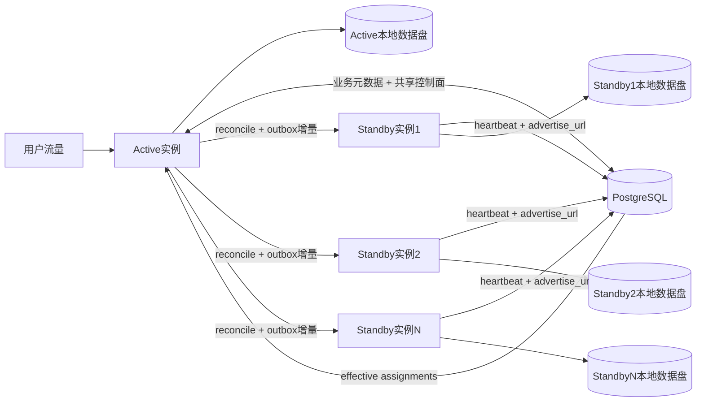
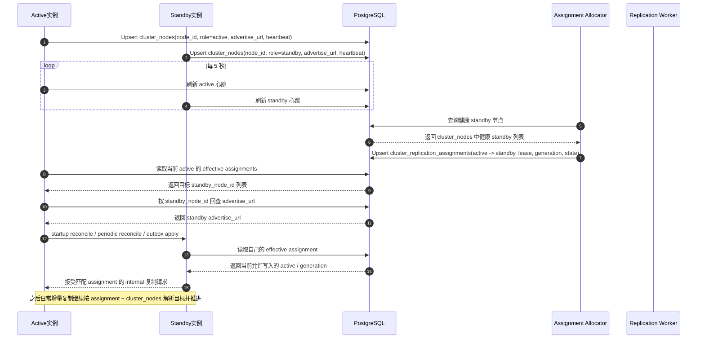
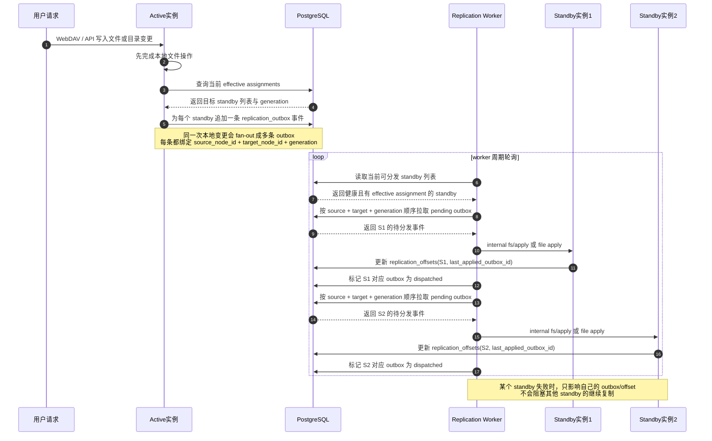
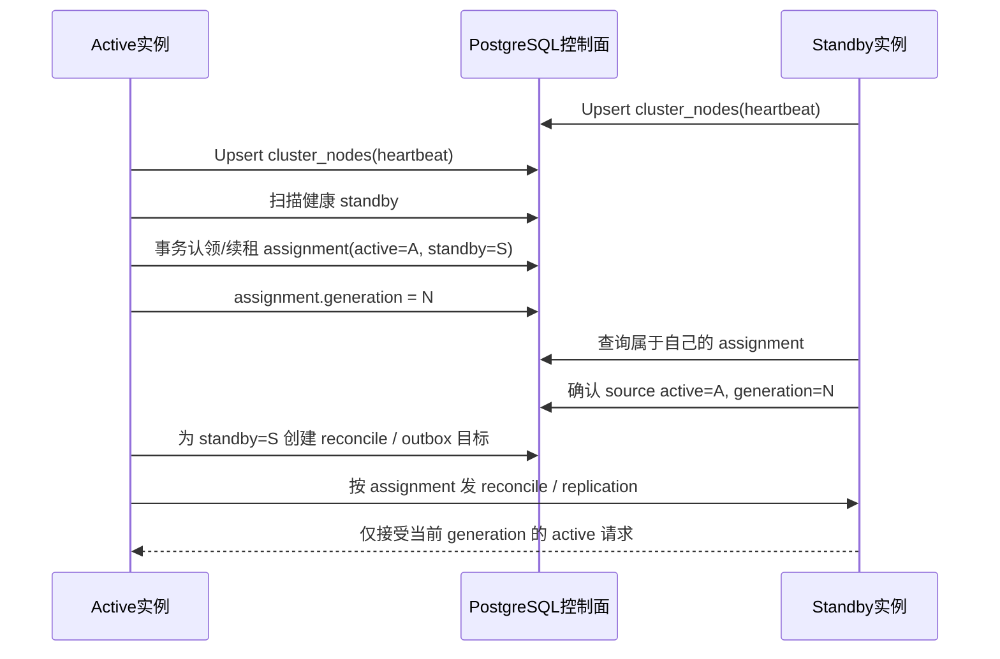
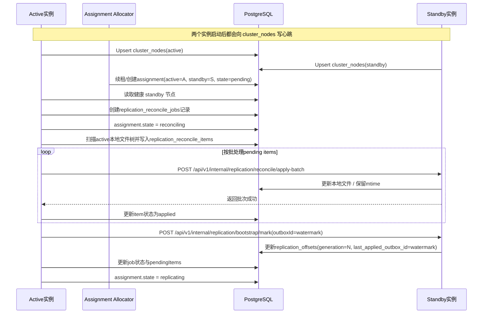
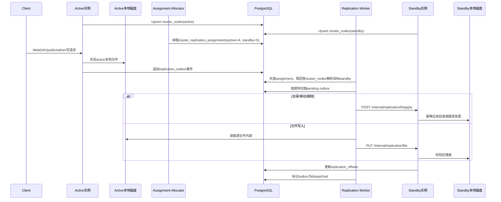

# 容灾方案

> 本文记录当前仓库在容灾/高可用上的选定路线、已经实现的能力、明确边界、常见 QA 与待办事项。  
> 任何复制、自愈、切换、恢复逻辑变更后，都应同步更新本文。

## 1. 当前选定路线

当前代码的阶段一容灾/高可用路线是：

- `1 active + N standby`
- active 对外提供 `public` / `admin` 流量
- standby 不接用户流量，只接实例间 `internal` 同步流量
- 每个实例各自使用本地 `webdav.directory`
- 元数据以 PostgreSQL 为准
- active / standby 都不再配置静态 `peer_node_id` / `peer_base_url`
- 每个实例通过 `node.advertise_url` + PostgreSQL `cluster_nodes` 注册表定期上报心跳
- active 会周期性在 `cluster_replication_assignments` 中为所有健康 standby 维持有效 assignment
- 每个 standby 在任一时刻最多只允许存在 1 条有效 assignment，避免多个 active 并发写同一 standby
- 当前所有有效 assignment 对应的 standby 都会接收历史补齐和日常增量复制
- 新 assignment 会先进入 `pending`，历史补齐期间进入 `reconciling`，完成后进入 `replicating`
- 如果历史补齐失败，assignment 会进入非有效的 `error`，并写入 `last_error`
- allocator 会对健康 standby 上的 `error` assignment 按退避节奏自动尝试 `error -> pending` 恢复
- 运维也可以通过 `warehouse ha assignments drain/pause/release/retry/resume` 显式推进 assignment 状态
- active / standby 在解析 peer 时，都会优先读取有效 assignment
- 运行时复制链路统一以 effective assignment 决定复制目标，再通过 `cluster_nodes` 中的 `advertise_url` 补齐地址
- active 每次文件变更会按当前有效 standby fan-out 生成多条 outbox 事件
- `replication_offsets`、`replication_reconcile_jobs`、`replication_reconcile_items` 都按 `source_node_id + target_node_id + generation` 独立推进
- active 启动后会自动对当前所有有效 standby 逐个触发一次历史 reconcile
- active 还会周期性扫描当前健康 standby，对仍处于 `pending` / `reconciling` 或缺少当前 generation baseline 的 standby 自动再次触发 reconcile
- 日常文件变化继续通过 outbox 增量复制追平
- `GET /api/v1/internal/replication/status?targetNodeId=...` 和 `warehouse ha status --target-node-id ...` 可以按 standby 独立观察状态

这已经是一种“单活 + 多 standby fan-out”的方案，但还不是“自动 failover / 自动 rebalance / 自动 promote”都已完成的完整多副本编排方案。

### 1.1 快速结论

先看三句话：

- 当前代码已经支持 `1 active -> 多个 standby` 同步，每个 standby 都有独立 assignment / outbox / offset / reconcile 状态
- `cluster_nodes` 负责“发现节点和地址”，`cluster_replication_assignments` 负责“决定哪些 standby 当前有效、各自处于哪一代”
- 当前主要缺口不再是 fan-out，而是自动 failover、更完整的周期性对账 / 漂移修复、自愈调度、限流与观测增强

### 1.2 总体结构图

### 1.3 当前路线摘要

| 项目 | 当前实现 |
| --- | --- |
| 拓扑 | `1 active + N standby` |
| 对外流量 | 只有 active 对外提供 `public` / `admin` |
| standby 角色 | standby 只接 internal 同步流量，不接用户写流量 |
| 元数据 | 以 PostgreSQL 为准 |
| 共享控制面 | `cluster_nodes` + `cluster_replication_assignments` |
| 复制目标选择 | 只认 effective assignment，active 会为所有健康 standby 维持有效 assignment |
| 地址解析 | 从 `cluster_nodes.advertise_url` 解析 |
| 历史补齐 | active 启动时会对当前所有有效 standby 自动 reconcile，也可手工按 standby 触发 |
| 日常增量 | `replication_outbox` -> worker -> 所有有效 standby，按 target 独立推进 |
| 当前硬边界 | 还不支持自动 failover / promote / rebalance；auto reconcile 目前只覆盖“仍需 baseline 的 standby”，不是周期性全量对账 |

### 1.4 先用一句话理解这套方案

可以把当前方案理解成：

- active 是唯一对外写入的主实例
- standby 是只接 internal 同步流量的被动副本集合，当前所有有效 assignment 对应的 standby 都会参与复制
- PostgreSQL 不只存业务元数据，也承担“共享控制面”
- active 先把本地文件写成功，再按每个有效 standby 记多条 outbox
- 每个有效 standby 都通过“历史补齐 + 后续增量”维持自己的本地副本数据
- assignment / generation / fence 负责保证“当前到底谁能往哪个 standby 写”

如果只记一件事，就是：

- `cluster_nodes` 解决“有哪些 standby 在线、地址是什么”
- `cluster_replication_assignments` 解决“当前 active 实际复制给哪些 standby、每条关系在哪一代”
- `replication_outbox` / `replication_offsets` 解决“每个 standby 已经复制到哪里了”

#### 核心表职责对照

| 表 | 所属层次 | 主要回答什么问题 | 谁写入 | 主要谁读取 | 关键字段 |
| --- | --- | --- | --- | --- | --- |
| `cluster_nodes` | 节点发现层 | 当前有哪些节点在线、它们的 internal 地址是什么 | active / standby 心跳注册器 | assignment allocator、peer resolver、运维排障 | `node_id` `role` `advertise_url` `last_heartbeat_at` |
| `cluster_replication_assignments` | 编排控制层 | 当前哪个 active 正式复制给哪个 standby、状态和代际是什么 | active 侧 allocator / renewer，部分运维命令 | peer resolver、standby 准入校验、状态观察 | `active_node_id` `standby_node_id` `state` `generation` `lease_expires_at` |
| `replication_outbox` | 增量分发层 | 哪些复制事件还要发给哪个 standby | active 本地文件变更记录器 | replication worker、状态接口 | `source_node_id` `target_node_id` `assignment_generation` `status` `id` |
| `replication_offsets` | 复制进度层 | 某个 standby 已经应用到哪个 outbox 序号 | standby apply / bootstrap mark | 状态接口、切换前检查、自愈判断 | `source_node_id` `target_node_id` `assignment_generation` `last_applied_outbox_id` |

可以把这 4 张表分成两组理解：

- `cluster_nodes` + `cluster_replication_assignments` 是控制面，决定“谁在线、谁归谁、谁能给谁发”
- `replication_outbox` + `replication_offsets` 是复制进度面，决定“还有什么没发、已经追到哪里”

### 1.5 active 和 standby 如何知道对方

当前实现里，active 和 standby 已经不再通过配置文件里互相写死对方地址来配对，而是通过 PostgreSQL 里的共享控制面自动发现。

可以拆成 4 步理解：

1. 每个节点先声明“我是谁”
   - 每个实例启动时都有自己的 `node.id`、`node.role`、`node.advertise_url`
   - `node.advertise_url` 是给其他实例访问自己 internal 接口时使用的地址

2. 每个节点把自己注册到 `cluster_nodes`
   - active 和 standby 启动后，都会周期性把自己的心跳、角色、`advertise_url` 写入 `cluster_nodes`
   - 所以这张表回答的是：“当前有哪些节点在线，它们的 internal 地址分别是什么”

3. active 根据健康 standby 写入正式 assignment
   - active 侧 allocator 会周期性扫描 `cluster_nodes`
   - 找到健康的 standby 后，在 `cluster_replication_assignments` 里为它们建立或续租 effective assignment
   - 所以 assignment 才是“正式关系”，不是 `cluster_nodes`

4. 运行时复制再按 assignment 反查地址
   - active 发 outbox / reconcile / apply 请求时，不是随便挑一个 standby 地址直接发
   - 它会先查 effective assignment，确认“当前应该复制给哪些 standby”
   - 再根据 assignment 里的 `standby_node_id` 去 `cluster_nodes` 取对应 `advertise_url`
   - standby 反过来也会根据自己的 effective assignment，确认当前允许哪个 active 给自己发复制请求

因此，当前模型里两张表分工非常明确：

- `cluster_nodes` 负责“节点发现”
- `cluster_replication_assignments` 负责“正式配对”

如果只用一句话概括，就是：

- active 通过 `cluster_nodes` 发现 standby 候选，再通过 `cluster_replication_assignments` 确认正式复制关系
- standby 通过自己的 effective assignment 知道当前对应哪个 active，并通过 `cluster_nodes` 解析该 active 的地址

#### 节点发现到开始复制的时序图

#### 文件写入后到多 standby fan-out 的时序图

### 1.6 文档边界

- 当前运行现状、术语、QA、自愈与运维判断：维护在本文
- 复制链路内部设计、表结构、状态机：维护在 [内部复制版备用节点设计.md](./内部复制版备用节点设计.md)
- 尚未完成的工作：维护在 [待办.md](./待办.md)
- 多实例 / 多副本远期路线比较：维护在 [多实例与多副本方案设计.md](./多实例与多副本方案设计.md)
- 历史“内部复制实施清单”已收口到上述两份文档，不再单独维护

### 1.7 术语表

下面把当前 standby 方案里最常出现的概念，用中文逐个解释清楚。

#### active 实例

- 指当前对外提供 `public` / `admin` 流量的实例
- 正常情况下，只有 active 会接收用户写请求
- active 本地盘上的文件变化，会被记录成 outbox 事件，再异步复制到 standby
- 当前阶段里，active 是“唯一写入者”，这是避免双写的基础前提

#### standby 实例

- 指不对外接用户流量、只接实例间 `internal` 同步流量的实例
- standby 的目标不是参与负载均衡，而是保持第二份本地文件数据
- 当前一个集群里可以存在多个 standby 候选节点
- 当前所有被 assignment 选中的 effective standby 都会真正接收复制流量
- standby 只做三件事：
  - 上报自身心跳
  - 接收 active 发来的复制请求
  - 维护本地复制进度与状态

#### standby candidate / effective standby

- standby candidate 指已经注册到 `cluster_nodes`、具备被选资格的 standby 节点
- effective standby 指当前被 `cluster_replication_assignments` 选中、真正参与复制的 standby
- 当前代码支持“多个 candidate”，也支持“多个 effective standby”

#### internal 接口

- 指 active 和 standby 之间使用的内部 HTTP 接口
- 当前包括几类核心入口：
  - `fs/apply`：目录、移动、删除等文件系统操作
  - `file`：文件内容复制
  - `reconcile/apply-batch`：历史补齐批量下发
  - `bootstrap/mark`：写入当前 generation 的 baseline
  - `status`：查看当前复制状态
- 这些接口不面向外部用户，只面向实例间调用
- 当前用 internal HMAC 做鉴权，避免随便伪造复制请求

#### 共享控制面

- 指当前通过 PostgreSQL 承担的复制编排与状态存储能力
- 它不是一个单独的服务进程，而是一组表 + 一套约束
- 当前共享控制面主要由两张表组成：
  - `cluster_nodes`
  - `cluster_replication_assignments`
- 这套控制面的作用，是让 active / standby 不靠人工硬编码关系，而是通过共享状态协作

#### `cluster_nodes`

- 这是“节点注册表”
- 它回答的问题只有两个：
  - 哪些节点还活着
  - 这些节点的 internal 地址是什么
- active 和 standby 都会定期把自己的心跳、角色、`advertise_url` 写进去
- 这张表不负责表达正式复制关系，只负责“节点发现”

#### `node.advertise_url`

- 指节点对其他实例暴露的 internal 可达地址
- active 访问 standby 的 internal 接口，最终就是通过这个地址
- 如果这个地址不对，shared control plane 虽然知道节点在线，也无法真正发送复制流量

#### `cluster_replication_assignments`

- 这是“正式复制关系表”
- 它回答的问题是：
  - 当前哪个 active 正在负责哪个 standby
  - 这条关系处于什么状态
  - 现在是第几代 generation
- 相比 `cluster_nodes`，这张表不是“发现信息”，而是“编排结果”

#### assignment

- 一条 assignment 就是一条“active -> standby”的正式复制绑定
- 例如：`warehouse-active -> warehouse-standby`
- 当前运行时复制链路只认 assignment，不认临时猜测关系
- 一个 standby 在任一时刻最多只能有一条有效 assignment，这是为了避免多个 active 同时往同一 standby 写

#### effective assignment

- 指当前被运行时复制链路视为“有效”的 assignment
- 当前有效状态包括：
  - `pending`
  - `reconciling`
  - `replicating`
  - `draining`
- 非有效状态包括：
  - `paused`
  - `released`
  - `error`
- “effective” 这个词很关键，因为 resolver、worker、standby 准入都是围绕它判断的

#### lease / `lease_expires_at`

- 可以把 lease 理解成“assignment 还是否有效的租约”
- active 会持续续租
- 如果 lease 过期，说明这条 assignment 可能已经失效，不能继续把它当成可靠归属关系
- 这样做是为了避免 active 异常退出后，数据库里还残留一条看起来像“活着”的 assignment

#### assignment state

- 这是 assignment 的生命周期状态机
- 当前状态含义如下：
  - `pending`
    - 已经分配好 active 和 standby
    - 但还没有完成这一轮历史补齐
    - 可以理解成“关系已经建立，数据还没补齐”
  - `reconciling`
    - 正在做历史补齐
    - active 正在扫描自己的本地文件树，并批量下发到 standby
  - `replicating`
    - 历史补齐已经完成
    - 后续主要依赖 outbox 增量复制追平
    - 这是日常运行时最稳定的状态
  - `draining`
    - 这条 assignment 正在准备退出
    - 一般用于切换、释放、重编排前的过渡阶段
  - `paused`
    - 这条 assignment 被运维显式暂停，或被系统因连续失败自动暂停
    - 它不是有效 assignment
    - allocator 不会自动把它恢复成 `pending`
    - automatic reconcile 也会跳过它
    - 需要运维执行 `resume` 才会重新开始新一轮生命周期
  - `released`
    - 这条 assignment 已经释放
    - 它不再是有效 assignment
  - `error`
    - 这条 assignment 在生命周期里出现了失败
    - 它也不是有效 assignment
    - 当前会由 allocator 按退避节奏自动恢复，必要时也可以由运维手工执行 `retry`

#### generation

- generation 可以理解成“这条 assignment 生命周期的代次”
- 它不是简单的状态版本号，而是用来做 fencing 的
- 当前实现里，generation 只会在“生命周期重新开始”时递增，例如：
  - `released -> pending`
  - `error -> pending`
- 下面这些状态推进不会切代：
  - `pending -> reconciling`
  - `reconciling -> replicating`
  - `replicating -> draining`
- 这样做的目的，是让 generation 真正表示“旧链路”和“新链路”的边界，而不是普通状态变更

#### fencing / fence

- fencing 可以理解成“拦住旧写入者，防止并发双写”的机制
- 在当前方案里，fence 主要靠 generation 落地
- standby 会检查：
  - 请求里带来的 assignment generation
  - 当前 effective assignment 的 generation
  - 自己本地 offset 里已经初始化的 generation
- 如果 generation 不匹配，或者新 generation 还没完成 baseline 初始化，standby 会拒绝写入
- 这就是“旧 active / 旧 generation 不能继续写 standby”的核心保障

#### outbox

- outbox 是 active 侧的“增量变更记账表”
- active 每次本地文件操作成功后，会把一个复制事件写进 `replication_outbox`
- 它解决的问题是：
  - 复制事件持久化
  - 失败可重试
  - 顺序可追踪
  - lag 可观察
- 当前 outbox 记录的是“要复制什么”，不是“复制已经完成了什么”

#### worker

- worker 是 active 侧后台分发器
- 它会按顺序拉取 pending outbox 事件，发到 standby
- 可以把它理解成“把数据库里排队的复制事件真正送出去的人”
- worker 只会发送当前 assignment generation 对应的事件，不会乱发旧代次事件

#### offset / `replication_offsets`

- offset 是 standby 侧的“已应用进度”
- 它至少记录两类东西：
  - 已经应用到哪个 outbox id
  - 当前已经初始化的是哪一代 assignment generation
- outbox 记录“待分发”，offset 记录“已完成”
- 当前 standby 是否已经追平、是否已经完成新 generation 的 fence 初始化，都要看 offset

#### reconcile

- reconcile 就是“历史补齐 / 对账补齐”
- 它不是日常增量复制，而是把 active 当前整棵文件树重新扫描一遍，把历史存量和可能漂移的内容补到 standby
- 当前代码里：
  - active 启动后会自动触发一次 reconcile
  - 运维也可以手工触发 `ha reconcile start`
- reconcile 解决的是“standby 只靠增量不够”的问题

#### reconcile job / reconcile item

- reconcile job 是一次历史补齐任务
- reconcile item 是这次任务里的一条待补齐路径
- job 负责记录“这次补齐整体怎么样”
- item 负责记录“具体哪些目录/文件待处理”
- 这样失败时可以看到不是“reconcile 失败了”这么简单，而是能追到是哪次任务、还剩多少项

#### bootstrap mark

- bootstrap mark 可以理解成“给当前 generation 打一个基线标记”
- 它会把 standby 当前这代 generation 的 baseline outbox 序号写进 offset
- 当前有两种使用场景：
  - reconcile 成功后，active 自动补一次 bootstrap mark
  - 运维显式执行 `ha bootstrap mark`
- 它的意义是告诉 standby：
  - “到这个 outbox id 为止，这一代的历史基线已经建立好了”
  - “后面可以开始按这代的增量顺序继续追”

#### watermark outbox id

- watermark 可以理解成“这次 reconcile 所面对的增量边界”
- active 在开始 reconcile 时，会记录当时的最大 outbox id
- reconcile 负责把这之前的历史状态补齐
- 补齐完成后，再通过 bootstrap mark 把这个 watermark 写成 baseline
- 这样 reconcile 和后续增量 outbox 就能自然衔接起来

#### allocator

- allocator 是 active 侧负责分配/续租 assignment 的后台逻辑
- 它会根据健康 standby、当前有效 assignment 来决定：
  - 继续续租哪些 standby
  - 是否释放旧关系
  - 是否按退避节奏把 `error -> pending`
- 当前阶段它已经是单 active -> 多 standby 的分配器，但还不是带 rebalance / promote / failover 自动化的完整调度器

### 1.6 这些概念之间怎么串起来

按当前代码的主链路，可以这样理解：

1. active 和 standby 先把自己注册到 `cluster_nodes`
2. active 的 allocator 为某个 standby 建立或续租一条 assignment
3. assignment 先进入 `pending`
4. active 自动触发 reconcile，assignment 进入 `reconciling`
5. 历史文件批量补到 standby
6. active 自动调用一次 bootstrap mark，把当前 generation 的 baseline 写进 offset
7. assignment 进入 `replicating`
8. 后续文件变化继续写入 outbox，由 worker 增量发给 standby
9. standby 通过 generation fence 保证旧链路和错误代次不能继续写

如果这一轮失败了：

1. assignment 进入 `error`
2. 它不再是有效 assignment
3. allocator 会按退避节奏自动恢复 `error -> pending`，运维也可以手工执行 `retry`
4. generation 进入新的一代
5. 新一轮 reconcile / bootstrap mark 完成后，再恢复增量复制

## 2. 阶段二现状与剩余目标

本节原本用于描述“阶段二目标形态”。

随着当前仓库演进，阶段二的核心能力已经基本落地，因此这里不再把它当成纯规划文档，而是明确拆成两部分：

- 哪些属于阶段二核心能力，并且已经实现
- 哪些还属于阶段二后半段或下一阶段增强项，仍待继续落地

### 2.1 为什么还要继续往前走

当前实现已经解决了这些关键问题：

- standby 不需要再把自己的地址手工写进 active 的配置
- active 通过 effective assignment + `cluster_nodes` 自动发现 peer
- active 已经会在 `cluster_replication_assignments` 中持续写入 lease / generation / state，运维可直接观察正式 assignment
- active / standby 的 peer 解析在运行时已经收敛到 effective assignment，不再只看临时发现结果
- standby 的 internal apply / reconcile / bootstrap 入口已经只接受当前 effective assignment 对应 active 的请求
- active 已经支持同时向多个 effective standby fan-out
- 每个 standby 已经拥有独立的 outbox / reconcile / offset / generation / status 推进路径

所以，阶段二“把复制链路收敛到共享控制面 + 正式 assignment”的核心目标，实际上已经基本完成。

当前仍然存在下面这些问题：

- 还没有自动 failover / promote / rebalance 编排
- standby 新加入后，已经能通过后台 auto reconcile 自动补 baseline，但还没有更完整的失败调度、节流和差异对账能力
- standby 虽然已经可以按 `targetNodeId` 独立观察，但还缺少更完整的多副本观测、指标和告警
- assignment 已经具备 `pending -> reconciling -> replicating -> draining -> released` 主链路，以及失败进入 `error`、运维 `retry -> pending`、`pause -> resume` 的恢复/干预路径，但还没有完整 failover / fencing 状态机
- 运维虽然已经能看到 assignment，也能按 standby 观察状态，但还看不到 drain / failover / rebalance 这类更完整的编排状态

所以，当前下一步的重点已经不是“把 assignment 引进来”，而是继续补齐“基于 assignment 的自动化编排、观测和资源控制”。

### 2.2 阶段二核心能力：已完成

下面这些原本属于阶段二目标，现在已经是当前实现：

- standby 只向共享控制面注册，不向 active 直接登记
- active 不自行临时决定复制对象，而是从共享控制面读取正式 assignment
- assignment 由 PostgreSQL 中的控制面表持久化，并带 lease / generation / state
- 一个 standby 在任一时刻最多只属于一个 active
- 一个 active 可以拥有多个 standby assignment
- 每个 assignment 都有独立的复制状态、历史补齐状态、观测指标
- standby 会主动感知“自己当前是否被分配、归属哪个 active、处于哪一代 generation”

换句话说，阶段二最关键的“共享控制面正式分配 + 多 standby assignment 化复制”已经落地。

### 2.3 阶段二剩余增强项：未完成

当前还没有完成的部分，主要是下面这些：

- `warehouse ha assignments ...` 继续扩展到 rebalance、promote、自动切换等编排能力
- 更完整的 failover / fencing 状态机，而不只是当前 generation fence + assignment state
- 多 standby 下更细粒度的 reconcile 并发控制、带宽限制、优先级与背压
- reconcile 的差异对账、跳过策略与更强的历史补齐自愈
- 更完整的多副本观测、指标、告警与运维解释

这些更适合被理解为：

- 阶段二后半段增强项
- 或者阶段三的编排自动化方向

### 2.4 当前采用的实现路线

当前没有引入单独控制器进程，而是采用“PostgreSQL 共享控制面 + active 侧分配器”：

- 所有节点继续把心跳写入 `cluster_nodes`
- active 周期性扫描健康 standby，并在事务里认领 assignment
- standby 周期性读取“属于自己”的 assignment
- 复制、reconcile、切换都以 assignment 为准，而不是以临时发现结果为准

这条路线比单独加一个 controller service 更小、更容易落地，也符合当前仓库“先最小闭环、后增强”的节奏。

### 2.5 当前数据模型与约束

当前已实现：

- `cluster_nodes`
- `cluster_replication_assignments`

建议字段：

- `id`
- `active_node_id`
- `standby_node_id`
- `state`
  说明：`pending` / `reconciling` / `replicating` / `draining` / `released` / `error`
- `generation`
  说明：只在 assignment 生命周期重新开始时递增，例如 `released -> pending`、`error -> pending`；`pending -> reconciling -> replicating` 这类同一轮生命周期内的状态推进不会切代
- `lease_expires_at`
  说明：active 需要持续续租；过期后说明 assignment 需要被回收或重分配
- `last_reconcile_job_id`
- `last_error`
- `created_at`
- `updated_at`

约束建议：

- `standby_node_id` 在“有效 assignment”上只能有一条
- `active_node_id + standby_node_id` 唯一
- generation 只能递增，不能回退

### 2.6 当前编排规则

当前已经采用，并应继续保持的规则如下：

- `cluster_nodes` 只回答“谁活着、地址是什么”
- `cluster_replication_assignments` 只回答“谁跟谁复制、当前是哪一代”
- active 只允许向自己持有 assignment 的 standby 发流量
- standby 只接受当前 assignment 对应 active 的 internal 复制流量
- standby 当前 assignment generation 与本地 offset generation 不一致时，会拒绝增量 apply，直到新的 reconcile / bootstrap mark 完成 fence 初始化
- assignment 切换时，先进入 `draining`，再切到新 generation，避免新旧 active 并发写同一 standby

### 2.7 Active / Control Plane / Standby 时序图

### 2.8 阶段二落地进度

下面这份清单表示：阶段二哪些已经完成，哪些还没有完成。

1. 已完成：引入 `cluster_replication_assignments` 表、`warehouse ha assignments status` 状态展示，以及 active 侧 assignment allocator / renewer
2. 已完成：standby 增加 assignment 感知，`fs/file apply`、`reconcile apply-batch`、`bootstrap mark` 只接受当前 assignment 对应 active 的请求
3. 已完成：`replication_outbox`、`replication_offsets`、`replication_reconcile_jobs` 已绑定 `assignment_generation`，active/standby internal 链路严格校验 generation；新 generation 未完成 fence 初始化前，standby 会拒绝增量 apply
4. 已完成：assignment 生命周期已接入 `pending -> reconciling -> replicating -> draining -> released`，失败时会进入 `error` 并写入 `last_error` / `last_reconcile_job_id`
5. 已完成：reconcile 成功后，active 会自动向 standby 发送一次 bootstrap mark，把当前 watermark outbox id 写成该 generation 的基线 offset
6. 已完成：outbox 已按有效 assignment fan-out，`replication_offsets` / `replication_reconcile_jobs` / status 也按 standby 独立推进
7. 已完成：`warehouse ha assignments drain/pause/release/retry/resume` 可显式推进 assignment 状态迁移
8. 已完成：`warehouse ha status` / `warehouse ha reconcile status` / internal status 已支持按 `target-node-id` 或 `targetNodeId` 观察单个 standby
9. 待实现：`warehouse ha assignments ...` 继续扩展到 rebalance、promote、自动切换等编排能力

### 2.9 阶段二已经带来的收益

截至当前，系统能力已经从“能发现 peer”升级到“能正式管理副本关系”：

- 多 standby 具备可解释的 assignment 关系
- standby 知道自己是不是当前有效副本
- 切换时可以用 generation 和 state 避免旧链路残留
- 运维可以直接看 assignment，而不是靠猜测当前谁在跟谁同步
- 当前已经具备多 standby fan-out 的数据复制基础，后续做 rebalance、drain、promote 会有稳定的控制面基础

## 3. Active / Standby 时序图

### 3.1 启动后的历史补齐

### 3.2 日常增量复制

## 4. 当前已经实现

- [x] active / standby 节点身份配置
- [x] internal HMAC 鉴权
- [x] `replication_outbox` / `replication_offsets`
- [x] active 侧增量复制 worker
- [x] standby 侧文件/目录幂等 apply
- [x] `replication_reconcile_jobs` / `replication_reconcile_items`
- [x] active 启动时会对当前所有有效 standby 逐个触发 startup reconcile
- [x] `cluster_nodes` 共享控制面注册表
- [x] active / standby 心跳注册
- [x] active 通过共享控制面发现 peer URL，显式 CLI `--base-url` 覆盖路径仍保留
- [x] `cluster_replication_assignments` 控制面表 schema
- [x] active 侧 assignment allocator / renewer
- [x] active 会在 `cluster_replication_assignments` 中为所有健康 standby 维护有效 assignment lease
- [x] 新 assignment 会以 `pending` 起步，而不是直接标记为 `replicating`
- [x] `reconcile/start` 已与 assignment 状态联动：开始时切 `reconciling`，成功后切 `replicating`
- [x] reconcile 失败时 assignment 会进入 `error`，并把 `last_error` / `last_reconcile_job_id` 写回 assignment
- [x] allocator 会优先保持当前健康 assignment，并把其他健康 standby 一并纳入 assignment
- [x] active / standby 的运行时 peer resolver 只按 effective assignment 解析 peer，再通过 `cluster_nodes` 补齐地址
- [x] standby 的 `fs/file apply`、`reconcile apply-batch`、`bootstrap mark` 已增加 assignment 校验，只接受当前 assigned active
- [x] `replication_outbox`、`replication_offsets`、`replication_reconcile_jobs` 已持久化 `assignment_generation`
- [x] active 只会发送当前 assignment generation 的 outbox / reconcile 请求，standby 会严格校验 generation header
- [x] generation 只会在 assignment 生命周期重新开始时切换，`error/released -> pending` 会进入新 generation
- [x] standby 在 assignment generation 与本地 offset generation 不一致时，会拒绝增量 apply，直到新的 bootstrap mark 完成 fence 初始化
- [x] active 每次文件变更会按当前所有有效 standby fan-out 记录 outbox
- [x] active worker 会按 standby 独立拉取 outbox，并隔离单个 standby 的失败
- [x] active 启动时会对当前所有有效 standby 逐个触发 startup reconcile
- [x] active 会周期性扫描当前健康 standby，对仍需 baseline 的目标自动再次触发 reconcile
- [x] allocator 会对 `error` assignment 按退避节奏自动恢复为 `pending`，从而触发新一轮 reconcile / bootstrap
- [x] 手工触发 `POST /api/v1/internal/replication/reconcile/start`
- [x] standby 批量接收历史文件 `POST /api/v1/internal/replication/reconcile/apply-batch`
- [x] reconcile 成功后，active 会自动补一条 `bootstrap mark`，把当前 watermark 写成 standby 的 generation 基线
- [x] 历史同步保留文件 `mtime`
- [x] `GET /api/v1/internal/replication/status` 暴露复制与 reconcile 状态
- [x] `GET /api/v1/internal/replication/status?targetNodeId=...` 可按 standby 查看 active 侧状态
- [x] `build/warehouse ha status --peer` 会从共享控制面解析 peer
- [x] `build/warehouse ha status --target-node-id ...` / `build/warehouse ha reconcile status --target-node-id ...` 可按 standby 观察
- [x] `build/warehouse ha bootstrap mark --peer` 会自动补齐当前 assignment generation
- [x] `build/warehouse ha assignments status` 可读取 assignment 控制面状态
- [x] `build/warehouse ha assignments drain` 可将有效 assignment 显式切到 `draining`
- [x] `build/warehouse ha assignments pause` 可将 assignment 显式切到 `paused`，暂停自动恢复与自动 reconcile
- [x] `build/warehouse ha assignments release` 可将 `draining` assignment 显式切到 `released`
- [x] `build/warehouse ha assignments retry` 可将 `error` assignment 显式切回 `pending`
- [x] `build/warehouse ha assignments resume` 可将 `paused` assignment 切回 `pending`，并开始新 generation 生命周期

## 5. 当前真实边界

下面这些限制是当前代码的真实状态，文档需要明确反映，不能假设已经解决：

- 当前支持 `1 active -> 多个 standby`
- 但当前仍然只支持单 active 写入，不支持多 active 并发写或自动主从切换
- 虽然 active 会为所有健康 standby 维持有效 assignment，并通过后台 auto reconcile 自动补 baseline，但它目前只补“仍需 baseline 的 standby”，不会周期性重扫所有已稳定副本
- assignment allocator / renewer、startup/manual reconcile、增量 outbox 路径都已收紧到有效 assignment
- `release` 命令默认要求 standby 心跳已不健康；如果用 `--force` 在 healthy standby 上释放，active allocator 仍可能在后续续租周期重新认领它
- assignment 进入 `error` 后不会再被视为有效复制目标；当前 allocator 会对健康 standby 上的 error assignment 按退避节奏自动恢复，运维也可以执行 `warehouse ha assignments retry` 显式回到 `pending`
- assignment 会持久化 `failure_count` 和 `next_retry_at`，用于观察连续失败次数与下一次自动恢复时间
- 当连续 `reconcile` 失败达到阈值后，assignment 会自动切到 `paused`；默认阈值是 `replication.reconcile_auto_pause_failures = 3`
- assignment 进入 `paused` 后不会再自动恢复；无论它是人工暂停还是系统自动暂停，都需要运维显式执行 `resume`
- `warehouse ha assignments retry` 或 allocator 自动恢复 `error -> pending` 时，会进入新的 generation；旧 generation 的增量请求会被 standby fence 拒绝
- 当前 startup reconcile 的自动重试为 24 次、每次间隔 5 秒，约 2 分钟窗口
- standby 单独重启不会自动重新触发一次完整历史 reconcile
- 当前有一个轻量的周期性 auto reconcile sweep，默认每 30 秒检查一次“仍需 baseline 的 standby”
- 当前已经具备“error assignment 自动退避恢复 + pending assignment 自动 reconcile + 自动/人工 pause/resume”的主链路，但还没有更细粒度的失败分类和分级重试策略
- 当前 periodic auto reconcile 只针对 `pending` / `reconciling` / 当前 generation baseline 缺失的 standby，不会周期性全量重扫所有已稳定 `replicating` 的副本
- 当前 reconcile 仍然是“active 全量重扫 + 直接重推”，不是差异对账后只补缺口
- 当前 reconcile 下发文件内容使用批量 JSON + base64，功能可用，但不适合超大历史数据集
- 当前 active 对 standby 的 fan-out 还没有更细粒度的并发控制、带宽限制和优先级调度
- 当前双本地盘双份不等于备份，仍然需要外部备份与恢复演练

## 6. 自愈能力说明

### 6.1 增量复制路径

- standby 临时不可用时，outbox 会积压
- standby 恢复后，增量复制可以继续追平
- 这部分自愈能力相对稳定，因为 outbox / offsets 是持久化的

### 6.2 历史补齐路径

当前默认运维结论：

- 历史补齐的主路径默认是“后台自动补”，不是“先人工补”
- 只要 active 还在运行，standby 恢复后不依赖人工先执行 `reconcile/start`
- 只要 active 还在运行，standby 恢复后也不依赖再重启一次 active 才会继续补
- `standby 全挂 -> active 继续写 -> standby 恢复` 这条主路径下，运维默认动作应该是先观察自动恢复，而不是马上手工介入

自动补齐会在下面条件满足时继续接管：

- standby 重新发出心跳，并重新被控制面视为健康节点
- allocator 为该 standby 建立或恢复 effective assignment
- 该 assignment 处于 `pending`、`reconciling`，或缺少当前 generation baseline
- active 仍然能够访问该 standby 的 `internal` 地址，且 internal 鉴权配置正确

当前后台机制分两段：

- active 启动时会尝试自动跑一次 startup reconcile
- startup reconcile 带有限重试窗口，不是无限阻塞的后台任务
- 如果启动窗口内没有补齐完成，后台还会继续做轻量 periodic auto reconcile sweep
- 当前代码的启动重试窗口约为 2 分钟
- 如果 standby 在该窗口内恢复，可继续完成历史补齐
- 如果 standby 恢复晚于该窗口，但 assignment 仍有效且 active 能访问到它的 internal 地址，periodic auto reconcile 仍会继续尝试补齐

建议运维按下面顺序判断：

1. 先看 `build/warehouse ha status -c config.yaml --target-node-id <standby-node-id>`，确认 standby 已恢复心跳，assignment 是否已经存在。
2. 再看 assignment 是否处于 `pending`、`reconciling`、`replicating` 之一；如果是，说明自动链路已经开始接管。
3. 再看 `build/warehouse ha reconcile status -c config.yaml --target-node-id <standby-node-id>`，确认 reconcile job 是否正在推进，或最近是否已经完成。
4. 给系统一个正常观察窗口；典型恢复时延通常是几十秒到 1 分钟级：standby 心跳默认 5 秒、assignment allocator 默认 5 秒续租或重建、periodic auto reconcile sweep 默认 30 秒一轮。
5. 只要状态在推进，就继续观察，不需要先手工执行 `reconcile/start`。

下面情况才说明“自动补”可能没有接住，需要人工介入：

- standby 长时间不可达，心跳一直没有恢复
- assignment 长时间停留在 `error`，或反复恢复后仍立即失败
- `ha status` / `ha reconcile status` 连续多个周期都没有任何推进
- standby 的 `internal` 地址、shared secret、网络或鉴权配置错误
- 运维希望显式暂停某个失败副本的自动恢复，改为手工控制

出现这些情况时，才考虑手工 `reconcile/start`、`retry` 或排查网络 / 配置。

## 7. Standby QA

### 7.1 是否支持只部署 active、暂时没有 standby

支持。

当前代码行为是：

- 即使 `replication.enabled=true`，只要当前没有可用 standby，active 仍然会继续处理本地写请求
- 这类写请求不会因为 `replication peer is unavailable` 或 `replication assignment is unavailable` 而返回 `500`
- active 会记录 `WARN`，表示“这次变更没有写入当前复制 outbox”
- 等后续 standby 恢复并重新建立 effective assignment 后，后台通常会自动通过 reconcile 把缺失的历史文件补齐，不需要人工先手工执行命令

这意味着：

- “没有 standby”不会把 active 直接打成不可写
- 但在没有有效 standby 的时间窗口内，新写入不会形成对应 standby 的增量 outbox 事件
- 因此 active-only 或 standby 全挂场景下，后续仍然必须依赖 reconcile 恢复副本完整性，只是这条 reconcile 主路径默认是自动的

### 7.2 支持多少个 standby 实例

当前代码路径已经支持 `1 active -> N standby`。

更准确地说：

- active 会为所有健康 standby 维持有效 assignment
- 每次文件变更会为每个 target standby 生成独立 outbox 事件
- `replication_offsets`、`replication_reconcile_jobs`、`status` 也都是按 standby 独立推进
- 一个 standby 在任一时刻最多只有 1 条有效 assignment，避免多个 active 并发写它

当前没有写死的“最多几个 standby”的代码上限，实际可承载数量取决于：

- active 的磁盘读取能力
- active 到各 standby 的网络带宽
- PostgreSQL 写入 outbox / offset / reconcile 元数据的压力
- standby 的落盘能力

所以结论是：

- 语义上已经支持 `N`
- 工程上的可承载上限，需要按实际数据量和硬件资源压测确认
- 当前还没有为多 standby 做更细粒度限流，因此 standby 数量越多，对 active 的放大效应越明显

### 7.3 standby 在同步历史数据时断电重启，能否自愈

通常可以自动补齐，只有持续异常时才需要人工介入。

- 如果 standby 在 active 启动后的自动 reconcile 重试窗口内恢复，通常还有机会在这轮窗口里继续完成
- 如果这轮 reconcile 已经失败并把 assignment 打到 `error`，allocator 会按退避节奏自动尝试 `error -> pending` 恢复
- 如果超过启动期窗口，但 assignment 仍然有效且 standby 已恢复健康，后台 periodic auto reconcile 还会继续尝试补齐
- 所以正常运维预期应该是“先观察自动补齐是否接管”，而不是一恢复就立刻手工执行 `reconcile/start`
- 如果持续恢复仍然失败，仍然需要手工 `retry`、排查网络 / 配置或观察 `last_error`

### 7.4 standby 一段时间没有工作，重新启动，能不能自愈

结论上通常也不需要人工先介入，但要分两类理解：

- 增量变更：
  - 如果这个 standby 已经完成过当前 generation 的 baseline，offset 还在，那么通常可以继续通过 outbox 追平
- 历史缺口：
  - 如果这个 standby 还没完成 baseline，或者 assignment 已经切到新的 generation，仅靠 standby 自己重启不保证自动修复

所以如果 standby 长时间离线后回来，而 active 没有重启，也没有手工触发 reconcile，那么：

- 新增量事件会继续走 outbox 复制
- 如果这个 standby 仍处于需要 baseline 的状态，后台 periodic auto reconcile 会继续尝试补齐
- 如果它已经进入 `error`，allocator 也会按退避节奏自动恢复并再次尝试
- 所以默认处理方式应该是先观察 `ha status` / `ha reconcile status` 是否已经进入自动恢复，不要第一时间人工补
- 如果持续恢复仍失败，旧历史缺口仍不保证自动补齐

### 7.5 standby 对 active 的影响控制

当前复制是异步的，不阻塞用户主写请求，这是当前方案的核心优点。

当前进一步明确为：

- 有有效 standby 时，active 会在本地写成功后记录 outbox，并异步复制
- 没有有效 standby 时，active 仍然继续本地写成功，只记录 `WARN`，不把用户写请求打成失败
- 这保证了“standby 全挂”不会直接导致 active 无法提供写服务

但多 standby 会线性放大 active 的资源消耗：

- 数据库写入 outbox 的压力
- active 本地磁盘扫描与读盘压力
- 历史文件传输带来的网络占用
- 大量历史文件补齐时的 CPU / 内存消耗
- standby 数量增加后，worker / reconcile 的并发和排队开销

当前已经做到“无 standby 不阻塞主链路”，但还没有做到“精细限流”。

### 7.6 还有哪些工作可以继续优化

优先级建议如下：

- [ ] 差异对账式 reconcile，而不是全量重推
- [ ] 大文件历史同步改为流式 / 分片，不再使用 base64 JSON
- [ ] reconcile 限流、并发、批大小、带宽控制
- [ ] 复制与补齐的指标、日志、告警
- [ ] 切换自动化：rebalance / fencing / promote / 回切 SOP
- [ ] reconcile 表清理与历史审计策略

## 8. 运维建议

### 8.1 当前推荐操作方式

- active 放在 LB 上游
- standby 只暴露 internal，不对外接 public/admin
- 切换前同时检查 readiness、replication status、reconcile status
- 优先使用 `build/warehouse ha ...` 作为运维入口，而不是手工 `curl` 或签名脚本
- 如果要显式控制基线，可使用 `build/warehouse ha bootstrap mark ...`
- 如果要修复历史缺口，优先使用 `build/warehouse ha reconcile start ...`

### 8.2 当前不应误判为已具备的能力

- 不能把“有 standby”理解成“已经等价于完整灾备”
- 不能把“双本地盘双份”理解成“已经有备份”
- 不能把“standby 能追增量”理解成“所有历史缺口都能自动无限自愈”

## 9. 仍需外部保障的部分

即使应用内 active / standby 已经工作，仍然建议运维层继续做：

- PostgreSQL 主备或 PITR
- 文件异地备份
- 备份保留策略
- 定期恢复演练
- 存活、磁盘、复制状态告警

## 10. 当前待办清单

当前待办已统一收敛到独立文档，避免与本文重复维护。

请以 [待办.md](./待办.md) 为准：

- 包含当前阶段的 `P0 / P1 / P2` 优先级拆分
- 包含 application、运维、CLI、多 standby、性能优化等后续工作
- 当推进顺序或优先级变化时，只更新这一份待办文档

## 11. 文档维护约定

以下改动发生时，必须同步更新本文：

- standby 自愈策略改变
- reconcile 触发方式改变
- 多 standby 调度或编排能力变化
- assignment / lease / generation 规则改变
- 切换流程改变
- 备份 / 恢复 / 演练策略改变
