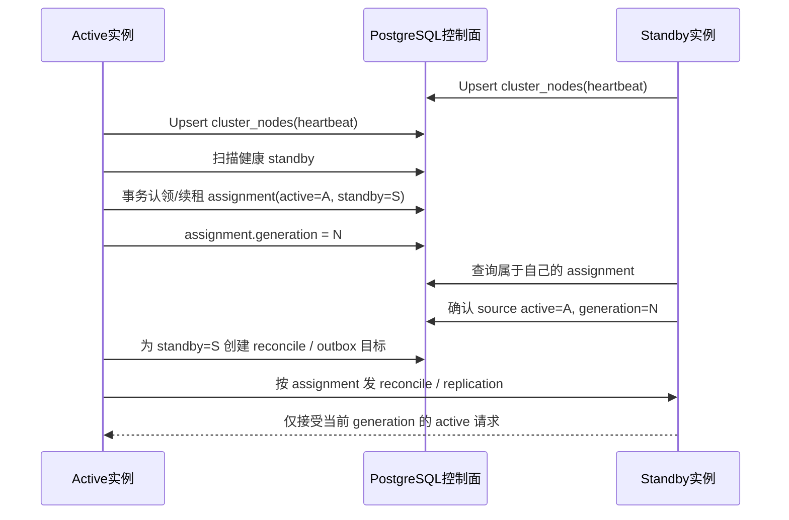
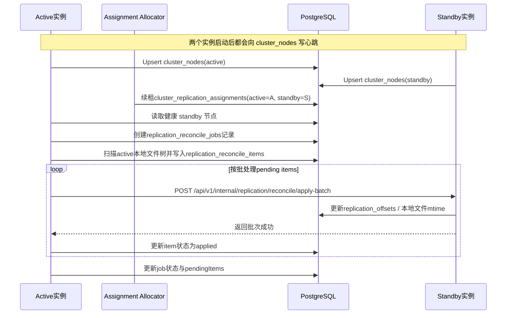
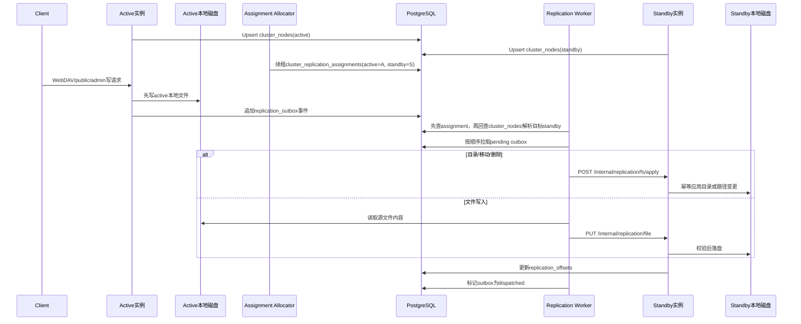

# 容灾方案

> 本文记录当前仓库在容灾/高可用上的选定路线、已经实现的能力、明确边界、常见 QA 与待办事项。  
> 任何复制、自愈、切换、恢复逻辑变更后，都应同步更新本文。

## 1. 当前选定路线

当前代码的阶段一容灾/高可用路线是：

- `1 active + 1 standby`
- active 对外提供 `public` / `admin` 流量
- standby 不接用户流量，只接实例间 `internal` 同步流量
- active / standby 各自使用本地 `webdav.directory`
- 文件数据通过应用内 `internal` 同步保持双份
- 元数据以 PostgreSQL 为准
- active / standby 都可以把 `internal.replication.peer_base_url` 留空
- 每个实例通过 `node.advertise_url` + PostgreSQL `cluster_nodes` 注册表定期上报心跳
- active 会周期性在 `cluster_replication_assignments` 中续租 1 条有效 assignment
- active / standby 在解析 peer 时，都会优先读取有效 assignment
- 如果没有有效 assignment，才会回退到 `peer_node_id` / `cluster_nodes`
- active 启动后会自动触发一次历史 reconcile
- 日常文件变化继续通过 outbox 增量复制追平

这是一种单活双机方案，不是正式多副本负载均衡方案。

## 2. 阶段二目标形态

本节描述的是下一阶段目标形态，用于把当前“共享控制面注册 + active 续租单条 assignment”，升级为“共享控制面正式分配 + 多 standby 编排”。

这一节包含规划和当前进度说明。凡是未实现部分，会在文中明确标注。

### 2.1 为什么还要继续往前走

当前实现已经解决了四件事：

- standby 不需要再把自己的地址手工写进 active 的配置
- active 可以在 `peer_base_url` 留空时，通过 `cluster_nodes` 自动发现 peer
- active 已经会在 `cluster_replication_assignments` 中持续写入 lease / generation / state，运维可直接观察正式 assignment
- active / standby 的 peer 解析已经优先收敛到 effective assignment，不再只看临时发现结果
- standby 的 internal apply / reconcile / bootstrap 入口已经只接受当前 effective assignment 对应 active 的请求

但它还没有解决“谁应该跟谁复制”的正式编排问题。

当前仍然存在下面这些问题：

- outbox / offsets / reconcile 仍然是单目标模型，不具备多副本 fan-out 语义
- standby 还没有把 assignment 观测、代际信息暴露给更完整的运维视图
- assignment 目前只有单条续租语义，还没有完整 drain / failover / fencing 状态机
- 运维虽然已经能看到 assignment，但还看不到 drain / failover / rebalance 这类更完整的编排状态

所以，下一阶段的重点不是继续增强“发现”，而是引入“分配”。

### 2.2 阶段二目标

目标形态如下：

- standby 只向共享控制面注册，不向 active 直接登记
- active 不自行临时决定复制对象，而是从共享控制面读取正式 assignment
- assignment 由 PostgreSQL 中的控制面表持久化，并带 lease / generation / state
- 一个 standby 在任一时刻最多只属于一个 active
- 一个 active 可以拥有多个 standby assignment
- 每个 assignment 都有独立的复制状态、历史补齐状态、观测指标
- standby 会主动感知“自己当前是否被分配、归属哪个 active、处于哪一代 generation”

### 2.3 推荐的最小演进方案

不引入单独控制器进程，先采用“PostgreSQL 共享控制面 + active 侧分配器”：

- 所有节点继续把心跳写入 `cluster_nodes`
- active 周期性扫描健康 standby，并在事务里认领 assignment
- standby 周期性读取“属于自己”的 assignment
- 复制、reconcile、切换都以 assignment 为准，而不是以临时发现结果为准

这条路线比单独加一个 controller service 更小、更容易落地，也符合当前仓库“先最小闭环、后增强”的节奏。

### 2.4 推荐的数据模型

当前已实现：

- `cluster_nodes`

阶段二建议新增：

- `cluster_replication_assignments`

建议字段：

- `id`
- `active_node_id`
- `standby_node_id`
- `state`
  说明：`pending` / `reconciling` / `replicating` / `draining` / `released` / `error`
- `generation`
  说明：每次 assignment 发生实质切换时递增，standby 用它识别“旧主”和“新主”
- `lease_expires_at`
  说明：active 需要持续续租；过期后说明 assignment 需要被回收或重分配
- `last_reconcile_job_id`
- `last_error`
- `created_at`
- `updated_at`

约束建议：

- `standby_node_id` 在“有效 assignment”上只能有一条
- `active_node_id + standby_node_id` 唯一
- generation 只能递增，不能回退

### 2.5 编排规则

建议把规则定死，减少运维歧义：

- `cluster_nodes` 只回答“谁活着、地址是什么”
- `cluster_replication_assignments` 只回答“谁跟谁复制、当前是哪一代”
- active 只允许向自己持有 assignment 的 standby 发流量
- standby 只接受当前 assignment 对应 active 的 internal 复制流量
- assignment 切换时，先进入 `draining`，再切到新 generation，避免新旧 active 并发写同一 standby

### 2.6 Active / Control Plane / Standby 时序图

### 2.7 分阶段落地建议

建议按下面顺序推进，而不是一次改完：

1. 已完成：引入 `cluster_replication_assignments` 表、`warehouse ha assignments status` 状态展示，以及 active 侧 assignment allocator / renewer
2. 已完成：standby 增加 assignment 感知，`fs/file apply`、`reconcile apply-batch`、`bootstrap mark` 只接受当前 assignment 对应 active 的请求
3. 已完成：`replication_outbox`、`replication_offsets`、`replication_reconcile_jobs` 已绑定 `assignment_generation`，active/standby internal 链路严格校验 generation
4. 待实现：outbox 从“单 target”演进为“按 assignment fan-out”
5. 待实现：`warehouse ha assignments ...` 继续扩展到续租、drain、rebalance 观测
6. 待实现：多 standby 编排、rebalance、drain、promote 自动化

### 2.8 阶段二完成后的收益

完成后，系统能力会从“能发现 peer”升级到“能正式管理副本关系”：

- 多 standby 具备可解释的 assignment 关系
- standby 知道自己是不是当前有效副本
- 切换时可以用 generation 和 state 避免旧链路残留
- 运维可以直接看 assignment，而不是靠猜测当前谁在跟谁同步
- 后续做 rebalance、drain、promote 会有稳定的控制面基础

## 3. Active / Standby 时序图

### 3.1 启动后的历史补齐

### 3.2 日常增量复制

## 4. 当前已经实现

- [x] active / standby 节点身份配置
- [x] internal HMAC 鉴权
- [x] `replication_outbox` / `replication_offsets`
- [x] active 侧增量复制 worker
- [x] standby 侧文件/目录幂等 apply
- [x] `replication_reconcile_jobs` / `replication_reconcile_items`
- [x] active 启动后自动触发一次历史 reconcile
- [x] `cluster_nodes` 共享控制面注册表
- [x] active / standby 心跳注册
- [x] active 通过共享控制面发现 peer URL，保留静态配置回退
- [x] `cluster_replication_assignments` 控制面表 schema
- [x] active 侧 assignment allocator / renewer
- [x] active 会在 `cluster_replication_assignments` 中维护单条有效 assignment lease
- [x] 未配置 `peer_node_id` 时，allocator 会优先保持当前健康 assignment，避免多 standby 场景频繁切换
- [x] active / standby 的 peer resolver 会优先按 effective assignment 解析 peer，再回退到 `peer_node_id` / `cluster_nodes`
- [x] standby 的 `fs/file apply`、`reconcile apply-batch`、`bootstrap mark` 已增加 assignment 校验，只接受当前 assigned active
- [x] `replication_outbox`、`replication_offsets`、`replication_reconcile_jobs` 已持久化 `assignment_generation`
- [x] active 只会发送当前 assignment generation 的 outbox / reconcile 请求，standby 会严格校验 generation header
- [x] 手工触发 `POST /api/v1/internal/replication/reconcile/start`
- [x] standby 批量接收历史文件 `POST /api/v1/internal/replication/reconcile/apply-batch`
- [x] 历史同步保留文件 `mtime`
- [x] `GET /api/v1/internal/replication/status` 暴露复制与 reconcile 状态
- [x] `build/warehouse ha status --peer` 可在 `peer_base_url` 留空时从共享控制面解析 peer
- [x] `build/warehouse ha bootstrap mark --peer` 会自动补齐当前 assignment generation
- [x] `build/warehouse ha assignments status` 可读取 assignment 控制面状态
- [x] `scripts/bootstrap_standby.sh` 可用于显式 baseline / 状态查询

## 5. 当前真实边界

下面这些限制是当前代码的真实状态，文档需要明确反映，不能假设已经解决：

- 当前只支持 `1 active -> 1 standby`
- 当前没有多 standby 扇出能力
- 即使 `cluster_nodes` 里出现多个 standby，当前实现也只会续租 1 条有效 assignment，不保证多副本 fan-out
- assignment allocator / renewer 已经实现，peer 解析和 standby 请求准入也已优先按 assignment；但 replication worker / reconcile 的任务模型还没有完全切成 assignment 驱动
- 为了保证 active 在 standby 短暂离线时仍能稳定记账，单 standby 场景仍建议配置 `internal.replication.peer_node_id`
- 当前的自动历史补齐只发生在 active 启动后
- 当前 startup reconcile 的自动重试为 24 次、每次间隔 5 秒，约 2 分钟窗口
- standby 单独重启不会自动重新触发一次完整历史 reconcile
- 当前没有周期性 reconcile worker
- 当前没有“失败 job 自动持续恢复直到成功”的后台调度器
- 当前 reconcile 是“active 全量重扫 + 直接重推”，不是差异对账后只补缺口
- 当前 reconcile 下发文件内容使用批量 JSON + base64，功能可用，但不适合超大历史数据集
- 当前双本地盘双份不等于备份，仍然需要外部备份与恢复演练

## 6. 自愈能力说明

### 6.1 增量复制路径

- standby 临时不可用时，outbox 会积压
- standby 恢复后，增量复制可以继续追平
- 这部分自愈能力相对稳定，因为 outbox / offsets 是持久化的

### 6.2 历史补齐路径

- active 启动时会尝试自动跑一次历史 reconcile
- 自动 reconcile 带有限重试窗口，不是无限后台任务
- 当前代码的重试窗口约为 2 分钟
- 如果 standby 在该窗口内恢复，可继续完成历史补齐
- 如果 standby 恢复晚于该窗口，历史缺口不会无限自动重试
- 这类场景目前需要手工触发 `reconcile/start`，或重启 active 再触发一次 startup reconcile

## 7. Standby QA

### 7.1 支持多少个 standby 实例

当前受支持的路径仍然是 1 个有效 standby。

原因是现有 outbox / offsets / worker / reconcile 仍然是单目标模型，而 active 侧 allocator 目前也只会维持 1 条有效 assignment。

- `internal.replication.peer_node_id`
- `replication_outbox.target_node_id`

`cluster_nodes` + `cluster_replication_assignments` 已经可以完成“注册、单条 assignment 续租、按 assignment 解析 peer、按 assignment 校验 standby 写入来源”，但还没有做正式的多 standby 编排。
如果数据库里存在多个 standby：

- 配置了 `peer_node_id` 时，active 只会续租该 node_id 对应 standby 的 assignment；resolver 会优先按 assignment 解析，再从 `cluster_nodes` / 静态配置补全 URL
- 未配置 `peer_node_id` 时，active 会优先保留当前健康 assignment；如果当前 assignment 不可用，再选择最新健康心跳的一个 standby
- 这种自动选择目前只是一种兼容行为，不等价于正式支持多 standby

### 7.2 standby 在同步历史数据时断电重启，能否自愈

可以部分自愈，但不是绝对自动。

- 如果 standby 在 active 启动后的自动 reconcile 重试窗口内恢复，通常可以继续完成
- 如果超过该窗口，历史缺口不会继续无限自动补齐
- 当前需要手工触发一次 `reconcile/start`，或重启 active 重新触发 startup reconcile

### 7.3 standby 一段时间没有工作，重新启动，能不能自愈

要分两类：

- 增量变更：通常可以继续追平
- 历史缺口：当前不保证仅靠 standby 自己重启就能自动修复

如果 standby 长时间离线后回来，而 active 没有重启，也没有手工触发 reconcile，那么：

- 新增量事件会继续走 outbox 复制
- 旧历史缺口不一定会自动补齐

### 7.4 standby 对 active 的影响控制

当前复制是异步的，不阻塞用户主写请求，这是当前方案的核心优点。

但 standby 仍会影响 active 的资源消耗：

- 数据库写入 outbox 的压力
- active 本地磁盘扫描与读盘压力
- 历史文件传输带来的网络占用
- 大量历史文件补齐时的 CPU / 内存消耗

当前已经做到“不阻塞主链路”，但还没有做到“精细限流”。

### 7.5 还有哪些工作可以继续优化

优先级建议如下：

- [ ] 多 standby 扇出能力
- [ ] 周期性 reconcile，不只依赖 active 启动时的一次补齐
- [ ] 失败 reconcile job 自动恢复 / 持续重试
- [ ] 差异对账式 reconcile，而不是全量重推
- [ ] 大文件历史同步改为流式 / 分片，不再使用 base64 JSON
- [ ] reconcile 限流、并发、批大小、带宽控制
- [ ] 复制与补齐的指标、日志、告警
- [ ] 切换自动化：fencing / promote / 回切 SOP
- [ ] reconcile 表清理与历史审计策略

## 8. 运维建议

### 8.1 当前推荐操作方式

- active 放在 LB 上游
- standby 只暴露 internal，不对外接 public/admin
- 切换前同时检查 readiness、replication status、reconcile status
- 优先使用 `build/warehouse ha ...` 作为运维入口，而不是手工 `curl` 或签名脚本
- 如果要显式控制基线，可使用 `build/warehouse ha bootstrap mark ...`
- 如果要修复历史缺口，优先使用 `build/warehouse ha reconcile start ...`

### 8.2 当前不应误判为已具备的能力

- 不能把“有 standby”理解成“已经等价于完整灾备”
- 不能把“双本地盘双份”理解成“已经有备份”
- 不能把“standby 能追增量”理解成“所有历史缺口都能自动无限自愈”

## 9. 仍需外部保障的部分

即使应用内 active / standby 已经工作，仍然建议运维层继续做：

- PostgreSQL 主备或 PITR
- 文件异地备份
- 备份保留策略
- 定期恢复演练
- 存活、磁盘、复制状态告警

## 10. 当前待办清单

当前待办已统一收敛到独立文档，避免与本文重复维护。

请以 [待办.md](/Users/liuxin2/Workspace/opensource/warehouse/docs/待办.md) 为准：

- 包含当前阶段的 `P0 / P1 / P2` 优先级拆分
- 包含 application、运维、CLI、多 standby、性能优化等后续工作
- 当推进顺序或优先级变化时，只更新这一份待办文档

## 11. 文档维护约定

以下改动发生时，必须同步更新本文：

- standby 自愈策略改变
- reconcile 触发方式改变
- 多 standby 能力落地
- assignment / lease / generation 规则改变
- 切换流程改变
- 备份 / 恢复 / 演练策略改变
