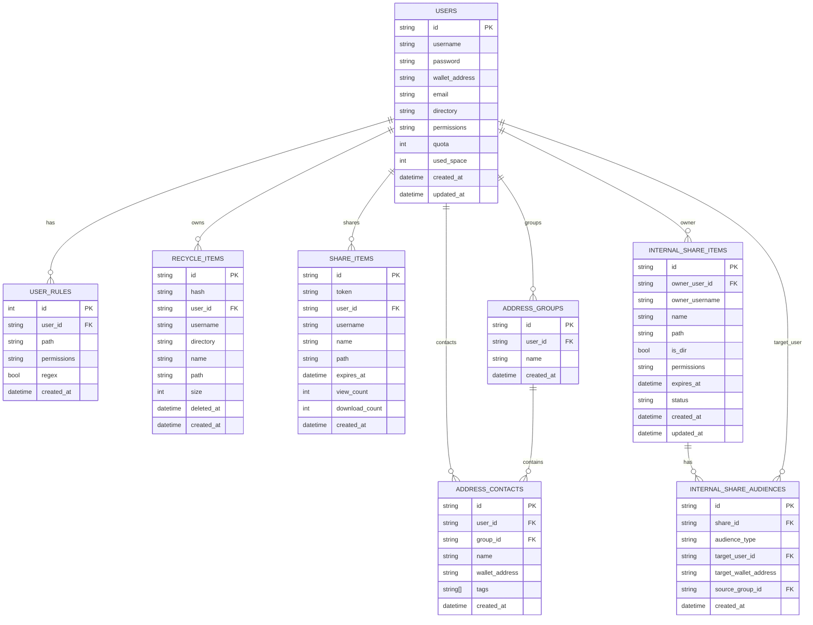

# 数据模型

本文档概述 PostgreSQL 数据表结构与核心字段。

## ER 图

## 关键表说明

- **users**：用户主表，包含权限、配额与钱包地址。
- **user_rules**：路径级权限规则，优先于默认权限。
- **recycle_items**：回收站记录，用于恢复或永久删除。
- **share_items**：公开分享记录，按 token 访问。
- **internal_share_items / internal_share_audiences**：站内共享主表与受众表，统一承载单地址、分组展开和全员共享。
- **address_groups / address_contacts**：地址簿与联系人分组。

## 升级提示（分享相关）

- 新安装只使用 `internal_share_items / internal_share_audiences`，不再创建 `share_user_items`。
- 从旧版本升级时，如果数据库里存在 `share_user_items`，启动迁移会自动幂等导入到 `internal_share_*`。
- 创建接口请求体统一使用 `targetMode + targetAddresses/groupIds`。

## 重要索引/约束（摘要）

- `users.username` 唯一
- `users.wallet_address` 唯一（非空时）
- `users.email` 唯一（非空时）
- `share_items.token` 唯一
- `internal_share_items.id` 唯一
- `internal_share_audiences.id` 唯一
- `internal_share_audiences(share_id, audience_type, target_user_id)` 在 `audience_type='user'` 下唯一
- `internal_share_audiences(share_id, audience_type)` 在 `audience_type='all_users'` 下唯一
- `recycle_items.hash` 唯一
- `address_groups(user_id, name)` 唯一
- `address_contacts(user_id, wallet_address)` 唯一
