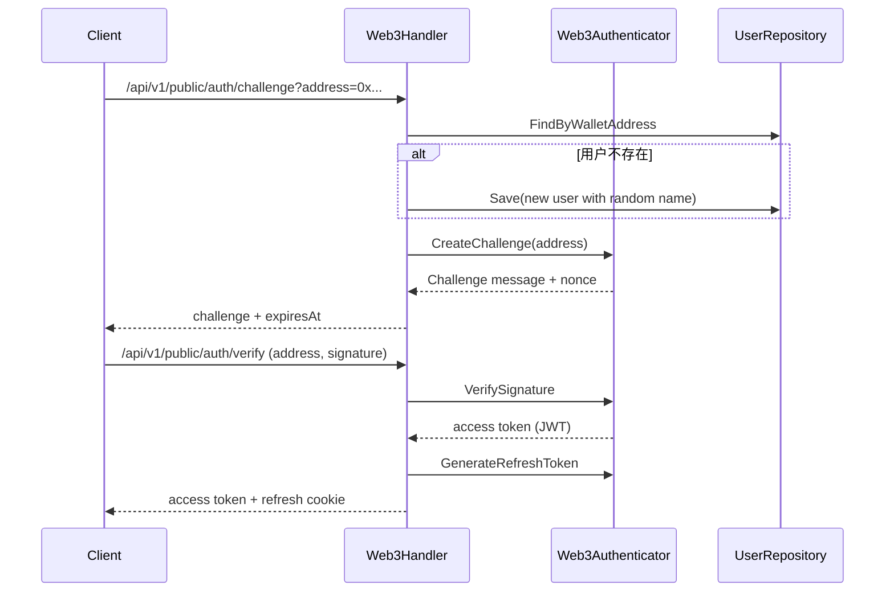
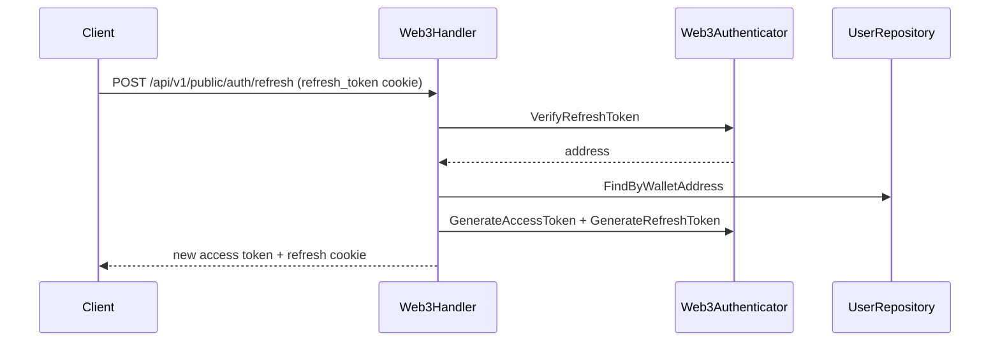

# 认证设计

本文档概述 WebDAV 服务的认证体系：Basic 认证、Web3 认证、JWT/UCAN 令牌与刷新机制。

## 认证器概览

系统在容器中初始化三类认证器：

- **AccessKeyAuthenticator**：WebDAV 目录级访问密钥认证（`ak_*` / `sk_*`）
- **BasicAuthenticator**：用户名/密码认证（可配置无密码模式）
- **Web3Authenticator**：Bearer Token 认证，支持 JWT 和 UCAN

认证中间件会根据请求凭证类型选择可处理的认证器。

## 凭证来源与优先级

`AuthMiddleware` 的凭证提取顺序：

1. `Authorization: Bearer <token>`
2. `authToken` Cookie（当作 Bearer Token）
3. HTTP Basic Auth

如果是 WebDAV 请求且缺少凭证，会返回 `WWW-Authenticate` 以满足客户端行为。

## Basic 认证

- 用户存储在 PostgreSQL 的 `users` 表中，密码使用 bcrypt 哈希。
- `security.no_password=true` 时，Basic 认证跳过密码校验（仅依赖用户名）。
- 用户权限由 `users.permissions` 与 `user_rules` 控制。

### WebDAV 访问密钥认证（目录级最小权限）

- 访问密钥保存在 `webdav_access_keys` 表，包含：
  - 密钥标识（`key_id`，格式 `ak_*`）
  - 密钥密文（`secret_hash`，bcrypt）
  - 权限位（`permissions`）
  - 状态、过期时间、最近使用时间
- 密钥目录绑定保存在 `webdav_access_key_bindings` 表：
  - `access_key_id + root_path` 唯一
  - 一个密钥可绑定多个目录
- 认证顺序上，访问密钥认证器优先于普通 Basic 认证器。
- 认证成功后，会基于“密钥 owner + bindingPaths + permissions”构造作用域用户：
  - `Directory` 设置为 owner 基础目录（`user.directory` 或 `username`）
  - `Permissions` 置空
  - `Rules` 根据每个绑定目录生成正则规则，仅放行绑定目录及其子路径
- 如果密钥没有任何绑定目录，认证失败（等价无效凭证）。
- 安全边界：
  - 访问密钥只允许访问 WebDAV 路径（`webdav.prefix`）
  - 使用访问密钥调用其他 API 会被拒绝（`403`）

访问密钥权限建议按下面理解：

- `R`：只读。
- `C+R`：只允许新增不存在的文件/目录，不允许覆盖已有内容。
- `C+R+U`：允许覆盖已有文件、修改已有内容、重命名，更适合 `davfs2` 这类挂载客户端。
- `C+R+U+D`：完整文件管理。

## 访问资源的权限设计

认证只确认“是谁”，资源访问授权由权限系统统一控制（与 Basic/JWT/UCAN 基本无关），  
但当 UCAN 携带 `app:<appId>` 时，会额外做应用目录前缀与读写动作限制。

### 权限来源与优先级

- 用户默认权限来自 `users.permissions`（`C/R/U/D`）。
- 路径规则来自 `user_rules`，按配置顺序匹配；命中后直接使用该规则权限，不再继续匹配。
- 未命中规则时回退到默认权限。

### WebDAV 资源权限

- 权限检查发生在 WebDAV 处理前。
- 校验路径为“逻辑路径”：`(user.Directory || user.Username) + 请求路径`，再做规范化。
- HTTP 方法 → 权限：
  - `GET/HEAD/OPTIONS/PROPFIND` → Read (`R`)
  - `PUT` → 目标不存在时 Create (`C`)，目标已存在时 Write (`U`)
  - `PATCH/PROPPATCH` → Write (`U`)
  - `POST/MKCOL` → Create (`C`)
  - `COPY/MOVE` → Write (`U`)
  - `DELETE` → Delete (`D`)
  - 其他方法默认 Read
- 对 `Create/Write` 操作会额外校验父目录是否存在。
- `davfs2` 挂载后的写入行为通常不等价于“单次 `PUT` 新建文件”，可能会触发需要 `U` 的更新语义请求；因此如果要通过挂载点像本地目录一样写入，通常至少需要 `C+R+U`。

### API / 分享 / 回收站

- 公开分享（Share）：仅允许读（下载），不允许写入。
- 定向分享（Share User）：权限来自 `internal_share_items.permissions`，下载/上传/创建目录/重命名/删除时校验对应权限位。
- 回收站：仅允许资源所有者执行恢复/删除/清空操作。

### 管理员登录与用户管理

- 管理员通过 `security.admin_addresses` 配置钱包地址白名单（支持多个）。
- 只有钱包地址命中的账号可以访问管理员用户管理接口。
- 若使用环境变量可配置 `WEBDAV_ADMIN_ADDRESSES`（逗号分隔）。

## Web3/JWT 认证

### 登录挑战流程



### 自动注册行为

- 在 `HandleChallenge` 中若钱包地址不存在，会自动创建用户：
  - 用户名为随机组合（形如 `QuickFox42`）
  - 默认权限 `CRUD`
  - 默认配额 `1GB`（`1073741824` 字节）
- 可通过配置开关控制自动创建行为：
  - `web3.auto_create_on_challenge`：是否在 challenge 阶段自动创建（默认 `true`）
  - `web3.auto_create_on_ucan`：是否在 UCAN 首次访问时自动创建（默认 `true`）

> 规划：后续会在自动创建账户前校验该钱包是否持有足够额度的“权益代币”，
> 未满足条件则不会自动创建账户（仅返回错误）。届时以服务端实际校验逻辑为准。

### 刷新流程



### 密码登录（兼容 Web3 Token）

- `/api/v1/public/auth/password/login` 接收用户名/密码。
- 校验用户密码后，要求用户必须绑定钱包地址。
- 使用钱包地址生成 JWT access/refresh 令牌。

### 邮箱验证码登录

- `email.enabled=true` 时开放接口。
- `/api/v1/public/auth/email/code` 发送验证码到邮箱。
- `/api/v1/public/auth/email/login` 使用邮箱 + 验证码登录。
- `email.auto_create_on_login=true` 时邮箱不存在会自动创建账号。
- 登录成功后颁发 JWT access/refresh 令牌，并写入 `refresh_token` Cookie。

## UCAN 支持

### 启用方式与配置

在 `config.yaml` 中开启 UCAN：

```yaml
web3:
  ucan:
    enabled: true
    audience: "did:web:127.0.0.1:6065"
    required_capabilities:
      - with: "app:*"
        can: "read,write"
    # 兼容旧字段（可选）
    # required_resource: "app:*"
    # required_action: "read,write"
    app_scope:
      path_prefix: "/apps"
```

说明：

- `enabled`：开启 UCAN 校验。
- `audience`：UCAN 的 `aud` 必须与之完全一致；为空时默认 `did:web:localhost:<port>`。
- `required_capabilities`：推荐使用标准 `with/can` 字段配置必需能力，支持多条。
- `required_resource` / `required_action`：历史兼容字段；仅在 `required_capabilities` 为空时回退使用。
- `app_scope.path_prefix`：应用目录根前缀，默认 `/apps`。

只读模式可以把 `can` 改为 `read`；此时写操作会返回 `403`。

### Bearer Token 分流规则

当请求携带 `Authorization: Bearer <token>` 时：

- 若 token 看起来像 UCAN（JWS 头部 `typ=UCAN` 或 `alg=EdDSA`），走 UCAN 校验。
- 否则走 JWT 校验。

### UCAN 校验范围

当 `web3.ucan.enabled=true` 时，Bearer token 若是 UCAN JWS 格式，将走 UCAN 验证。

UCAN 校验内容包括：

- `audience` 与 `web3.ucan.audience` 匹配
- 能力字段满足服务端配置的必需能力
- `prf` proof 链合法
- `iss` / `exp` / `nbf` / 签名合法

验证成功后，服务端从 root proof 或 proof 链中恢复地址，并返回 `did:pkh:eth:<address>` 对应的钱包地址用于用户匹配。

### 能力字段与匹配规则

服务端支持三种能力输入形式，并会先归一化后再匹配：

- `cap: [{ with, can, nb? }]`：推荐格式
- `cap: [{ resource, action, nb? }]`：兼容历史格式
- `att: { "<with>": { "<can>": <constraints> } }`：ReCap 形式

必需能力来源：

- 优先读取 `web3.ucan.required_capabilities`
- 如果为空，再回退到 `required_resource` / `required_action`

匹配规则：

- `*` 表示任意值
- 以 `*` 结尾表示前缀匹配
- 支持多值匹配，分隔符可用 `,` 或 `|`
- 通配符可以出现在服务端 required，也可以出现在 token cap

### `resource` / `action` 详细说明

UCAN 的能力字段可理解为：`cap: [{ resource, action }]` 或标准写法 `cap: [{ with, can }]`。
服务端会把配置项组合成“必需能力”，并在认证时做匹配。

空值处理：

- 两者都为空：不做能力校验，只验证 UCAN 自身合法性
- 只设置 `resource`：`action` 视为 `*`
- 只设置 `action`：`resource` 视为 `*`

当前实现的关键边界：

- UCAN 默认只做“认证准入 + 必需能力校验”
- **不会**把 UCAN 的 action 直接映射成通用 WebDAV `C/R/U/D` 权限
- 真正的资源授权仍由 `users.permissions`、`user_rules`、分享权限、回收站权限等系统决定

### app scope：应用目录隔离

当 UCAN 能力中包含 `app:` 命名空间资源时，会自动启用应用目录隔离。

当前规则：

- 推荐格式：`app:all:<appId>`
- 兼容格式：`app:<appId>`
- 当前只接受 `scope=all`
- `appId` 必须是单段字符串，只允许 `a-zA-Z0-9._-`
- 请求路径必须落在 `${app_scope.path_prefix}/<appId>/...` 下，否则直接拒绝

动作限制：

- `read`
- `write`
- `create`
- `update`
- `delete`
- `move`
- `copy`

补充说明：

- `write` 视为写类动作总开关
- 如果一个 UCAN 同时包含多个 `app:<appId>`，则该 UCAN 可以访问多个应用目录
- 每次请求会根据实际路径选择对应 appId 做校验
- `MOVE/COPY` 会同时校验源路径和目标路径；如果两个 appId 都在能力列表中且动作允许，则可以跨应用移动或复制
- 如果不希望一个 UCAN 同时访问多个应用，建议每个 app 单独签发 UCAN

### Proof Chain 校验

`prf` 当前支持两类证明：

1. 链式 UCAN
- `prf` 中继续嵌套 UCAN 字符串
- 每一跳要求 `aud` 等于上一跳 `iss`
- 每一跳能力必须覆盖上一跳所需能力
- 每一跳 `exp` 不能早于上一跳

2. Root Proof（SIWE）
- `type = "siwe"`
- `siwe.message` 中包含一行 `UCAN-AUTH: {...}`
- 服务端从中解析 `aud` / `cap` / `exp` / `nbf`
- `siwe.signature` 用于恢复以太坊地址

最终根证明需要满足：

- root 的 `aud` 与当前 `iss` 匹配
- root 的 `cap` 覆盖当前所需能力
- root 的 `exp` 不早于当前 `exp`

### 与权限系统的关系

认证只确认“是谁”，资源访问授权由权限系统统一控制（与 Basic/JWT/UCAN 基本无关），但当 UCAN 携带 `app:<appId>` 时，会额外做应用目录前缀与读写动作限制。

因此要明确：

- UCAN 通过，不代表一定拥有目录读写权限
- UCAN 只解决“能否以该身份进入系统”
- 进入系统后，仍会继续做：
  - 用户默认 `C/R/U/D` 权限校验
  - `user_rules` 路径规则匹配
  - 分享权限校验
  - 配额限制

### WebDAV 场景的推荐能力模型

推荐把 UCAN 作为“应用目录访问准入”的能力模型，而不是通用文件 CRUD 模型。

推荐配置：

- `required_capabilities: [{ with: "app:*", can: "read,write" }]`
- 只读场景：`can: "read"`

推荐 token 能力：

- `resource/with = app:<appId>`
- `action/can = read` 或 `write`
- 需要细粒度时再使用 `create/update/delete/move/copy`

示例：

```json
{
  "cap": [
    { "resource": "app:dapp-a", "action": "write" }
  ]
}
```

如果一个 UCAN 要访问两个应用目录，可以显式写两条能力：

```json
{
  "cap": [
    { "resource": "app:dapp-a", "action": "write" },
    { "resource": "app:dapp-b", "action": "read" }
  ]
}
```

### 失败日志与排查

当出现能力不匹配时，日志通常会包含：

- `required_caps`
- `provided_caps`
- `audience`
- `issuer`

典型排查顺序：

1. 对比 `required_caps` 与 `provided_caps`
2. 检查 `aud` 是否与服务端配置完全一致
3. 检查 token 是否已过期
4. 检查 `app:<appId>` 是否与访问路径一致
5. 检查当前请求方法是否超出 token 允许的动作范围

### 安全建议

- `required_resource/action` 或 `required_capabilities` 不要留空，否则任何合法 UCAN 都可能通过
- `audience` 应固定为当前服务域名，避免跨环境复用
- 建议缩短 UCAN 过期时间，例如 5 到 30 分钟
- 不建议在 token cap 中使用 `app:*` 或 `app:xxx*` 这类宽泛通配
- 需要更细粒度授权时，建议在 DApp 或网关侧追加路径/动作限制


## 安全与 Cookie 策略

- Refresh token 通过 `refresh_token` Cookie 下发，`HttpOnly`。
- Cookie 的 `Secure` 由请求协议或 `X-Forwarded-Proto` 决定。
- Access token 仍通过响应体返回，前端自行保存并在请求中携带。
