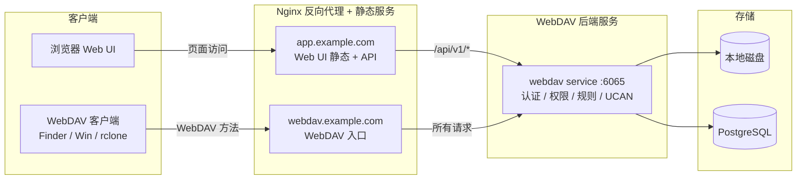

本文档负责已部署实例的日常运行、高可用复制、人工切换、故障排查和入口代理维护。安装包生成、初始化配置、升级和回滚见[部署手册](./部署手册.md)。

## 5. 阶段一高可用部署

### 5.1 当前目标与边界

阶段一的目标是：

- 让 standby 上始终有一份可接管的本地文件数据
- active 故障后，standby 能在可接受的 RPO / RTO 内接管
- 支持 `1 active + N standby`

阶段一暂不解决：

- WebDAV 锁跨副本共享
- challenge / email code 跨副本共享
- 多副本无状态并发接流量

### 5.2 standby 的职责

standby 负责：

- 接收复制事件
- 在本地盘幂等应用文件变更
- 暴露健康状态与复制状态
- 在故障时接管流量

standby 不负责：

- 正常情况下承接 public/admin 用户写流量
- 与 active 同时写同一份逻辑文件树

### 5.3 复制行为说明

当前实现支持：

- active 启动时，对所有有效 standby 逐个触发 startup reconcile
- active 周期性扫描当前健康 standby，对仍需补历史的 standby 按 `replication.reconcile_max_concurrency` 自动触发 reconcile
- reconcile 成功后，自动执行一次 `bootstrap/mark`，为该 standby 写入 baseline offset
- assignment 因历史补齐失败进入 `error` 时，会按退避节奏自动恢复到 `pending`
- 连续 `reconcile` 失败达到阈值后，assignment 自动进入 `paused`，等待运维显式 `resume`

这意味着：

- `replication.enabled=true` 但暂时没有 standby 时，active 仍然可以继续对外提供写服务
- 此时用户写入不会因为 `replication peer is unavailable` 被直接打成失败
- standby 恢复后，系统会优先尝试自动补齐历史，再继续增量复制
- 正常情况下不需要人工先执行 `reconcile/start`

### 5.4 运维默认动作

| 场景 | 系统默认行为 | 运维默认动作 |
| --- | --- | --- |
| 只部署 active，暂时没有 standby | active 继续本地写；日志会出现复制不可用的 `WARN` | 不需要人工补；后续 standby 接入后观察自动补齐 |
| standby 全挂，但 active 仍在运行 | active 继续本地写；缺失窗口不会形成对应 standby 的 outbox | 先恢复 standby，再观察自动补齐 |
| standby 刚恢复或新加入 | allocator 重建 assignment；后台自动跑 reconcile / bootstrap | 先观察状态，通常不需要立刻手工触发 |
| assignment 长时间 `error` / `paused` | 自动恢复未收敛，或达到自动暂停阈值 | 再人工排查网络、地址、鉴权，并执行 `retry` / `resume` |

### 5.5 推荐观察顺序

1. 确认 active / standby 都已启动
2. 确认 `replication.shared_secret` 一致
3. 观察 standby 心跳是否恢复
4. 观察 assignment 是否存在并推进
5. 观察 reconcile 是否已经自动开始
6. 等待 baseline 建立完成
7. 再看增量复制是否追平

典型观察窗口：

- standby 心跳默认 5 秒
- active allocator 默认 5 秒一轮
- periodic auto reconcile 默认 30 秒一轮

standby 恢复后，几十秒到 1 分钟级重新被发现并开始自动补齐，是正常现象。

### 5.6 值班速查版

如果你正在值班，先不要把整篇文档从头读完。优先执行下面 5 条命令和 3 组 SQL，通常就能快速定位问题是在“节点发现 / assignment / reconcile / outbox / offset”哪一层。

#### 5 条最常用命令

查看 assignment 总览：

```bash
./bin/warehouse -c config.yaml ha assignments status
```

查看某个 standby 的 active 侧状态：

```bash
./bin/warehouse -c config.yaml ha status --target-node-id warehouse-standby-1
```

查看某个 standby 的 standby 侧状态：

```bash
./bin/warehouse -c config.yaml ha status --peer --target-node-id warehouse-standby-1
```

查看某个 standby 的历史补齐状态：

```bash
./bin/warehouse -c config.yaml ha reconcile status --target-node-id warehouse-standby-1
```

恢复已暂停的 assignment：

```bash
./bin/warehouse -c config.yaml ha assignments resume --standby-node-id warehouse-standby-1
```

#### 3 组最常用 SQL

看节点发现：

```sql
SELECT node_id, role, advertise_url, last_heartbeat_at
FROM cluster_nodes
ORDER BY role, node_id;
```

看正式 assignment：

```sql
SELECT active_node_id, standby_node_id, state, generation, lease_expires_at, last_error
FROM cluster_replication_assignments
ORDER BY standby_node_id;
```

看增量复制 lag：

```sql
SELECT
  o.target_node_id,
  o.assignment_generation,
  o.max_outbox_id,
  COALESCE(x.last_applied_outbox_id, 0) AS last_applied_outbox_id,
  o.max_outbox_id - COALESCE(x.last_applied_outbox_id, 0) AS lag
FROM (
  SELECT target_node_id, assignment_generation, MAX(id) AS max_outbox_id
  FROM replication_outbox
  WHERE source_node_id = 'warehouse-active'
  GROUP BY target_node_id, assignment_generation
) o
LEFT JOIN replication_offsets x
  ON x.source_node_id = 'warehouse-active'
 AND x.target_node_id = o.target_node_id
 AND x.assignment_generation = o.assignment_generation
ORDER BY o.target_node_id, o.assignment_generation;
```

怎么快速判断：

- `cluster_nodes` 没有 standby：先查节点进程、配置、数据库连通性
- assignment 不存在或 lease 不续：先查 active allocator、节点健康度
- assignment 是 `error` / `paused`：先看 `last_error`，修复后再 `retry` 或 `resume`
- lag 持续扩大：先查 internal 可达性、`replication.shared_secret`、standby 本地磁盘写入

### 5.7 复制状态观察与人工干预

查看当前节点复制状态：

```bash
./bin/warehouse -c config.yaml ha status
```

在 active 上查看某个 standby：

```bash
./bin/warehouse -c config.yaml ha status --target-node-id warehouse-standby-1
```

直接查看某个 standby 自己的状态：

```bash
./bin/warehouse -c config.yaml ha status --peer --target-node-id warehouse-standby-1
```

查看 assignment：

```bash
./bin/warehouse -c config.yaml ha assignments status
```

查看某个 standby 的历史补齐状态：

```bash
./bin/warehouse -c config.yaml ha reconcile status --target-node-id warehouse-standby-1
```

手工触发某个 standby 的历史补齐：

```bash
./bin/warehouse -c config.yaml ha reconcile start --target-node-id warehouse-standby-1
```

暂停某个 standby 的 assignment：

```bash
./bin/warehouse -c config.yaml ha assignments pause --standby-node-id warehouse-standby-1
```

将 `error` assignment 推回 `pending`：

```bash
./bin/warehouse -c config.yaml ha assignments retry --standby-node-id warehouse-standby-1
```

将 `paused` assignment 恢复到 `pending`：

```bash
./bin/warehouse -c config.yaml ha assignments resume --standby-node-id warehouse-standby-1
```

如果需要手工写 baseline：

```bash
./bin/warehouse -c config.yaml ha bootstrap mark --peer --target-node-id warehouse-standby-1 --outbox-id 123
```

说明：

- 多 standby 场景下，建议显式带 `--target-node-id`
- `--peer` 表示通过共享控制面解析目标 standby 地址，然后直接访问该 standby 的 internal 接口
- `ha assignments status` 可直接观察 `state`、`failureCount`、`nextRetryAt`

### 5.8 复制链路排障速查

建议按“控制面 -> 历史补齐 -> 增量复制”这个顺序排查。

#### 第一步：先看 CLI

检查 assignment 总览：

```bash
./bin/warehouse -c config.yaml ha assignments status
```

检查某个 standby 的复制状态：

```bash
./bin/warehouse -c config.yaml ha status --target-node-id warehouse-standby-1
```

检查某个 standby 自己看到的状态：

```bash
./bin/warehouse -c config.yaml ha status --peer --target-node-id warehouse-standby-1
```

检查某个 standby 的 reconcile 进度：

```bash
./bin/warehouse -c config.yaml ha reconcile status --target-node-id warehouse-standby-1
```

看到什么算异常：

- `ha assignments status` 里没有目标 standby：说明还没形成有效 assignment，先看心跳和节点注册
- assignment 长时间停留在 `error` / `paused`：先看 `lastError`、`failureCount`、`nextRetryAt`
- `ha status` 里目标 peer 为空：说明运行时没有解析到 effective assignment 或没有解析到目标地址
- reconcile 长时间没有推进：先看 internal 地址可达性、shared secret、standby 本地磁盘权限

#### 第二步：再看数据库控制面

检查节点注册和心跳：

```sql
SELECT node_id, role, advertise_url, last_heartbeat_at
FROM cluster_nodes
ORDER BY role, node_id;
```

检查正式 assignment：

```sql
SELECT active_node_id, standby_node_id, state, generation, lease_expires_at, last_error
FROM cluster_replication_assignments
ORDER BY standby_node_id;
```

怎么判断：

- `cluster_nodes` 没有某个 standby：说明它根本没注册上来，先查该节点进程、配置、数据库连通性
- `last_heartbeat_at` 长时间不刷新：说明节点活性上报中断
- assignment 不存在：说明 active allocator 还没认领这个 standby，或该 standby 当前不健康
- assignment 的 `lease_expires_at` 已过期或接近不刷新：说明 active 侧续租异常

#### 第三步：最后看增量复制进度

检查 outbox 积压：

```sql
SELECT source_node_id, target_node_id, assignment_generation, status, COUNT(*) AS cnt, MAX(id) AS max_outbox_id
FROM replication_outbox
GROUP BY source_node_id, target_node_id, assignment_generation, status
ORDER BY target_node_id, assignment_generation, status;
```

检查各 standby 当前 offset：

```sql
SELECT source_node_id, target_node_id, assignment_generation, last_applied_outbox_id, updated_at
FROM replication_offsets
ORDER BY target_node_id, assignment_generation;
```

对比某个 standby 的 outbox 上限和 offset：

```sql
SELECT
  o.target_node_id,
  o.assignment_generation,
  o.max_outbox_id,
  COALESCE(x.last_applied_outbox_id, 0) AS last_applied_outbox_id,
  o.max_outbox_id - COALESCE(x.last_applied_outbox_id, 0) AS lag
FROM (
  SELECT target_node_id, assignment_generation, MAX(id) AS max_outbox_id
  FROM replication_outbox
  WHERE source_node_id = 'warehouse-active'
  GROUP BY target_node_id, assignment_generation
) o
LEFT JOIN replication_offsets x
  ON x.source_node_id = 'warehouse-active'
 AND x.target_node_id = o.target_node_id
 AND x.assignment_generation = o.assignment_generation
ORDER BY o.target_node_id, o.assignment_generation;
```

怎么判断：

- `replication_outbox` 持续增长但 `replication_offsets` 不动：说明 standby 没有成功应用，重点查 internal 请求、鉴权、磁盘写入
- 某个 standby 的 lag 持续扩大，其他 standby 正常：通常是该 standby 自身问题，不是全局问题
- 当前 generation 没有 offset baseline：说明这个 standby 还没完成 bootstrap mark，通常还在 reconcile 阶段
- outbox 很少但 lag 很大：需要确认是不是看错 generation，或 standby 还停留在旧 generation

#### 最常见的 4 个直接原因

1. `node.advertise_url` 配错，active 能看到 standby 心跳，但连不到 standby internal 地址
2. `replication.shared_secret` 不一致，internal 请求被鉴权拒绝
3. standby 本地 `webdav.directory` 权限或磁盘异常，apply / reconcile 无法落盘
4. assignment 已进入 `paused`，系统不会继续自动推进，必须先修复再 `resume`

## 6. readiness 与复制状态的边界

当前就绪检查包括：

- `scripts/health-check.sh`（默认 `--level readiness`）
- `GET /api/v1/public/health/heartbeat`
- `GET /api/v1/public/health/readiness`
- `warehouse -c config.yaml --check-ready`

这些检查只能回答：

- 进程是否活着
- 数据库是否可连通
- 本机 `webdav.directory` 是否存在且可写

这些检查不能回答：

- standby 是否已经追平 active
- 复制事件是否卡住
- standby 是否还有未应用 outbox

所以在 active / standby 场景下：

- readiness 只能说明“节点可运行”
- 不能单独作为“可切换”的判断依据
- 切换前必须同时看复制状态

## 7. 人工切换 SOP

V2 只提供人工切换 SOP，不提供自动 promote / 自动 failover。切换的核心原则是：先隔离旧 active，确认目标 standby 的数据落后量在可接受 RPO 内，再把目标 standby 作为新的唯一 active 接流量。

### 7.1 适用场景

适用：

- 原 active 已故障，无法稳定提供写服务。
- 原 active 需要维护，且已经进入明确切换窗口。
- standby 已完成 baseline，且复制 lag 在业务可接受范围内。

不适用：

- 希望多个 active 同时接用户写流量。
- 原 active 仍在写入，但没有办法摘流量或停服务。
- standby 从未完成 reconcile / bootstrap，或者本地数据目录明显不可信。

### 7.2 切换前检查

在原 active 上检查目标 standby：

```bash
./bin/warehouse -c config.yaml ha assignments status --standby-node-id warehouse-standby-1
./bin/warehouse -c config.yaml ha status --target-node-id warehouse-standby-1
./bin/warehouse -c config.yaml ha reconcile status --target-node-id warehouse-standby-1
```

必须确认：

- assignment 存在，且不是长期 `error` / `paused`。
- `leaseExpired=false` 或故障窗口内可以解释 lease 过期原因。
- `lastAppliedOutboxId` 接近 `lastOutboxId`，lag 在本次切换可接受 RPO 内。
- reconcile 没有长期 running 卡住；如果仍有 pending item，应先判断是否接受这些文件缺口。
- 目标 standby readiness 成功，且本地 `webdav.directory` 可写。

在目标 standby 上检查自身：

```bash
./bin/warehouse -c config.yaml --check-ready
./bin/warehouse -c config.yaml ha status
```

### 7.3 Fencing 旧 active

切换前必须确保旧 active 不会继续接受 public/admin 写流量。推荐顺序：

1. 从 LB / Nginx upstream 中摘掉旧 active。
2. 停止旧 active 进程。
3. 确认旧 active 端口不再接受请求。

```bash
cd /opt/deploy/warehouse
bash scripts/starter.sh stop
ss -lntp | grep 6065 || true
```

如果旧 active 无法登录或无法停进程，必须先在网络层隔离它；不能在旧 active 仍可能写入时提升 standby，否则会形成双写。

### 7.4 提升 standby

在目标 standby 节点执行：

1. 停止 standby 进程。
2. 备份当前 `config.yaml`。
3. 将 `node.role` 从 `standby` 改为 `active`。
4. 保持 `node.id` 为该节点自己的唯一 ID，不要冒用旧 active 的 ID。
5. 启动服务。

```bash
cd /opt/deploy/warehouse
bash scripts/starter.sh stop
cp config.yaml config.yaml.before-promote.$(date +%Y%m%d%H%M%S)
# 编辑 config.yaml：node.role: "active"
bash scripts/starter.sh start
./bin/warehouse -c config.yaml --check-ready
```

说明：

- PostgreSQL 元数据继续作为共享控制面使用。
- 新 active 会使用自己的 `node.id` 写新的 outbox / assignment generation。
- V2 不自动修改配置文件，也不自动切 LB；这些动作必须由运维显式执行。

### 7.5 切换流量

将 LB / Nginx 的 public/admin upstream 指向新 active。切换后立刻验证：

```bash
curl -fsS http://localhost:6065/api/v1/public/health/readiness
./bin/warehouse -c config.yaml ha assignments status --all
```

业务验收至少覆盖：

- Web UI 登录和目录列表。
- WebDAV 下载一个已存在文件。
- 上传一个小文件，并确认可下载。
- 创建目录、重命名、删除到回收站。
- 分享访问和收到的共享目录访问。
- S3 凭证路径范围内的 list / put / get / delete。

### 7.6 旧 active 回归

新 active 接受过任何写入后，不允许直接把流量切回旧 active。旧 active 必须作为 standby 重新加入：

1. 确认旧 active 仍然不接 public/admin 流量。
2. 修改旧节点 `config.yaml`：`node.role: "standby"`，保留它自己的 `node.id` 和 `advertise_url`。
3. 启动旧节点。
4. 在新 active 上观察 assignment、reconcile 和 offset，等待追平。

```bash
./bin/warehouse -c config.yaml ha assignments status --all
./bin/warehouse -c config.yaml ha status --target-node-id warehouse-old-active
./bin/warehouse -c config.yaml ha reconcile status --target-node-id warehouse-old-active
```

追平后，旧节点只作为 standby 保留。是否回切，需要重新走一次完整人工切换 SOP。

### 7.7 回切与回滚边界

只在“新 active 尚未接受任何写入”时，才可以把 LB 直接切回旧 active。

如果新 active 已经接受写入：

- 不要直接启动旧 active 并接流量。
- 先让旧节点以 standby 身份从新 active reconcile 追平。
- 需要回切时，先隔离当前新 active，再按本章流程提升旧节点。

这条边界比“进程是否能启动”更重要；违反它会导致文件树和数据库元数据出现不可自动修复的分叉。

### 7.8 切换后观察

切换后建议连续观察 10-30 分钟：

```bash
./bin/warehouse -c config.yaml ha assignments status --all
./bin/warehouse -c config.yaml ha status
tail -n 200 logs/warehouse.log
```

重点看：

- 新 active readiness 稳定。
- 没有第二个 active 被 LB 命中。
- 新写入没有持续报 quota、permission、replication generation 或 filesystem 错误。
- 旧节点作为 standby 回归后，assignment 能进入可解释状态并最终追平。

## 8. 回滚与升级

### 8.1 回滚方式

建议保留至少一个旧版本目录：

```text
/opt/deploy/
├── warehouse-v0.0.18-1234567/
└── warehouse-v0.0.19-40cc83f/
```

停止当前版本：

```bash
cd /opt/deploy/warehouse-v0.0.19-40cc83f
bash scripts/starter.sh stop
```

切回旧版本：

```bash
cd /opt/deploy/warehouse-v0.0.18-1234567
bash scripts/starter.sh start
```

如果新旧版本配置项不完全一致，回滚前应恢复旧版本自己的 `config.yaml`，不要直接混用新版本配置。

回滚后建议验证：

```bash
curl http://localhost:6065/api/v1/public/health/readiness
tail -n 100 logs/warehouse.log
```

### 8.2 active / standby 升级顺序

`1 active + 1 standby` 或 `1 active + N standby` 部署形态下，推荐先升级 standby，验证复制链路恢复后再升级 active。

升级原则：

- 优先保证业务连续性，standby 先升级，active 后升级
- 升级窗口内允许短时 lag，但复制链路不能长期卡住
- 升级完成后必须确认 assignment、heartbeat、offset 和 reconcile 状态持续正常

升级前在 active 节点记录基线：

```bash
cd /opt/deploy/warehouse-<version>
bin/warehouse ha status -c config.yaml --target-node-id warehouse-standby
bin/warehouse ha assignments status -c config.yaml --all
```

重点关注：

- `resolvedPeerHealthy=true`
- assignment 存在且 `leaseExpired=false`
- 当前 `resolvedGeneration`、`lastAppliedOutboxId`、`lastOutboxId`

先升级 standby：

1. 在 standby 节点停止旧版本服务。
2. 部署新版本目录，例如 `/opt/deploy/warehouse-vX.Y.Z`。
3. 更新新版本目录下的 `config.yaml`。
4. 启动 standby 服务。
5. 在 active 节点确认 standby 心跳恢复。

```bash
cd /opt/deploy/warehouse-vX.Y.Z
bin/warehouse ha status -c config.yaml --target-node-id warehouse-standby
```

再升级 active：

1. 在 active 节点停止旧版本服务。
2. 部署新版本目录并更新 `config.yaml`。
3. 启动 active 服务。
4. 观察 assignment、replication 和 reconcile 状态。

```bash
cd /opt/deploy/warehouse-vX.Y.Z
bin/warehouse ha assignments status -c config.yaml --all
bin/warehouse ha status -c config.yaml --target-node-id warehouse-standby
bin/warehouse ha reconcile status -c config.yaml --target-node-id warehouse-standby
```

判定复制链路未卡住的最小标准：

- `lastAppliedOutboxId` 随时间持续增长
- `pendingEvents` 不持续单边上涨
- `lastError` 不长期固定在同一条 fence 或顺序冲突错误

升级完成后，在 active 节点连续执行 2~3 次检查，间隔 1 分钟：

```bash
bin/warehouse ha status -c config.yaml --target-node-id warehouse-standby
bin/warehouse ha assignments status -c config.yaml --all
```

验收通过条件：

- standby 心跳健康
- assignment 存在且 lease 未过期
- `lastAppliedOutboxId` 持续前进
- 无持续重复的同类致命错误，尤其 generation fence 冲突

常见异常处理：

- `standby generation fence is not initialized` 或 `assignmentGeneration != offsetGeneration`：在 active 执行 `bin/warehouse ha bootstrap mark -c config.yaml --peer --target-node-id warehouse-standby`
- `expected next outbox id N, got a later event after M`：先观察短时间重试；若持续出现，执行 `bin/warehouse ha reconcile start -c config.yaml --target-node-id warehouse-standby --timeout 300s`
- assignment 长时间停在 `reconciling` 且复制不前进：先检查 `ha assignments status`，必要时在运维窗口内执行 `assignments release` 后重新 `bootstrap mark`

### 8.3 数据库迁移注意

当版本包含“WebDAV 目录访问密钥”功能时，首次启动会自动迁移数据库，新增：

- `webdav_access_keys`
- `webdav_access_key_bindings`
- `idx_webdav_access_keys_owner_name`

请确认：

- 数据库账号具备 `CREATE TABLE / CREATE INDEX / CREATE TRIGGER` 权限
- 升级后无需新增配置项
- 即使暂不使用访问密钥，也不影响 active / standby 同步链路

建议升级后执行一次自检：

```sql
SELECT COUNT(*) FROM webdav_access_keys;
SELECT COUNT(*) FROM webdav_access_key_bindings;
```

## 9. 常见问题

### 9.1 配置文件缺失

```bash
cp config.yaml.template config.yaml
```

然后补齐对应环境配置。

### 9.2 启动脚本执行失败

优先检查：

- `bin/warehouse` 是否存在且可执行
- `config.yaml` 是否存在
- `logs/warehouse.log` 是否有明确错误

### 9.3 端口冲突

```bash
ss -lntp | grep 6065
```

然后修改 `config.yaml` 的 `server.port`，或释放冲突端口。

### 9.4 数据目录权限不足

检查运行账号对 `webdav.directory` 是否有读写权限，并确认挂载目录已存在。

### 9.5 quota 校验与修正

当前系统已支持：

- WebDAV 写入口 quota 校验
- 覆盖文件按大小增量判断
- `COPY` 按源路径与目标路径的大小增量判断
- 回收站永久删除 / 清空回收站释放额度
- 可选的后台自动 quota 对账修正
- 手工 `quota check / rebuild`

推荐配置：

```yaml
quota:
  auto_reconcile_enabled: true
  auto_reconcile_interval: 6h
```

查看某个用户当前记录值与重算值是否一致：

```bash
./bin/warehouse quota check -c config.yaml --username alice
```

输出里重点看：

- `stored_used_space`
- `recalculated_used`
- `drift`
- `matches`

如果 `matches=false`，说明当前 `used_space` 与按“用户目录 + 回收站记录”重算出来的结果存在漂移。

手工把某个用户的 `used_space` 修正为当前重算值：

```bash
./bin/warehouse quota rebuild -c config.yaml --username alice
```

说明：

- `quota check` / `quota rebuild` 的重算口径包含：
  - 用户目录下的实际文件占用
  - `recycle_items` 中该用户的回收站记录大小
- 因为回收站文件仍计入额度，所以不能只扫用户目录，不然会低估 `used_space`
- 自动对账与手工 `check / rebuild` 使用同一套重算口径
- 自动对账默认关闭；开启后，服务启动时会先跑一轮，之后按 `quota.auto_reconcile_interval` 周期分批执行
- 自动对账完成日志会输出 `user_count`、`checked_count`、`repaired_count`、`failed_count`、`batch_size` 和 `batch_pause`
- 额度告警不是按巡检频率重复发送；同一用户持续处于同一风险周期时只更新现有通知，不重复发邮件
- 用户从风险区间恢复到阈值以下后，当前风险周期关闭；之后再次达到阈值会重新生成站内通知，并触发 Node 邮件通知
- `warning` 与 `error` 是不同风险周期；接近上限升级为已超额时会触发新的告警事件

运维职责边界：

- 单个用户“额度不够”默认不是平台故障，优先由管理员判断是否扩容
- 运维主要处理“统计不准 / 对账失败 / 巡检负载异常 / 数据目录异常”这类平台问题
- 不建议运维直接绕过管理员给用户随意扩容，除非现场已经有明确授权

推荐排查顺序：

1. 先判断是“真实额度不足”还是“统计漂移”
2. 如果是统计漂移，先执行 `quota check`
3. 确认漂移后，再执行 `quota rebuild`
4. 如果不是漂移，而是用户真实占用过高，转管理员决定是否扩容

典型场景与处理方式：

| 场景 | 现象 | 优先动作 |
| --- | --- | --- |
| 用户上传失败，提示额度不足 | 前端提示超额，写入被拒绝 | 先看该用户 `quota check`，判断是真超额还是漂移 |
| 用户声称明明删了文件还是无法上传 | 往往只是删到了回收站 | 引导先清理回收站；必要时再 `quota check` |
| `used_space` 明显不可信 | 与实际目录占用差异很大 | 执行 `quota check`，必要时 `quota rebuild` |
| 自动对账任务长时间没效果 | 日志没有巡检结果，或多轮后仍漂移 | 先检查日志，再检查配置与目录/数据库状态 |
| 某些用户接近上限或已超额 | 巡检日志出现风险提示 | 交管理员处理容量决策，运维只负责把信号暴露出来 |

建议观察的日志信号：

- `quota reconciler started`
  - 说明自动对账任务已启动
- `quota reconcile pass finished`
  - 一轮巡检完成
- `quota drift repaired`
  - 某个用户的 `used_space` 已被自动修正
- `quota user is nearing storage limit`
  - 某个用户使用率已达到 `>= 80%`
- `quota user exceeded storage limit`
  - 某个用户已经超额，新增写入会被拒绝
- `quota reconcile pass failed`
  - 整轮巡检失败
- `quota reconcile user failed`
  - 单个用户巡检失败

重点日志字段：

- `username`
- `quota`
- `used_space`
- `active_used`
- `recycle_used`
- `quota_status`
- `quota_usage_percent`

运维读取建议：

```bash
# 最近的 quota 巡检相关日志
grep -E "quota reconciler|quota drift repaired|quota user is nearing storage limit|quota user exceeded storage limit" logs/warehouse.log
```

如果你是 systemd / journalctl 场景，可按同样关键词检索。

风险日志解读：

- `quota_status=near_limit`
  - 当前用户已接近上限，但还未被拒绝写入
  - 这属于预警信号，通常转管理员关注即可
- `quota_status=over_quota`
  - 当前用户已超额
  - 新增写入会被拒绝
  - 这不等于系统故障，先交管理员决定是否扩容

邮件通知频率说明：

- Warehouse 负责判断额度风险周期，并在新周期开始时向 Node 发布邮件事件。
- Node 负责实际邮件投递与失败重试；如果邮件发送失败，是否重试、重试次数和退避间隔以 Node 的 `notification.emailDelivery*` 配置为准。
- 如果 Warehouse 日志显示风险告警已触发，但用户只收到站内通知、没有收到邮件，应先检查 Node 是否生成 `email` delivery，再看 delivery 状态是 `pending`、`delivered` 还是 `failed`。

自动对账配置建议：

- 小规模环境：`quota.auto_reconcile_interval=6h`
- 用户量较多、文件树较大：先从 `12h` 或更大周期开始观察
- 巡检影响磁盘或数据库负载时：优先调大 `quota.auto_reconcile_batch_pause` 或调小 `quota.auto_reconcile_batch_size`

什么时候需要人工介入：

- 自动对账日志持续报 `quota reconcile pass failed`
- 单个用户反复报 `quota reconcile user failed`
- `quota check` 显示长期漂移，但自动对账迟迟未修正
- 数据目录损坏、回收站记录异常、数据库故障，导致重算结果本身不可信

什么时候不需要人工介入：

- 只是出现 `quota user is nearing storage limit`
- 只是出现单个用户 `over_quota`，且这是业务真实占用
- standby 节点磁盘比 active 更大或更小
  - quota 真相以数据库字段和 active 写入口判断为准，不以 standby 本地磁盘为准

### 9.6 WebDAV 系统对象清理

WebDAV 普通用户文件删除仍默认进入回收站。apps 空间下的 `backup.__sync_*` 同步运行态对象属于系统对象，删除时会直接硬删除，不进入用户可见回收站，也不会进入普通 reconcile 历史补齐。

如果历史版本已经把这类对象放入 `.recycle`，先 dry-run 查看影响范围：

```bash
./bin/warehouse recycle clean-sync-artifacts -c config.yaml --dry-run
```

确认后执行清理：

```bash
./bin/warehouse recycle clean-sync-artifacts -c config.yaml
```

说明：

- 清理规则只匹配 apps 路径下的 `backup.__sync_mutex_v1.__sync_lock_v1`、`backup.__sync_txn_head_v1*.json` 和 `backup.__sync_txn_data_v1.*.json`。
- personal 下同名文件仍按用户数据处理，不会被该命令清理。
- 命令会删除命中的 `.recycle` 文件和 `recycle_items` 记录，并按记录 `size` 释放对应用户的 `used_space`。
- 如果实际 `.recycle` 文件已经缺失，命令仍会删除脏记录并释放历史额度占用。

### 9.7 standby 一直不追平

优先检查：

- `node.advertise_url` 是否能互相访问
- `replication.shared_secret` 是否一致
- assignment 是否已经进入 `paused`
- `ha assignments status` 中的 `failureCount` / `nextRetryAt` / `lastError`

### 9.8 assignment 自动进入 paused

先检查 `lastError`、`failureCount`、`nextRetryAt`，再排查 internal 地址、shared secret、网络、鉴权。修复后执行：

```bash
./bin/warehouse -c config.yaml ha assignments resume --standby-node-id <standby-node-id>
```

## 10. WebDAV 入口与 Nginx 建议

### 10.1 推荐拓扑

推荐把 WebDAV 客户端入口与 Web UI 入口分开：

- `webdav.example.com`：只服务 WebDAV 客户端
- `app.example.com`：只服务 Web UI 静态资源与 `/api/v1/*`



推荐原因：

- 避免 SPA `try_files` 抢占 WebDAV 路径
- 避免 `/api` 或 `/dav` 代理规则互相干扰
- 第三方 WebDAV 客户端配置更简单

### 10.2 代理设计原则

- WebDAV 与 Web UI 最好分域名
- 代理层必须开启足够大的上传体积与超时
- 对 WebDAV 建议关闭 `proxy_request_buffering`
- 生产环境建议统一启用 HTTPS
- UCAN / JWT 都应只在 HTTPS 上传输

### 10.3 WebDAV 独立域名示例

```nginx
server {
  server_name webdav.example.com;

  client_max_body_size 1000M;
  client_body_timeout 300s;
  proxy_request_buffering off;
  proxy_read_timeout 300s;
  proxy_send_timeout 300s;

  location / {
    proxy_pass http://127.0.0.1:6065;
    proxy_set_header Host $host;
    proxy_set_header X-Real-IP $remote_addr;
    proxy_set_header X-Forwarded-For $proxy_add_x_forwarded_for;
    proxy_set_header X-Forwarded-Proto $scheme;
    proxy_redirect off;
  }
}
```

### 10.4 Web UI 域名示例

```nginx
server {
  server_name app.example.com;

  root /usr/share/nginx/html/webdav-ui;
  index index.html;

  location / {
    try_files $uri /index.html;
    add_header Cache-Control "no-cache";
  }

  location /api/ {
    proxy_pass http://127.0.0.1:6065;
    proxy_set_header Host $host;
    proxy_set_header X-Real-IP $remote_addr;
    proxy_set_header X-Forwarded-For $proxy_add_x_forwarded_for;
    proxy_set_header X-Forwarded-Proto $scheme;
  }

  gzip on;
  gzip_comp_level 6;
  gzip_min_length 1k;
  gzip_types text/plain text/css application/javascript application/json image/svg+xml font/woff2;
  gzip_vary on;

  # brotli 为可选项；若 nginx 未启用该模块，请移除
  # brotli on;
  # brotli_comp_level 5;
  # brotli_types text/plain text/css application/javascript application/json image/svg+xml font/woff2;

  location ~* \.(js|css|woff2|png|svg|ico)$ {
    expires 1y;
    add_header Cache-Control "public,max-age=31536000,immutable";
  }
}
```

静态资源建议：

- `index.html` 不要强缓存
- 带 hash 的 `js/css/font/image` 走长缓存
- `brotli` 只有在 nginx 已编译对应模块时才启用

### 10.5 单域名备选方案

如果只能使用一个域名，建议把 WebDAV 固定在 `/dav/`：

```nginx
location /dav/ { proxy_pass http://127.0.0.1:6065; }
location / { try_files $uri /index.html; }
```

后端保持 `webdav.prefix: "/dav"` 即可。

代理规则对照：

| 前端访问路径 | 后端 `webdav.prefix` | Nginx 配置 | 说明 |
| --- | --- | --- | --- |
| `/dav/` | `/dav` | `location /dav/ { proxy_pass http://127.0.0.1:6065; }` | 保留前缀 |
| `/dav/` | `/` | `location /dav/ { proxy_pass http://127.0.0.1:6065/; }` | 剥离前缀 |
| `/webdav/` | `/webdav` | `location /webdav/ { proxy_pass http://127.0.0.1:6065; }` | 自定义前缀 |

说明：`proxy_pass` 末尾是否带 `/` 决定是否剥离前缀。

### 10.6 验证清单

部署后建议检查：

1. WebDAV 客户端访问不会被 SPA 路由劫持
2. 大文件上传不会因为 buffering 或超时失败
3. `index.html` 为 `no-cache`
4. 带 hash 的静态资源为 `immutable`
5. JS/CSS 响应头包含 `gzip` 或 `br`（若已启用 brotli）

### 10.7 常见坑

- `/api` 或 `/dav` 代理规则写错，导致前缀被意外剥离
- SPA `try_files` 抢占 WebDAV 路径，导致 Finder / Windows 客户端异常
- 代理层开启强缓存，把 `index.html` 也缓存住
- 代理层 request buffering 或超时设置过小，导致大文件上传失败
