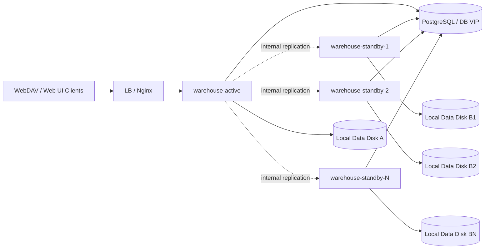

# 部署手册

本文档是 `warehouse` 当前唯一的部署入口文档，统一承载配置规则、安装包部署、阶段一高可用拓扑、复制观察与切换检查，避免多处重复维护。

## 1. 适用范围

本文覆盖：

- 配置来源与覆盖规则
- 安装包生成、拷贝、解压、启停、验证、回滚
- `1 active + N standby` 的阶段一高可用部署方式
- standby 复制状态的观察方法
- 切换前后的检查项
- 版本升级时需要注意的事项

本文不展开：

- `internal` 复制内部实现细节、数据表、状态机
- WebDAV / 分享 / 回收站等业务功能设计

相关深入设计请看：

- [内部复制版备用节点设计.md](./内部复制版备用节点设计.md)
- [容灾方案.md](./容灾方案.md)
- [多实例与多副本方案设计.md](./多实例与多副本方案设计.md)

## 2. 部署形态总览

当前推荐的阶段一部署形态是：

- 最简单：只部署 `1 active`
- 高可用：`1 active + 1 standby`
- 扩展形态：`1 active + N standby`

约束如下：

- active 对外提供 `public` / `admin` 流量
- standby 不接用户流量，只接实例间 `internal` 同步流量
- active / standby 各自使用本地挂载目录，不共享文件目录
- 文件通过应用内复制同步，元数据以 PostgreSQL 为准
- PostgreSQL 自身应具备主备、托管高可用，或可靠备份恢复能力

拓扑示意：



说明：

- 只有 active 在 LB 上游池中
- standby 需要能被 active 访问到 `internal` 接口
- standby 不需要配置静态 peer，只需要正确上报自己的 `node.advertise_url`
- 只部署 active 也是支持的，后续再接入 standby 即可

## 3. 配置规则

### 3.1 配置来源与优先级

配置加载顺序：

1. 默认配置：`config.DefaultConfig()`
2. 配置文件：通过 `-c/--config` 指定的 YAML 文件
3. 命令行参数：覆盖部分字段，例如地址、端口、目录
4. 环境变量：覆盖部分字段，例如 `WEBDAV_JWT_SECRET`

最终规则是：后覆盖前。

### 3.2 配置入口

统一建议：

- 以 `config.yaml.template` 为基础生成环境自己的 `config.yaml`
- 本地开发、二进制直接启动、安装包部署，最终都使用各自环境的 `config.yaml`

### 3.3 启动前校验要点

服务启动前会校验以下关键项，不通过会直接退出：

- `web3.jwt_secret` 必填且至少 32 字符
- `database.type` 仅支持 `postgres` / `postgresql`
- `webdav.directory` 必须存在或可创建
- 启用 TLS 时必须提供 `cert_file` / `key_file`
- `email.enabled=true` 时需要 SMTP 与模板配置完整

### 3.4 关键配置块

- `server`：监听地址、端口、TLS、超时
- `database`：PostgreSQL 连接信息与连接池
- `node`：节点身份、角色、`advertise_url`
- `replication`：复制开关、shared secret、退避参数、自动暂停阈值
- `webdav`：根目录、前缀、目录自动创建、NoSniff
- `web3`：JWT secret、Token 过期时间、UCAN 规则
- `email`：邮箱验证码登录
- `security`：反向代理、白名单、无密码模式
- `cors`：跨域设置

### 3.5 通用配置确认项

部署前至少确认：

- `database.*` 指向可用 PostgreSQL
- `webdav.directory` 指向真实数据目录
- `web3.jwt_secret` 已替换为真实密钥

如果启用阶段一高可用复制，还要确认：

- `node.id`：每个实例唯一
- `node.role`：只能是 `active` 或 `standby`
- `node.advertise_url`：必须是其他实例可访问的 internal 地址
- `replication.enabled=true`
- `replication.shared_secret`：active / standby 必须一致
- `replication.retry_backoff_base` / `replication.max_retry_backoff`
- `replication.reconcile_auto_pause_failures`

说明：

- `retry_backoff_base` / `max_retry_backoff` 同时影响 outbox 重试和 assignment error 自动恢复节奏
- `reconcile_auto_pause_failures` 默认 `3`
- 设为 `0` 表示关闭自动暂停

### 3.6 配置覆盖示例

```bash
warehouse -c config.yaml
warehouse -c config.yaml -p 8080 -d /data
export WEBDAV_JWT_SECRET="your-secret"
warehouse -c config.yaml
```

## 4. 安装包部署

### 4.1 部署对象

- 服务名称：`warehouse`
- 安装包名称规则：`warehouse-<tag>-<short-hash>.tar.gz`
- 启动入口：`scripts/starter.sh`

本文这里讲的是安装包部署，不是开发目录直接 `go run`。

### 4.2 生成安装包

在仓库根目录执行：

```bash
bash scripts/package.sh
```

如果要按已有 TAG 重新打包：

```bash
bash scripts/package.sh v0.0.19
```

输出位置：

```text
output/<package-name>.tar.gz
```

安装包当前至少包含：

```text
<package-dir>/
├── bin/warehouse
├── config.yaml.template
├── scripts/starter.sh
├── web/
└── resources/
```

### 4.3 目标环境准备

建议：

- Linux 服务器，例如 Ubuntu 22.04+ / Debian 12+
- PostgreSQL 可达
- 已安装 `bash`、`nohup`、`tar`
- 预先规划部署目录，例如 `/opt/deploy`
- 使用专用非 root 账号运行

示例：

```bash
mkdir -p /opt/deploy
```

如果启用 standby，还要提前准备：

- 每台机器自己的本地数据目录挂载点
- 每个实例唯一 `node.id`
- 其他实例可访问的 `node.advertise_url`
- 一致的 `replication.shared_secret`

### 4.4 拷贝与解压

```bash
scp output/warehouse-v0.0.19-40cc83f.tar.gz <user>@<host>:/opt/deploy/
ssh <user>@<host>
cd /opt/deploy
tar -xzf warehouse-v0.0.19-40cc83f.tar.gz
cd warehouse-v0.0.19-40cc83f
```

### 4.5 初始化配置

```bash
cp config.yaml.template config.yaml
```

然后按上面的配置规则补齐 `config.yaml`。

如需生成随机密钥，可使用：

```bash
openssl rand -base64 48
```

适合用于：

- `web3.jwt_secret`
- `replication.shared_secret`

### 4.6 启停命令

启动：

```bash
bash scripts/starter.sh
# 或
bash scripts/starter.sh start
```

停止：

```bash
bash scripts/starter.sh stop
```

重启：

```bash
bash scripts/starter.sh restart
```

### 4.7 启动后验证

进程与日志：

```bash
cat run/warehouse.pid
tail -f logs/warehouse.log
```

健康检查：

```bash
curl http://127.0.0.1:6065/api/v1/public/health/heartbeat
curl http://127.0.0.1:6065/api/v1/public/health/readiness
```

端口检查：

```bash
ss -lntp | grep 6065
```

CLI readiness：

```bash
./bin/warehouse -c config.yaml --check-ready
```

## 5. 阶段一高可用部署

### 5.1 当前目标与边界

阶段一的目标是：

- 让 standby 上始终有一份可接管的本地文件数据
- active 故障后，standby 能在可接受的 RPO / RTO 内接管
- 支持 `1 active + N standby`

阶段一暂不解决：

- WebDAV 锁跨副本共享
- challenge / email code 跨副本共享
- 多副本无状态并发接流量

### 5.2 standby 的职责

standby 负责：

- 接收复制事件
- 在本地盘幂等应用文件变更
- 暴露健康状态与复制状态
- 在故障时接管流量

standby 不负责：

- 正常情况下承接 public/admin 用户写流量
- 与 active 同时写同一份逻辑文件树

### 5.3 复制行为说明

当前实现支持：

- active 启动时，对所有有效 standby 逐个触发 startup reconcile
- active 周期性扫描当前健康 standby，对仍需补历史的 standby 自动再次触发 reconcile
- reconcile 成功后，自动执行一次 `bootstrap/mark`，为该 standby 写入 baseline offset
- assignment 因历史补齐失败进入 `error` 时，会按退避节奏自动恢复到 `pending`
- 连续 `reconcile` 失败达到阈值后，assignment 自动进入 `paused`，等待运维显式 `resume`

这意味着：

- `replication.enabled=true` 但暂时没有 standby 时，active 仍然可以继续对外提供写服务
- 此时用户写入不会因为 `replication peer is unavailable` 被直接打成失败
- standby 恢复后，系统会优先尝试自动补齐历史，再继续增量复制
- 正常情况下不需要人工先执行 `reconcile/start`

### 5.4 运维默认动作

| 场景 | 系统默认行为 | 运维默认动作 |
| --- | --- | --- |
| 只部署 active，暂时没有 standby | active 继续本地写；日志会出现复制不可用的 `WARN` | 不需要人工补；后续 standby 接入后观察自动补齐 |
| standby 全挂，但 active 仍在运行 | active 继续本地写；缺失窗口不会形成对应 standby 的 outbox | 先恢复 standby，再观察自动补齐 |
| standby 刚恢复或新加入 | allocator 重建 assignment；后台自动跑 reconcile / bootstrap | 先观察状态，通常不需要立刻手工触发 |
| assignment 长时间 `error` / `paused` | 自动恢复未收敛，或达到自动暂停阈值 | 再人工排查网络、地址、鉴权，并执行 `retry` / `resume` |

### 5.5 推荐观察顺序

1. 确认 active / standby 都已启动
2. 确认 `replication.shared_secret` 一致
3. 观察 standby 心跳是否恢复
4. 观察 assignment 是否存在并推进
5. 观察 reconcile 是否已经自动开始
6. 等待 baseline 建立完成
7. 再看增量复制是否追平

典型观察窗口：

- standby 心跳默认 5 秒
- active allocator 默认 5 秒一轮
- periodic auto reconcile 默认 30 秒一轮

standby 恢复后，几十秒到 1 分钟级重新被发现并开始自动补齐，是正常现象。

### 5.6 复制状态观察与人工干预

查看当前节点复制状态：

```bash
./bin/warehouse -c config.yaml ha status
```

在 active 上查看某个 standby：

```bash
./bin/warehouse -c config.yaml ha status --target-node-id warehouse-standby-1
```

直接查看某个 standby 自己的状态：

```bash
./bin/warehouse -c config.yaml ha status --peer --target-node-id warehouse-standby-1
```

查看 assignment：

```bash
./bin/warehouse -c config.yaml ha assignments status
```

查看某个 standby 的历史补齐状态：

```bash
./bin/warehouse -c config.yaml ha reconcile status --target-node-id warehouse-standby-1
```

手工触发某个 standby 的历史补齐：

```bash
./bin/warehouse -c config.yaml ha reconcile start --target-node-id warehouse-standby-1
```

暂停某个 standby 的 assignment：

```bash
./bin/warehouse -c config.yaml ha assignments pause --standby-node-id warehouse-standby-1
```

将 `error` assignment 推回 `pending`：

```bash
./bin/warehouse -c config.yaml ha assignments retry --standby-node-id warehouse-standby-1
```

将 `paused` assignment 恢复到 `pending`：

```bash
./bin/warehouse -c config.yaml ha assignments resume --standby-node-id warehouse-standby-1
```

如果需要手工写 baseline：

```bash
./bin/warehouse -c config.yaml ha bootstrap mark --peer --target-node-id warehouse-standby-1 --outbox-id 123
```

说明：

- 多 standby 场景下，建议显式带 `--target-node-id`
- `--peer` 表示通过共享控制面解析目标 standby 地址，然后直接访问该 standby 的 internal 接口
- `ha assignments status` 可直接观察 `state`、`failureCount`、`nextRetryAt`

## 6. readiness 与复制状态的边界

当前就绪检查包括：

- `GET /api/v1/public/health/heartbeat`
- `GET /api/v1/public/health/readiness`
- `warehouse -c config.yaml --check-ready`

这些检查只能回答：

- 进程是否活着
- 数据库是否可连通
- 本机 `webdav.directory` 是否存在且可写

这些检查不能回答：

- standby 是否已经追平 active
- 复制事件是否卡住
- standby 是否还有未应用 outbox

所以在 active / standby 场景下：

- readiness 只能说明“节点可运行”
- 不能单独作为“可切换”的判断依据
- 切换前必须同时看复制状态

## 7. 切换前检查与切换流程

### 7.1 切换前必须满足的条件

建议至少满足：

1. active 已失去写能力，或已被摘流量并确认不会继续写入
2. standby 本机 readiness 成功
3. standby 的复制 lag 在可接受 RPO 内
4. standby 已应用的最后事件序号不落后于切换基线
5. PostgreSQL 已具备可用主库或可恢复数据库入口

### 7.2 建议切换流程

1. 确认 active 故障，或人工进入切换窗口
2. 对 active 做 fencing，避免双写
3. 检查 standby readiness、复制 lag、最后应用序号
4. 将 LB 上游从 active 切到 standby
5. 做验收：目录列表、上传、下载、分享访问、回收站操作

### 7.3 验收重点

至少验证：

- WebDAV `PUT / MKCOL / MOVE / DELETE` 会产生复制事件
- 回收站恢复 / 清理会同步到 standby
- 定向分享中的 `upload / folder / rename / delete` 会同步到 standby
- standby 重复应用同一事件不会产生错误结果
- standby 落后时，系统能暴露 lag

## 8. 回滚与升级

### 8.1 回滚方式

建议保留至少一个旧版本目录：

```text
/opt/deploy/
├── warehouse-v0.0.18-1234567/
└── warehouse-v0.0.19-40cc83f/
```

停止当前版本：

```bash
cd /opt/deploy/warehouse-v0.0.19-40cc83f
bash scripts/starter.sh stop
```

切回旧版本：

```bash
cd /opt/deploy/warehouse-v0.0.18-1234567
bash scripts/starter.sh start
```

如果新旧版本配置项不完全一致，回滚前应恢复旧版本自己的 `config.yaml`，不要直接混用新版本配置。

回滚后建议验证：

```bash
curl http://127.0.0.1:6065/api/v1/public/health/readiness
tail -n 100 logs/warehouse.log
```

### 8.2 升级注意

当版本包含“WebDAV 目录访问密钥”功能时，首次启动会自动迁移数据库，新增：

- `webdav_access_keys`
- `webdav_access_key_bindings`
- `idx_webdav_access_keys_owner_name`

请确认：

- 数据库账号具备 `CREATE TABLE / CREATE INDEX / CREATE TRIGGER` 权限
- 升级后无需新增配置项
- 即使暂不使用访问密钥，也不影响 active / standby 同步链路

建议升级后执行一次自检：

```sql
SELECT COUNT(*) FROM webdav_access_keys;
SELECT COUNT(*) FROM webdav_access_key_bindings;
```

## 9. 常见问题

### 9.1 配置文件缺失

```bash
cp config.yaml.template config.yaml
```

然后补齐对应环境配置。

### 9.2 启动脚本执行失败

优先检查：

- `bin/warehouse` 是否存在且可执行
- `config.yaml` 是否存在
- `logs/warehouse.log` 是否有明确错误

### 9.3 端口冲突

```bash
ss -lntp | grep 6065
```

然后修改 `config.yaml` 的 `server.port`，或释放冲突端口。

### 9.4 数据目录权限不足

检查运行账号对 `webdav.directory` 是否有读写权限，并确认挂载目录已存在。

### 9.5 standby 一直不追平

优先检查：

- `node.advertise_url` 是否能互相访问
- `replication.shared_secret` 是否一致
- assignment 是否已经进入 `paused`
- `ha assignments status` 中的 `failureCount` / `nextRetryAt` / `lastError`

### 9.6 assignment 自动进入 paused

先检查 `lastError`、`failureCount`、`nextRetryAt`，再排查 internal 地址、shared secret、网络、鉴权。修复后执行：

```bash
./bin/warehouse -c config.yaml ha assignments resume --standby-node-id <standby-node-id>
```
